# Базовая настройка устройств

**Печатные страницы:** 17–38.

<!-- Стр. 17 -->

### Выполнение задания:

### Базовая настройка устройств

## Задание 1. Настройте имена устройств согласно топологии (см. рис. 1.2). Используйте полное доменное имя.


Рис. 1.2. Публичная схема экзаменационного задания

### Как делать? Переименование устройств с ОС «Альт». Изначально имя машины стандартное — localhost:

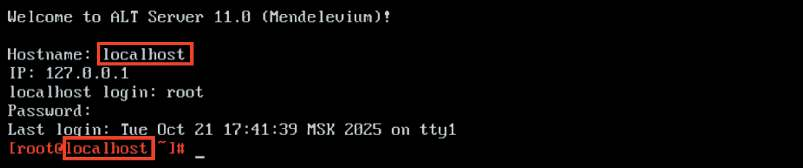

<!-- Стр. 18 -->

Для установки имени виртуальной машины необходимо воспользоваться утилитой HOSTNAMECTL (полное доменное имя прописывается везде, кроме ВМ ISP):

```text
hostnamectl set-hostname <hostname>.<domain-name>; exec bash
```


Описание применяемых команд: hostnamectl — программа для управления именем машины; set-hostname — аргумент, позволяющий выполнить изменение имени устройства; <hostname> — целевое имя машины; <domain-name> — имя домена; exec bash — перезапуск оболочки bash для отображения нового имени устройства. Как проверить? Перезагрузите компьютер с помощью команды reboot. После загрузки компьютера изменилось приглашение системы к вводу команд.


Команда hostname выведет текущее название машины, используйте ключ –f для отображения полного доменного имени (Fully Qualiˋed Domain Name).


Где выполнять?
На машинах с ОС «Альт».
Где изучается?
2 курс:
- Операционные системы и среды;
- Компьютерные сети и далее.
Краткая справка:
- Общая информация о сетевых настройках системы ОС «Альт» (https://
www.altlinux.org/Настройка_сети#Имя_компьютера).

<!-- Стр. 19 -->

### Как делать? Для переименования устройств с ОС «EcoRouterOS». Используйте следующие команды:

```text
enable configure terminal hostname <hostname> ip domain-name <domain-name> write memory
```

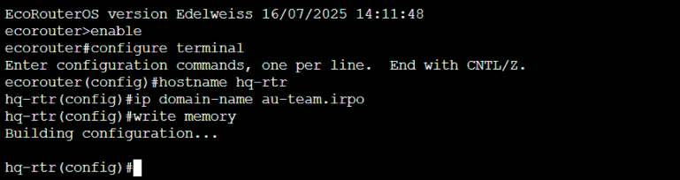

Описание применяемых команд: enable — переход в привилегированный режим; configure terminal — переход в режим конфигурирования; <hostname> — целевое имя машины; ip domain-name — установка доменного имени; <domain-name> — имя домена; write memory — сохранение изменений. Как проверить? Из привилегированного режима используйте команду:

```text
show hostname и show running-config | include domain-name.
```

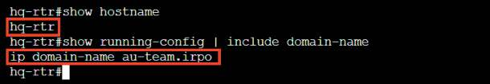

Где выполнять?
На машинах с ОС «EcoRouterOS».
Краткая справка:
- Документация по EcoRouterOS (Wiki) (https://docs.ecorouter.ru/).
Дополнительно:
Имена устройств нужны для упрощения идентификации и управления
ими. Они помогают пользователям легко находить, различать и взаимодействовать с множеством подключенных устройств. Хорошо подобранные имена делают взаимодействие более интуитивным и удобным. Кроме того, когда

<!-- Стр. 20 -->

пользователь подключается удаленно, имя устройства дает ему понимание, на
каком устройстве он работает прямо сейчас.
Где изучается?
2 курс:
- Операционные системы и среды;
- Компьютерные сети и далее.

## Задание 2. На всех устройствах необходимо конфигурировать IPv4.
Подробное описание пункта задания
На всех устройствах необходимо сконфигурировать IPv4:
• IP-адрес должен быть из приватного диапазона в случае, если сеть локальная, согласно RFC1918;
• локальная сеть в сторону HQ-SRV (VLAN 100) должна вмещать не более
32 адресов;
• локальная сеть в сторону HQ-CLI (VLAN 200) должна вмещать не менее
16 адресов;
• локальная сеть для управления (VLAN 999) должна вмещать не более
8 адресов;
• локальная сеть в сторону BR-SRV должна вмещать не более 16 адресов.
Как делать?
Для устройств с ОС «Альт».
Базовая настройка сетевых параметров на ОС «Альт» будет осуществляться
с использованием текстового редактора vim, а также с использованием сетевой подсистемы etcnet. Для открытия файла для редактирования необходимо
прописать vim и нужный путь (например: vim /etc/net/sysctl.conf) до файла,
после чего в открывшемся окне вписываются нужные параметры.
Внимание! Для применения настроек необходимо перезагрузить службу
network командой:

```text
systemctl restart network
```

Просмотр существующих интерфейсов выполняется командой:

```text
ip -c a
```

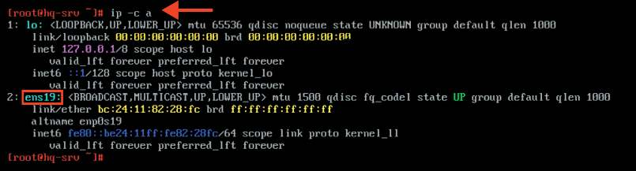

<!-- Стр. 21 -->

Голубым цветом показано название интерфейса (в примере оно может отличаться!). Для конфигурации IPv4 на устройствах будут отредактированы файлы options и созданы файлы ipv4address, ipv4route. В файле /etc/net/ ifaces/<ИМЯ_ИНТЕРФЕЙСА>/options должны быть заданы хотя бы два основных параметра. Параметр TYPE=eth указывает на тип интерфейса — ethernet, параметр BOOTPROTO=static означает, что настройка статического IP-адреса и маршрутов будет взята из файлов ipv4address и ipv4route.


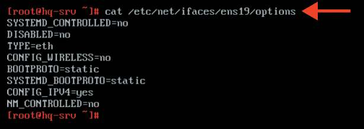

Внимание! Для того, чтобы в качестве сетевой подсистемы корректно использовался etcnet и операционная система могла считывать и применять содержимое конфигурационных файлов: ipv4address, ipv4route, resolv.conf из директории /etc/net/ifaces/<ИМЯ_ИНТЕРФЕЙСА>/, необходимо, чтобы значения параметров DISABLED, NM_CONTROLLED, SYSTEMD_ CONTROLLED были установлены в no или же указание данных параметров в файле options не является обязательным условием.

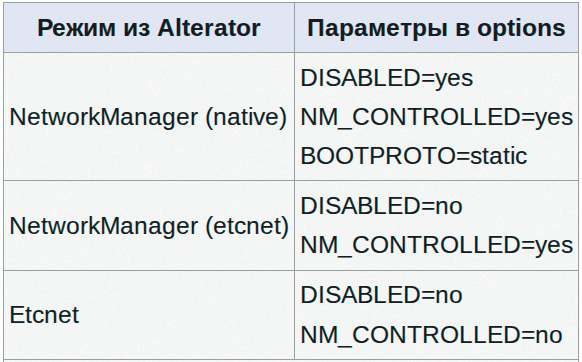

Далее опишем обязательное к указанию содержимое конфигурационных файлов: ipv4address, ipv4route, resolv.conf, используя текстовый редактор vim.

<!-- Стр. 22 -->

### Правила настройки

```text
vim /etc/net/ifaces/<ИМЯ_ИНТЕРФЕЙСА>/ipv4address
```

```text
<IP-адрес>/<Префикс>
```

```text
vim /etc/net/ifaces/<ИМЯ_ИНТЕРФЕЙСА>/ipv4route
```

```text
default via <IP-адрес шлюза>
```

```text
vim /etc/net/ifaces/<ИМЯ_ИНТЕРФЕЙСА>/resolv.conf search <ДОМЕН_ПОИСКА (ДОМЕННОЕ ИМЯ)>
```

```text
nameserver <IP-адрес DNS-сервера>
```

### Пример описания настроек на виртуальных машинах экзаменационного стенда

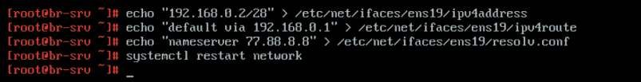

Для применения настроек необходимо перезагрузить службу network командой:

```text
systemctl restart network
```

### Как проверить? Проверка IP-адреса осуществляется командой:

```text
ip –c a
```

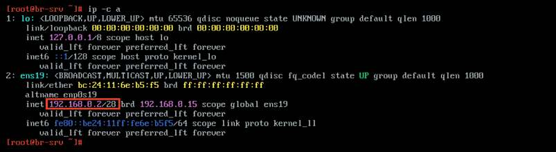

Проверка IP-адреса шлюза по умолчанию осуществляется командой:

```text
ip -c r
```

<!-- Стр. 23 -->

Проверка доступности шлюза по умолчанию осуществляется утилитой:

```text
ping
```

Проверка с hq-srv возможна только после настройки коммутации и маршрутизации между VLAN.

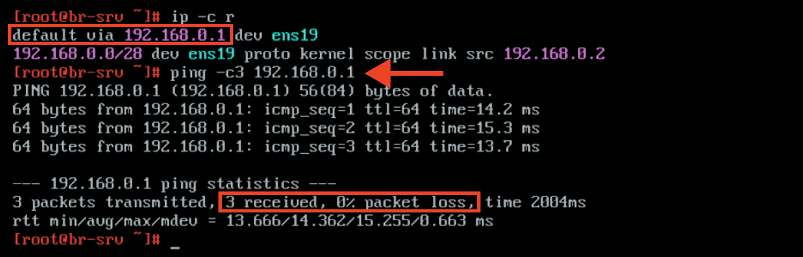

Проверка IP-адреса DNS-сервера осуществляется просмотром содержимого конфигурационного файла /etc/resolv.conf.

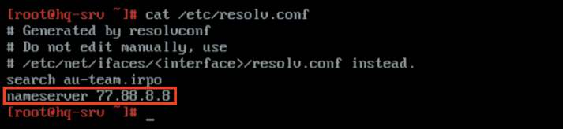

Где выполнять?
На машинах с ОС «Альт»: HQ-SRV, BR-SRV.
Краткая справка:
- подсказки пользователю /etc/net (https://www.altlinux.org/Etcnet);
- на серверах вместо Network Manager удобнее использовать сетевой менеджер Etcnet (https://www.altlinux.org/Etcnet_start).
Как делать?
Для устройств с ОС «EcoRouterOS».
Просмотр существующих портов выполняется командой привилегированного режима: show port или show port brief.

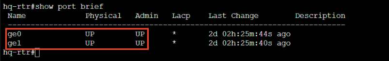

<!-- Стр. 24 -->

Основные понятия, касающиеся EcoRouter:
- порт (port) — это устройство в составе EcoRouter, которое работает на
физическом уровне (L1) модели OSI;
- интерфейс (interface) — это логический интерфейс для адресации,
работает на сетевом уровне (L3);
- service instance (Сабинтерфейс, SI, Сервисный интерфейс) является
логическим сабинтерфейсом, работающим на канальном уровне (L2), связывает L1, L2 и L3:

- данный вид интерфейса необходим для соединения физического порта с интерфейсами L3, интерфейсами bridge, портами;

- используется для гибкого управления трафиком на основании наличия
меток VLANов в фреймах или их отсутствия;

- сквозь сервисный интерфейс проходит весь трафик, приходящий на порт.
Для того чтобы назначить IPv4-адрес на EcoRouter, необходимо придерживаться следующего алгоритма в общем виде:
В режиме администрирования (conf t) создать интерфейс с произвольным именем и назначить на него IPv4:

```text
interface <ИМЯ_ИНТЕРФЕЙСА>
```

```text
ip address <IP-адрес>/<Префикс>
```

В режиме конфигурирования порта создать service-instance с произвольным именем, указать (инкапсулировать), что будет обрабатывать тегированный или нетегированный трафик, указать в какой интерфейс (ранее созданный) нужно отправить обработанные кадры. Для нетегированного трафика:

```text
port <ИМЯ_ПОРТА> service-instance <ИМЯ> encapsulation untagged connect ip interface <ИМЯ_ИНТЕРФЕЙСА>
```

```text
exit
```

Для тегированного трафика:

```text
port <ИМЯ_ПОРТА> service-instance <ИМЯ> encapsulation dot1q <TAG> connect ip interface <ИМЯ_ИНТЕРФЕЙСА>
```

```text
exit
```

<!-- Стр. 25 -->

Также стоит отметить, что интерфейс переходит в состояние «up» только после использования команды connect. Кроме того, команду connect можно использовать и на интерфейсе, так как интерфейс можно связать с портом с помощью команды connect port <ИМЯ_ПОРТА> service-instance <ИМЯ>. Для того чтобы задать IP-адрес шлюза (маршрута) по умолчанию, необходимо выполнить следующую команду из режима администрирования (conf t):

```text
ip route 0.0.0.0/0 <IP-адрес шлюза>
```

Пример описания настроек на виртуальных машинах экзаменационного стенда Создание интерфейсов с последующим назначением IP-адресов, создание сервис-инстансов на порту с указанием тегированного трафика и конкретного интерфейса:

```text
hq-rtr(config)#interface vl100 hq-rtr(config-if)#description “VLAN 100” hq-rtr(config-if)#ip address 192.168.100.1/27 hq-rtr(config-if)#exit hq-rtr(config)#interface vl200 hq-rtr(config-if)#description “VLAN 200” hq-rtr(config-if)#ip address 192.168.200.1/24 hq-rtr(config-if)#exit hq-rtr(config)#interface vl999 hq-rtr(config-if)#description “VLAN 999” hq-rtr(config-if)#ip address 192.168.99.1/29 hq-rtr(config-if)#exit hq-rtr(config)#port ge1 hq-rtr(config-port)#service-instance ge1/vl100 hq-rtr(config-service-instance)#encapsulation dot1q 100 exact hq-rtr(config-service-instance)#rewrite pop 1 hq-rtr(config-service-instance)#connect ip interface vl100 hq-rtr(config-service-instance)#exit hq-rtr(config-port)#service-instance ge1/vl200 hq-rtr(config-service-instance)#encapsulation dot1q 200 exact hq-rtr(config-service-instance)#rewrite pop 1 hq-rtr(config-service-instance)#connect ip interface vl200 hq-rtr(config-service-instance)#exit hq-rtr(config-port)#service-instance ge1/vl999 hq-rtr(config-service-instance)#encapsulation dot1q 999 exact hq-rtr(config-service-instance)#rewrite pop 1 hq-rtr(config-service-instance)#connect ip interface vl999 hq-rtr(config-service-instance)#exit
```

<!-- Стр. 26 -->

```text
hq-rtr(config-port)#exit hq-rtr(config)#write memory
```

Как проверить? Проверка осуществляется командами привилегированного режима. Краткий вывод настройки service-instance:

```text
show service-instance brief
```

Краткий вывод статусов всех интерфейсов:

```text
show ip interface brief
```

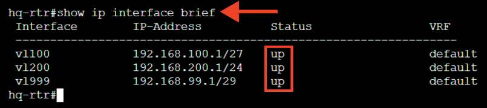

Пример описания настроек на виртуальных машинах экзаменационного стенда Создание сервис-инстанса на порту с указанием нетегированного трафика, с последующим созданием интерфейса и назначением IP-адреса, а также подключения порта на созданный интерфейс:

```text
br-rtr(config)#port ge1 br-rtr(config-port)#service-instance ge1/int1 br-rtr(config-service-instance)#encapsulation untagged br-rtr(config-service-instance)#exit br-rtr(config-port)#exit br-rtr(config)#interface int1 br-rtr(config-if)#description “BR-Net” br-rtr(config-if)#ip address 192.168.0.1/28 br-rtr(config-if)#connect port te1 service-instance ge1/int1 br-rtr(config-if)#exit br-rtr(config)#write memory
```

### Как проверить? Проверка осуществляется командами привилегированного режима.

<!-- Стр. 27 -->

Краткий вывод настройки service-instance:

```text
show service-instance brief
```

Краткий вывод статусов всех интерфейсов:

```text
show ip interface brief
```

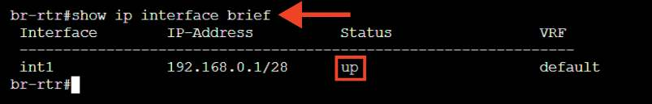

Где выполнять?
На машинах с ОС «EcoRouterOS»: HQ-RTR, BR-RTR.
Краткая справка:
- документация по EcoRouterOS (Wiki) (https://docs.ecorouter.ru/).
Дополнительно:
Знание IPv4 адресации необходимо для:
- сетевой конфигурации: правильной настройки и управления устройствами в сети;
- понимания сетевой архитектуры: формирования сетевых топологий
и маршрутов;
- устранения неполадок: диагностики и решения проблем с подклю
чением;
- безопасности: настройки брандмауэров и контроля доступа.
Где изучается?
2 курс:
- Операционные системы и среды;
- Компьютерные сети.
3 курс:
- Организация, принципы построения и функционирования компьютерных сетей;
- Программное обеспечение компьютерных сетей;
- Организация администрирования компьютерных систем и далее.

## Задание 3. Сведения об адресах занесите в табл. 1.2, в качестве примера используйте Приложение Б. Подробное описание пункта задания Сделать таблицу, учитывая, что IP-адресация должна быть из приватного диапазона в случае, если сеть локальная, согласно RFC1918.

<!-- Стр. 28 -->

### Как делать? На локальной машине с помощью табличного или текстового редактора. Пример заполненной таблицы:

<table>
<thead>
<tr>
<th>Имя устройства</th>
<th>IP-адрес</th>
<th>Шлюз по умолчанию</th>
</tr>
</thead>
<tbody>
<tr>
<td rowspan="4">HQ-RTR</td>
<td>172.16.1.2/28</td>
<td rowspan="4">172.16.1.1</td>
</tr>
<tr>
<td>192.168.100.1/27</td>
</tr>
<tr>
<td>192.168.200.1/24</td>
</tr>
<tr>
<td>192.168.99.1/29</td>
</tr>
<tr>
<td rowspan="2">BR-RTR</td>
<td>172.16.2.2/28</td>
<td rowspan="2">172.16.2.1</td>
</tr>
<tr>
<td>192.168.0.1/28</td>
</tr>
<tr>
<td>HQ-SRV</td>
<td>192.168.100.2/27</td>
<td>192.168.100.1</td>
</tr>
<tr>
<td>HQ-CLI</td>
<td>192.168.200.2/24</td>
<td>192.168.200.1</td>
</tr>
<tr>
<td>BR-SRV</td>
<td>192.168.0.2/28</td>
<td>192.168.0.1</td>
</tr>
</tbody>
</table>

Краткая справка:
- распределение адресов для частных IP-сетей (https://www.ietf.org/rfc/
rfc1918.txt).
Дополнительно:
Создание таблиц адресов устройств в сети с указанием имен, расположения версии операционной системы необходимо для:
- упрощения управления: легче отслеживать и управлять устройствами;
- устранения неполадок: быстрая диагностика проблем с конкретными
устройства;
- безопасности: упрощение настройки доступа и мониторинг;
- оптимизации сетевых ресурсов: эффективное распределение нагрузки
и планирование обновлений;
- повышения эффективности работы сети и облегчения администри
рования.
Где изучается?
- на учебной и производственной практике.
2 курс:
- Компьютерные сети.
3 курс:
- Эксплуатация объектов сетевой инфраструктуры.

### Настройка доступа к сети Интернет

## Задание 1. Настройте адресацию на интерфейсах. Подробное описание пункта задания Интерфейс, подключенный к магистральному провайдеру, получает адрес по DHCP. Настройте маршрут по умолчанию, если это необходимо.

<!-- Стр. 29 -->

### Как делать? Просмотр существующих интерфейсов выполняется командой:

```text
ip a
```

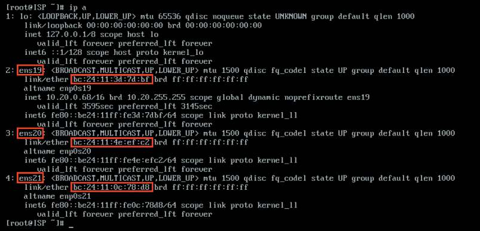

На рисунке красным цветом выделено название интерфейса, в формате «ensXX», и его MAC-адрес, в формате «XX:XX:XX:XX:XX:XX» (в примере они могут отличаться). Для того чтобы понять, какой интерфейс куда настроен, необходимо ориентироваться по их MAC-адресам. В настройках виртуальной машины, в настройках сетевых интерфейсов можно увидеть MAC-адрес и сеть (Bridge), к которой подключен сетевой интерфейс. Для того чтобы интерфейс, подключенный к магистральному провайдеру, получал адрес по DHCP, необходимо в конфигурационном файле, расположенном по пути /etc/net/ifaces/<ИМЯ_ИНТЕРФЕЙСА>/options, в параметре BOOTPROTO указать значение dhcp:

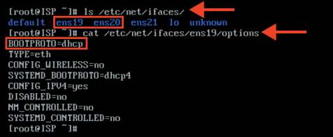

Для применения настроек необходимо перезагрузить службу network командой:

```text
systemctl restart network
```

<!-- Стр. 30 -->

### Как проверить? Проверка IP-адреса осуществляется командой:

```text
ip –с a
```

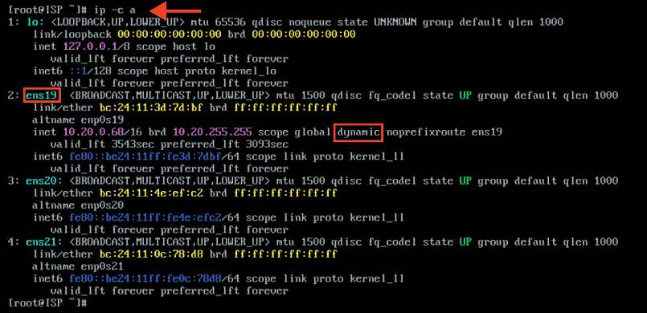

Проверка IP-адреса шлюза по умолчанию осуществляется командой:

```text
ip -c r
```

Проверка доступа к сети Интернет осуществляется утилитой:

```text
ping
```

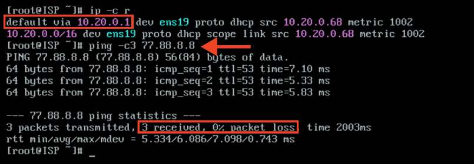

### Где выполнять? На машинах: ISP.

<!-- Стр. 31 -->

Краткая справка:
- подсказки пользователю /etc/net (https://www.altlinux.org/etcnet);
- на серверах, вместо network manager удобнее использовать сетевой менеджер etcnet (https://www.altlinux.org/etcnet_start).
Где изучается?
2 курс:
- Операционные системы и среды;
- Компьютерные сети.

## Задание 2. Настройте интерфейс в сторону HQ-RTR и BR-RTR.
Подробное описание пункта задания:
• настройте интерфейс в сторону HQ-RTR, интерфейс подключен к сети
172.16.1.0/28;
• настройте интерфейс в сторону BR-RTR, интерфейс подключен к сети
172.16.2.0/28.
Как делать?
Для каждого интерфейса необходимо в директории /etc/net/ifaces/
создать директорию с именем данного интерфейса, для этого используется команда mkdir /etc/net/ifaces/<ИМЯ_ИНТЕРФЕЙСА>.
Для каждого интерфейса необходимо в директории /etc/net/ifa
ces/<ИМЯ_ИНТЕРФЕЙСА>/ создать конфигурационный файл options с минимально необходимыми параметрами, а именно: TYPE=eth указывает на тип
интерфейса — ethernet, параметр BOOTPROTO=static означает настройку статических параметров.
Далее опишем содержимое конфигурационного файла ipv4address для
каждого интерфейса, используя текстовый редактор vim или nano.
Правила настройки

```text
vim /etc/net/ifaces/<ИМЯ_ИНТЕРФЕЙСА>/ipv4address <IP-адрес>/<Префикс>
```

Для применения настроек необходимо перезагрузить службу network командой:

```text
systemctl restart network
```

Пример описания настроек на виртуальных машинах экзаменационного стенда Просмотр существующих интерфейсов выполняется командой:

```text
ip –c a
```

<!-- Стр. 32 -->

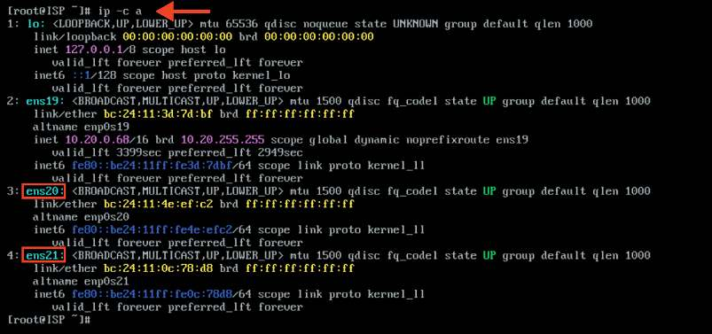

Создание директории для конкретного интерфейса выполняется утилитой mkdir:

```text
mkdir /etc/net/ifaces/ens20 mkdir /etc/net/ifaces/ens21
```

Создание файла options для конкретного интерфейса выполняется с использованием текстового редактора vim и указания необходимых параметров:

```text
vim /etc/net/ifaces/ens20/options vim /etc/net/ifaces/ens21/options
```

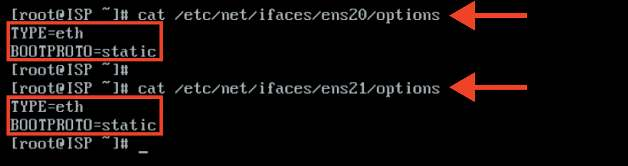

Создание файла ipv4address для конкретного интерфейса выполняется утилитой echo с указанием соответствующих IPv4-адресов:

```text
echo «172.16.1.1/28» > /etc/net/ifaces/ens20/ipv4address echo «172.16.2.1/28» > /etc/net/ifaces/ens20/ipv4address
```

Для применения настроек необходимо перезагрузить службу network командой:

```text
systemctl restart network
```

<!-- Стр. 33 -->

### Как проверить? Проверка IP-адреса осуществляется командой:

```text
ip –c a
```

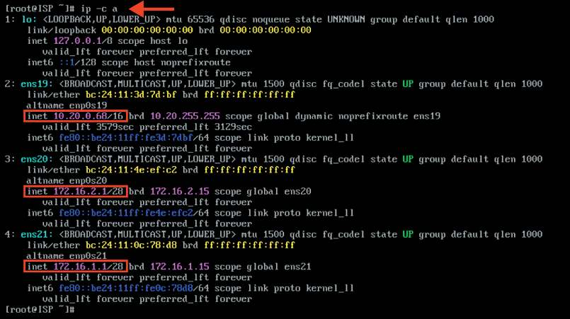

Где выполнять?
На машинах: ISP.
Краткая справка:
- подсказки пользователю /etc/net (https://www.altlinux.org/Etcnet);
- на серверах вместо Network Manager удобнее использовать сетевой менеджер Etcnet (https://www.altlinux.org/Etcnet_start).
Где изучается?
2 курс:
- Операционные системы и среды;
- Компьютерные сети.

## Задание 3. На ISP настройте динамическую сетевую трансляцию портов. Подробное описание пункта задания На ISP настройте динамическую сетевую трансляцию портов для доступа к сети Интернет HQ-RTR и BR-RTR. Как делать? Для того чтобы устройство ISP могло пересылать пакеты с интерфейса на интерфейс, необходимо включить пересылку пакетов (forwarding/передача транзитных пакетов между сетевыми интерфейсами). Для этого следует в конфигурационном файле /etc/net/sysctl.conf в параметре net.ipv4.ip_

<!-- Стр. 34 -->

forward = 0 заменить значение с 0 на 1. Для применения настроек необходимо перезагрузить службу network командой:

```text
systemctl restart network
```

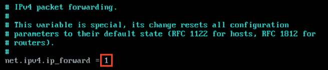

Для динамической сетевой трансляции можно использовать iptables. В случае использования в качестве ОС на ВМ ISP «JeOS» необходимо установить пакет iptables. Выполнить установку можно с помощью команды:

```text
apt-get install iptables
```

предварительно обновив список пакетов с помощью команды:

```text
apt-get update
```

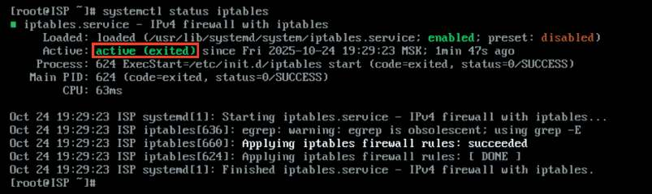

Реализацию сетевой трансляции адресов с помощью iptables можно выполнить одной командой:

```text
iptables –t nat –A POSTROUTING –o <ИМЯ_ВНЕШНЕГО_ИНТЕРФЕЙСА> –j MASQUERADE
```

где: <ИМЯ_ВНЕШНЕГО_ИНТЕРФЕЙСА.> — внешний интерфейс, смотрящий в сторону магистрального провайдера; t — --table (от англ. таблица) — идем по таблице (в данном случае это таблица nat); A — --append (от англ. добавлять) — добавление правила в конец списка;

<!-- Стр. 35 -->

- --out-interface (от англ. наружу, вне, за пределами) — исходящий ин
терфейс;
j — --jump (от англ. прыжок) — прописывается действие, которое будет
выполняться этим правилом.
Сохраните все изменения:

```text
iptables-save >> /etc/sysconfig/iptables
```

Далее необходимо запустить и добавить в автозагрузку службу iptables:

```text
systemctl enable --now iptables
```

Пример описания настроек на виртуальных машинах экзаменационного стенда Включить функцию пересылки пакетов между интерфейсами:

```text
sed –i “s/net.ipv4.ip_forward = 0/net.ipv4.ip_forward = 1/g” /etc/ net/sysctl.conf
```

Для применения настроек необходимо перезагрузить службу network командой:

```text
systemctl restart network
```

Обновить список пакетов и установить пакет iptables:

```text
apt-get update
```

```text
apt-get install –y iptables
```

Создать правила трансляции адресов для доступа к сети Интернет HQ-RTR и BR-RTR:

```text
iptables –t nat –A POSTROUTING –s 172.16.1.0/28 –o ens19 –j MASQUERADE
```

```text
iptables –t nat –A POSTROUTING –s 172.16.2.0/28 –o ens19 –j MASQUERADE
```

Cохранить созданные правила и запустить службу iptables с добавлением в автозагрузку:

```text
iptables-save >> /etc/sysconfig/iptables
```

```text
systemctl enable --now iptables
```

<!-- Стр. 36 -->

### Как проверить? Проверить включение функции пересылки пакетов:

```text
sysctl net.ipv4.ip_forward
```


Проверить наличие правила в таблице nat в цепочке POSTROUTING:

```text
iptables –t nat –L –n –v
```

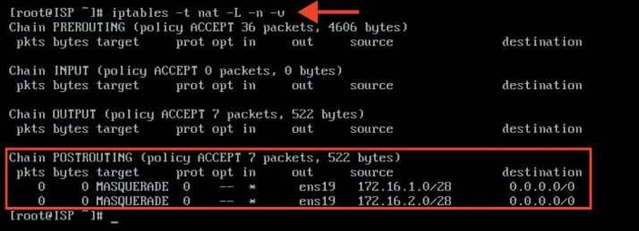

Где выполнять?
На машинах: ISP.
Краткая справка:
- подсказки пользователю /etc/net (https://www.altlinux.org/Etcnet);
- на серверах вместо Network Manager удобнее использовать сетевой менеджер Etcnet (https://www.altlinux.org/Etcnet_start);
- конфигурирование файрвола при помощи iptables (https://www.altlinux.
org/Iptables);
- сетевой экран Iptables (https://www.altlinux.org/Firewall_start);
- Iptables — утилита командной строки для настройки встроенного в ядро
Linux межсетевого экрана (https://wiki.archlinux.org/title/Iptables_(Русский)).
Где изучается?
2 курс:
- Операционные системы и среды;
- Компьютерные сети.

## Задание 4. Настройте адресацию на интерфейсах.
Подробное описание пункта задания
Настройте адресацию на интерфейсах:
• настройте интерфейс на HQ-RTR в сторону ISP, интерфейс подключен
к сети 172.16.1.0/28;

<!-- Стр. 37 -->

- настройте интерфейс на BR-RTR в сторону ISP, интерфейс подключен
к сети 172.16.2.0/28.
Пример описания настроек на виртуальных машинах
экзаменационного стенда
Создание интерфейса с последующим назначением IP-адреса, создание
сервис-инстанса на порту с указанием нетегированного трафика и конкретного
интерфейса:

```text
hq-rtr(config)#interface isp hq-rtr(config-if)#description “ISP” hq-rtr(config-if)#ip address 172.16.1.2/28 hq-rtr(config-if)#exit hq-rtr(config)#ip route 0.0.0.0/0 172.16.1.1 hq-rtr(config)#port ge0 hq-rtr(config-port)#service-instance ge0/isp hq-rtr(config-service-instance)#encapsulation untagged hq-rtr(config-service-instance)#connect ip interface isp hq-rtr(config-service-instance)#exit hq-rtr(config-port)#exit
```

```text
hq-rtr(config)#write memory
```

### Как проверить? Проверка осуществляется командой привилегированного режима:

```text
show ip interface brief
```

```text
show ip route
```

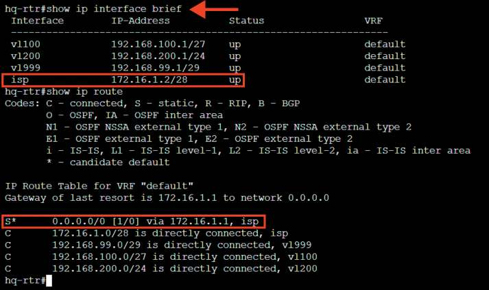

<!-- Стр. 38 -->

Проверка доступности шлюза по умолчанию и доступа в сеть Интернет:

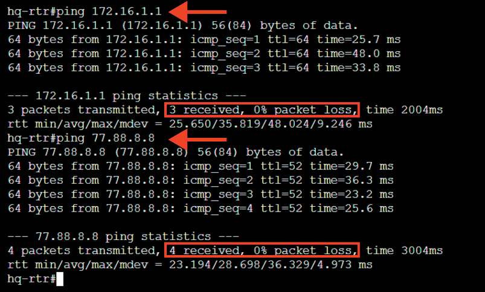

Где выполнять?
На машинах с ОС «EcoRouterOS»: HQ-RTR, BR-RTR.
Краткая справка:
- документация по EcoRouterOS (Wiki) (https://docs.ecorouter.ru/).
Дополнительно:
Знание IPv4 адресации необходимо для:
- сетевой конфигурации: правильной настройки и управления устройствами в сети;
- понимания сетевой архитектуры: формирования сетевых топологий
и маршрутов;
- устранения неполадок: диагностики и решения проблем с подклю
чением;
- безопасности: настройки брандмауэров и контроля доступа.
Где изучается?
2 курс:
- Операционные системы и среды;
- Компьютерные сети.
3 курс:
- Организация, принципы построение и функционирования компьютерных сетей;
- Программное обеспечение компьютерных сетей;
- Организация администрирования компьютерных систем и далее.
