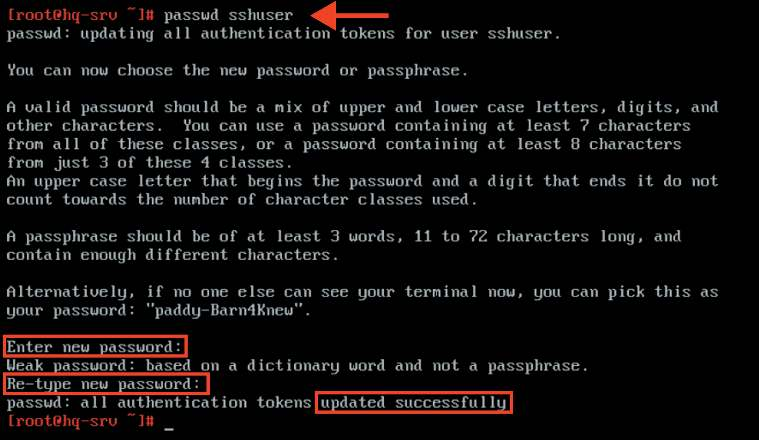
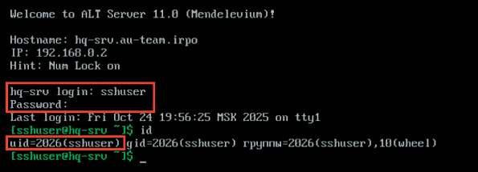
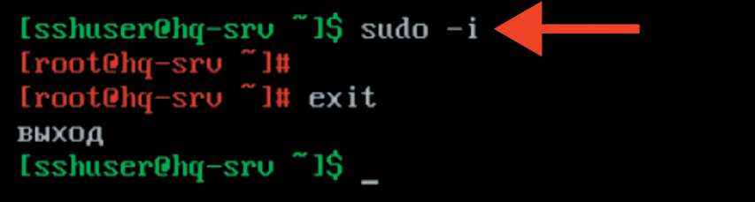
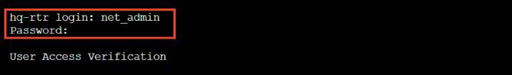
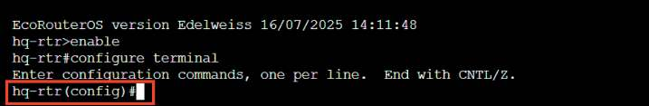
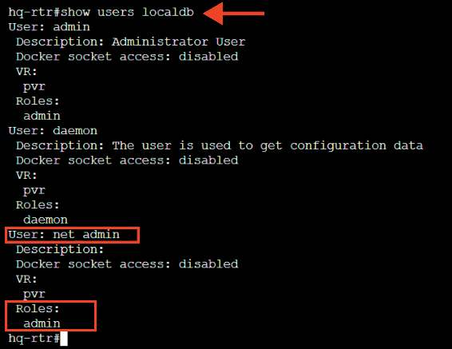

# Создание локальных учетных записей

**Печатные страницы:** 39–43.

<!-- Стр. 39 -->

### Создание локальных учетных записей

## Задание 1. Создайте пользователя sshuser на серверах HQ-SRV и BR-SRV.
Подробное описание пункта задания
Создайте пользователя sshuser на серверах HQ-SRV и BR-SRV:
• пароль пользователя sshuser — P@ssw0rd;
• идентификатор пользователя — 2026;
• пользователь sshuser должен иметь возможность запускать sudo без ввода пароля.
Как делать?
Во время создания учетных записей на ОС «Альт» создается пользователь
sshuser с идентификатором 2026, после чего задается пароль P@ssw0rd.
Затем запускается файл редактирования sudo, где необходимо раскомментировать строку, позволяющую пользователям, входящим в группу wheel,
выполнять через sudo любую команду с любого компьютера, не запрашивая
их пароль.
Создать пользователя с явным указанием UID можно с помощью команды:

```text
useradd <ИМЯ_ПОЛЬЗОВАТЕЛЯ> –u <UID>
```

Задать пароль пользователю можно с помощью утилиты passwd:

```text
passwd <ИМЯ_ПОЛЬЗОВАТЕЛЯ>
```

В результате запуска утилиты passwd необходимо задать пароль, а затем подтвердить заданный пароль. Для редактирования sudo можно воспользоваться командой visudo или явно открыть файл /etc/sudoers в текстовом редакторе vim или nano, после чего следует найти или добавить и раскомментировать строку WHEEL_USERS ALL=(ALL:ALL) NOPASSWD: ALL. Добавить пользователя в группу можно с помощью команды:

```text
gpasswd –a <ИМЯ_ПОЛЬЗОВАТЕЛЯ> <ИМЯ_ГРУППЫ>
```

Пример описания настроек на виртуальных машинах экзаменационного стенда Создать пользователя sshuser с явным указанием UID со значением 2026 можно с помощью команды:

```text
useradd sshuser –u 2026
```

<!-- Стр. 40 -->

Задать пароль для пользователя sshuser можно с помощью утилиты passwd:



Добавить пользователя sshuser в группу wheel можно с помощью команды:

```text
usermod -aG wheel sshuser
```

Добавить строку в конфигурационный файл /etc/sudoers, позволяющую пользователям, входящим в группу wheel, выполнять через sudo любую команду:

```text
echo «sshuser ALL=(ALL:ALL) NOPASSWD: ALL» >> /etc/sudoers
```

Как проверить? Выполнить вход из-под пользователя sshuser с паролем P@ssw0rd и с помощью утилиты id посмотреть UID.



<!-- Стр. 41 -->

Попытаться перейти в режим суперпользователя, используя sudo без ввода пароля.



Где выполнять?
На машинах: HQ-SRV и BR-SRV.
Краткая справка:
- особенности sudo в дистрибутивах ALT Linux (https://www.altlinux.org/
Sudo);
- в дистрибутивах ALT Linux для управления доступом к важным службам
используется подсистема control (https://www.altlinux.org/Control);
- управление пользователями в ОС «Альт» (https://www.altlinux.org/Управление_пользователями).
Дополнительно:
Управление пользователями в Linux включает в себя несколько ключевых
аспектов:
- создание и удаление пользователей: для создания новых пользователей
используется команда useradd, а для удаления — userdel. Эти команды позволяют задавать параметры, такие как домашний каталог и оболочка;
- управление паролями: команда passwd используется для установки
и изменения паролей пользователей. Это важный аспект безопасности системы;
- группы пользователей: пользователи могут быть организованы в группы для упрощения управления правами доступа. Команды groupadd, groupdel
и usermod позволяют создавать, удалять и изменять группы;
- права доступа: в Linux используется модель прав доступа, основанная на
владельцах, группах и других пользователях. Команды chmod, chown и chgrp
позволяют управлять правами доступа к файлам и каталогам;
- просмотр информации о пользователях: команды cat /etc/passwd и cat /
etc/group позволяют просматривать информацию о пользователях и группах.
Команда id показывает идентификаторы пользователя и группы;
- управление сеансами: команды who, w и last позволяют отслеживать активные сеансы пользователей и историю входов.
Где изучается?
2 курс:
- Операционные системы и среды;
- Компьютерные сети.

<!-- Стр. 42 -->

## Задание 2. Создайте пользователя net_admin на маршрутизаторах HQ-RTR
и BR-RTR.
Подробное описание пункта задания
Создайте пользователя net_admin на маршрутизаторах HQ-RTR и BR-RTR:
• пользователь net_admin с паролем P@ssw0rd;
• при настройке ОС на базе Linux нужно запускать sudo без ввода пароля;
• при настройке ОС отличных от Linux пользователь должен обладать максимальными привилегиями.
Как делать?
Во время создания учетных записей на EcoRouterOS создается пользователь net_admin, после чего задается пароль P@ssw0rd. Затем созданному ранее пользователю присваиваются привилегии (роль) администратора.
Создать пользователя можно из режима администрирования (conf t) при
помощи команды:

```text
username <ИМЯ_ПОЛЬЗОВАТЕЛЯ>
```

Задать пароль для пользователя можно из режима конфигурирования пользователя (перейти в него можно, использовав username <ИМЯ_ПОЛЬЗО- ВАТЕЛЯ>) с помощью команды:

```text
password <ПАРОЛЬ>
```

Задать необходимую роль для пользователя можно из режима конфигурирования пользователя (перейти в него можно, использовав username <ИМЯ_ ПОЛЬЗОВАТЕЛЯ>) с помощью команды:

```text
role <РОЛЬ>
```

Доступные роли: admin — права администратора; helpdesk — привилегия поддержки; noc — привилегии оператора. Пример описания настроек на виртуальных машинах экзаменационного стенда

```text
hq-rtr(config)#username net_admin hq-rtr(config-user)#password P@ssw0rd hq-rtr(config-user)#role admin hq-rtr(config-user)#exit
```

```text
hq-rtr(config)#write memory
```

<!-- Стр. 43 -->

### Как проверить? Выполнить вход из-под пользователя net_admin с паролем P@ssw0rd.






Проверить роль, заданную для пользователя net_admin, можно, использовав команду привилегированного режима:

```text
show users localdb
```



Где выполнять?
На машинах: HQ-RTR и BR-RTR.
Краткая справка:
- документация по EcoRouterOS (Wiki) (https://docs.ecorouter.ru/).
Где изучается?
2 курс:
- Операционные системы и среды;
- Компьютерные сети.
