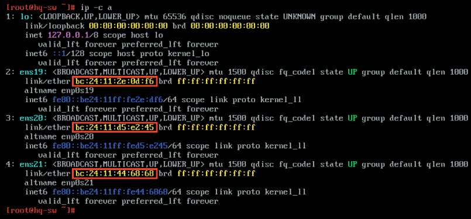
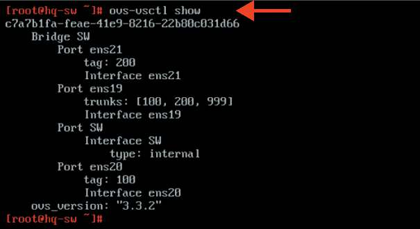

# Настройка коммутации, если HQ-SW — виртуальная машина

**Печатные страницы:** 44–45.

<!-- Стр. 44 -->

### Настройка коммутации, если HQ-SW — виртуальная машина

Подробное описание пункта задания
Настройте коммутацию в сегменте HQ следующим образом:
- трафик HQ-SRV должен принадлежать VLAN 100;
- трафик HQ-CLI должен принадлежать VLAN 200;
- предусмотрите возможность передачи трафика управления в VLAN 999;
- реализуйте на HQ-RTR маршрутизацию трафика всех указанных VLAN
с использованием одного сетевого адаптера ВМ/физического порта;
- сведения о настройке коммутации внесите в отчет.
Как делать?
Убедитесь, что службы ovs-vswitchd и ovsdb-server запущены, интерфейсы ovs включены и переведены в режим manual. Для этого необходимо
установить openvswitch командой apt-get install openvswitch, после
чего добавить в автозагрузку:

```text
systemctl enable –-now openvswitch
```

Для всех интерфейсов должны быть созданы свои директории в /etc/net/ ifaces/ и файл /etc/net/ifaces/<ИМЯ_ИНТЕРФЕЙСА>/options, в котором прописано TYPE = eth. После этого перезагрузите network командой:

```text
systemctl restart network
```

Сверку соответствия сетям рекомендуется проводить по MAC-адресам.



<!-- Стр. 45 -->

На конкретном стенде интерфейс ens3 подключен к HQ-RTR, ens4 к HQ-SRV, интерфейс ens5 к HQ-CLI. Таким образом, очевидно, что интерфейс ens3 будет выполнять роль «trunk», ens4 тегировать vlan 100, ens5 тегировать vlan 200. Создать мост:

```text
ovs-vsctl add-br SW
```

Добавить в мост транковый интерфейс:

```text
ovs-vsctl add-port SW ens3 trunk=100,200,999
```

Добавить в мост интерфейс доступа, трафик которого будет тегироваться:

```text
ovs-vsctl add-port SW ens4 tag=100
```

Добавить в мост интерфейс доступа, трафик которого будет тегироваться:

```text
ovs-vsctl add-port SW ens5 tag=200
```

### Как проверить?

```text
ovs-vsctl show
```



Где выполнять?
На HQ-SW.
Дополнительно:
Преимущества Open vSwitch:
- масштабируемость: Open vSwitch (OVS) поддерживает большое количество виртуальных машин и сетевых интерфейсов, что делает его идеальным для
облачных и виртуализированных сред;
