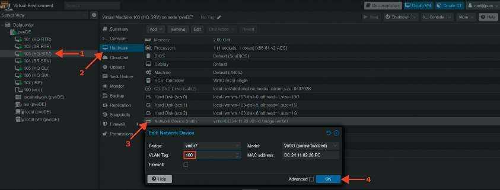
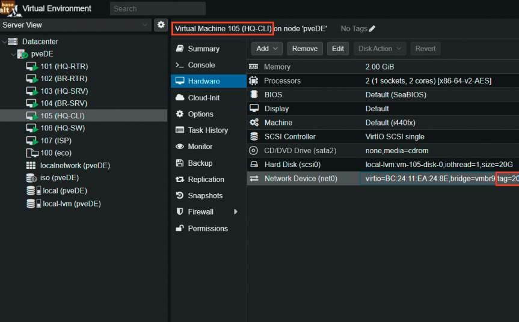

# Настройка коммутации, если HQ-SW не является виртуальной машиной

**Печатные страницы:** 46–47.

КОД 09.02.06-1-2026 СЕТЕВОЙ И СИСТЕМНЫЙ АДМИНИСТРАТОР

• гибкость и расширяемость: OVS можно настраивать и расширять с помощью различных плагинов и модулей, что позволяет адаптировать его под

специфические требования сети;

• поддержка виртуальных сетей: OVS позволяет создавать сложные виртуальные сетевые топологии, включая VLAN, VXLAN и GRE, что упрощает управ-

ление сетевыми ресурсами;

• мониторинг и диагностика: OVS предоставляет мощные инструменты

для мониторинга трафика и диагностики сетевых проблем, что облегчает администрирование и оптимизацию сети;

• интеграция с контейнерами: OVS хорошо работает с контейнерными технологиями, такими как Docker и Kubernetes, обеспечивая эффективное управ-

ление сетевыми ресурсами в контейнеризованных приложениях;

• поддержка QoS: Open vSwitch позволяет настраивать политику качества

обслуживания (QoS), что помогает управлять пропускной способностью и приоритизировать трафик;

• безопасность: OVS поддерживает различные механизмы безопасности,

включая фильтрацию трафика и контроль доступа, что повышает уровень защиты сети.

Эти преимущества делают Open vSwitch мощным инструментом для

управления виртуальными сетями в современных IT-инфраструктурах.

## Краткая справка

– официальная документация Open vSwitch (https://docs.openvswitch.org/

en/latest/);

– настройка openvswitch из etcnet (https://www.altlinux.org/Etcnet/

openvswitch);

– о настройке Open vSwitch непростым языком (https://habr.com/ru/

articles/325560/).

## Где изучается?

– на учебной и производственной практике.

2 курс:

– Компьютерные сети.

3 курс:

– Организация, принципы построения и функционирования компьютерных сетей.

Настройка коммутации,

если HQ-SW не является

виртуальной машиной

## Подробное описание пункта задания

Настройте коммутацию в сегменте HQ следующим образом:

• трафик HQ-SRV должен принадлежать VLAN 100;

• трафик HQ-CLI должен принадлежать VLAN 200;

• предусмотреть возможность передачи трафика управления в VLAN 999;

• реализовать на HQ-RTR маршрутизацию трафика всех указанных VLAN

с использованием одного сетевого адаптера ВМ/физического порта;

• сведения о настройке коммутации внесите в отчет.

## Как делать?

Поскольку данный вариант не подразумевает использование в качестве

HQ-SW выделенной виртуальной машины, необходимо на конечных устройствах настроить порты доступа на уровне гипервизора, например, «Альт Вир-

туализация» (редакция PVE).

Пример описания настроек на виртуальных машинах

экзаменационного стенда

Настройка порта доступа для виртуальной машины HQ-SRV с указанием

VID — 100:

Настройка порта доступа для виртуальной машины HQ-CLI с указанием

VID — 200:

---

## Иллюстрации из PDF

