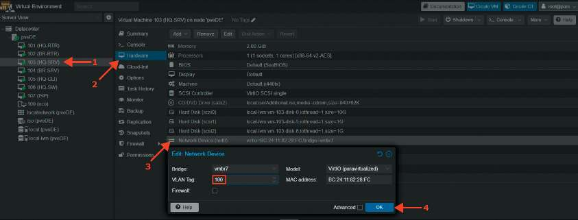
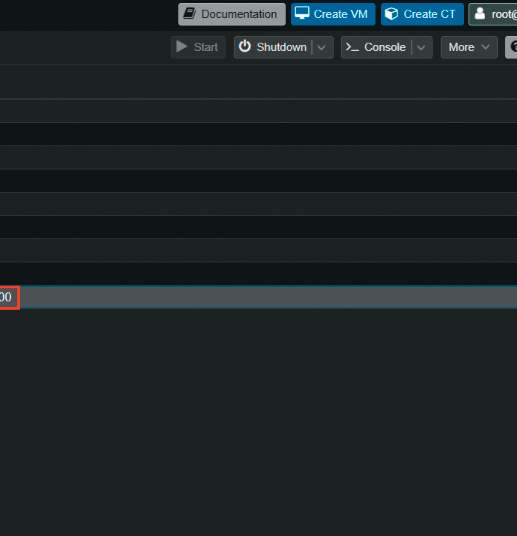

# Коммутация: VLAN на гипервизоре

Вариант без отдельной ВМ HQ-SW. На гипервизоре включи VLAN-aware для используемого моста и настрой сетевые адаптеры:

| ВМ | VLAN tag | Подключение |
| --- | --- | --- |
| HQ-SRV | 100 | access |
| HQ-CLI | 200 | access |
| HQ-RTR, адаптер к локальной сети | без access-тега | trunk: 100, 200, 999 |

> **Важно:** VLAN на HQ-RTR настраиваются внутри EcoRouter через один порт (см. [базовую настройку](./01-base-setup.md)). Не назначай access-тег адаптеру trunk. На конечных ВМ повторно тегировать трафик не нужно.

Проверка с HQ-SRV: `ping 192.168.100.1`. Сведения о коммутации внеси в отчет.
