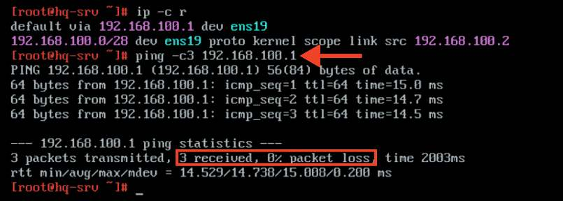
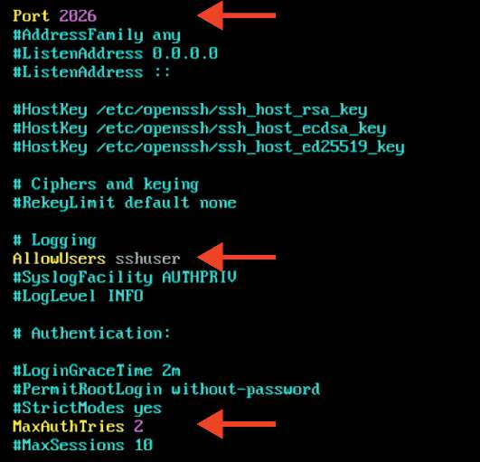
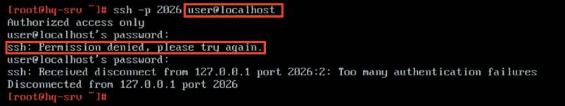
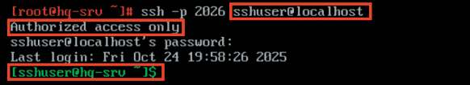
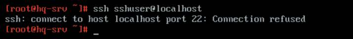
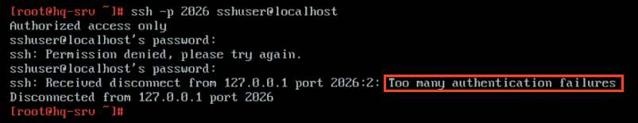

# Настройка безопасного удаленного доступа

**Печатные страницы:** 48–50.

<!-- Стр. 48 -->

### Как проверить? Средствами утилиты ping проверить связность с HQ-SRV до HQ-RTR:



Где выполнять?
На машинах: гипервизор (порты доступа).
Краткая справка:
- PVE поддерживает настройку VLAN для гостевых систем «из коробки» (https://docs.altlinux.org/ru-RU/alt-server-v/11.0/html/alt-server-v/ch28s06.
html).
Где изучается?
2 курс:
- Компьютерные сети.
3 курс:
- Организация, принципы построение и функционирования компьютерных сетей;
- Программное обеспечение компьютерных сетей;
- Организация администрирования компьютерных систем и далее.

### Настройка безопасного удаленного доступа

Подробное описание пункта задания
Настройте безопасный удаленный доступ на серверах HQ-SRV и BR-SRV:
- для подключения используйте порт 2026;
- разрешите подключения исключительно пользователю sshuser;
- ограничьте количество попыток входа до двух;
- настройте баннер «Authorized access only».
Как делать?
Редактируем конфигурационный файл openssh, расположенный по пути /
etc/openssh/sshd_config, текстовым редактором vim. Находим следующие
параметры и приводим их к следующему виду:

<!-- Стр. 49 -->




Здесь:
- Port 2026 — порт, на котором следует ожидать запросы на соединение.
Значение по умолчанию — 22;
- AllowUsers sshuser — список имен пользователей через пробел. Если
параметр определен, регистрация в системе будет разрешена только пользователям, чьи имена соответствуют одному из шаблонов;
- MaxAuthTries 2 — ограничение на число попыток идентифицировать
себя в течение одного соединения;
- Banner /etc/openssh/banner — содержимое указанного файла будет
отправлено удаленному пользователю прежде, чем будет разрешена аутентификация.
Редактируем баннер, а именно файл по пути /etc/openssh/banner и добавляем в него следующее содержимое Authorized access only:

```text
echo «Authorized access only» > /etc/openssh/banner
```

Для применения всех изменений необходимо перезапустить службу sshd, для этого можно использовать команду:

```text
systemctl restart sshd
```

<!-- Стр. 50 -->

### Как проверить? Попытаться подключиться не из-под пользователя sshuser:



Попытаться подключиться под пользователем sshuser:



Попытаться подключиться под пользователем sshuser на стандартный порт ssh:



Попытаться подключиться под пользователем sshuser с указанием неверных паролей более чем 2 раза:



Где выполнять?
На серверах: HQ-SRV и BR-SRV.
Дополнительно:
ssh (secure shell) — это сетевой протокол, который обеспечивает безопасный доступ к удаленным системам. Вот несколько ключевых преимуществ SSH:
- безопасность: SSH шифрует данные, передаваемые между клиентом
и сервером, защищая их от перехвата;
- аутентификация: поддержка как парольной аутентификации, так и аутентификации с помощью ключей, что повышает уровень безопасности;
- удаленное управление: позволяет администраторам безопасно управлять серверами и другими устройствами из любого места;
