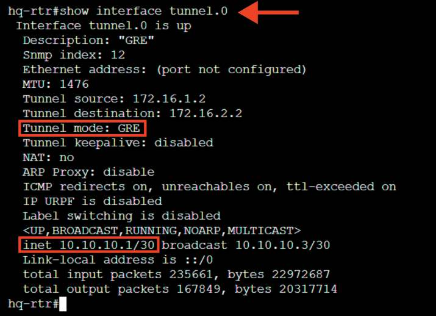

# Настройка на маршрутизаторах IP-туннеля с использованием технологии GRE

**Печатные страницы:** 51–52.

<!-- Стр. 51 -->

- создание туннелей: возможность перенаправления сетевого трафика
(SSH-туннели) обеспечивает безопасность для других протоколов;
- поддержка сценариев: SSH позволяет автоматизировать задачи через
скрипты, что упрощает администрирование. SSH является важным инструментом для безопасного управления системами и передачи данных в сетевой среде.
Краткая справка:
- создание и настройка входа через ssh (https://www.altlinux.org/SSH);
- доступ по SSH (https://www.altlinux.org/Доступ_по_SSH);
- man_sshd_(https://www.opennet.ru/man.shtml?topic=sshd_config&
category=5&russian=0).
Где изучается?
2 курс:
- Операционные системы и среды;
- Компьютерные сети и далее.

### Настройка на маршрутизаторах IP-туннеля с использованием технологии GRE

Подробное описание пункта задания
Между офисами HQ и BR на маршрутизаторах HQ-RTR и BR-RTR необходимо сконфигурировать IP-туннель:
- на выбор технологии GRE или IP in IP;
- сведения о туннеле занесите в отчет.
Как делать?
Для создания интерфейса GRE-туннеля на ОС «EcoRouterOS» создается
интерфейс tunnel.<№>, для этого из режима администрирования (conf t) используется команда:

```text
interface tunnel.<№>
```

После чего интерфейсу назначается IP-адрес, для этого используется команда (в режиме конфигурирования туннельного интерфейса):

```text
ip address <IP-адрес>/<Префикс>
```

Затем выставляется параметр ip tunnel, в котором необходимо указать адрес источника и назначения, а также режим работы туннеля:

```text
ip tunnel <IP-адрес_ИСТОЧНИКА> <IP-адрес_НАЗНАЧЕНИЯ> mode <ТУННЕЛЬ- НЫЙ_РЕЖИМ>
```

Туннельный режим должен быть выбран как gre.

<!-- Стр. 52 -->

### Пример описания настроек на виртуальных машинах экзаменационного стенда

```text
hq-rtr(config)#interface tunnel.0 hq-rtr(config-if-tunnel)#description “GRE” hq-rtr(config-if-tunnel)#ip address 10.10.10.1/30 hq-rtr(config-if-tunnel)#ip tunnel 172.16.1.2 172.16.2.2 mode gre hq-rtr(config-if-tunnel)#exit hq-rtr(config)#write memory
```

```text
br-rtr(config)#interface tunnel.0 br-rtr(config-if-tunnel)#description “GRE” br-rtr(config-if-tunnel)#ip address 10.10.10.2/30 br-rtr(config-if-tunnel)#ip tunnel 172.16.2.2 172.16.1.2 mode gre br-rtr(config-if-tunnel)#exit
```

```text
br-rtr(config)#write memory
```

### Как проверить? Выполнить команду (из привилегированного режима):

```text
show interface tunnel.<№>
```


