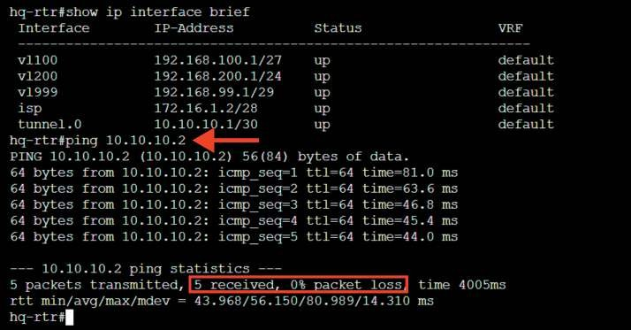
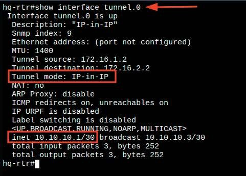
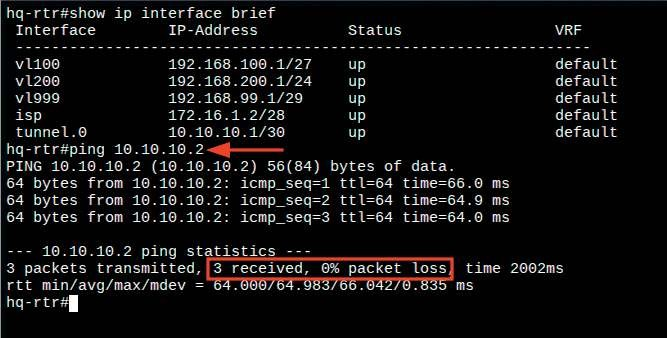

# Настройка на маршрутизаторах IP-туннеля с использованием технологии IP in IP

**Печатные страницы:** 53–55.

Средствами утилиты ping проверить связность с противоположной стороной туннеля:

## Где выполнять?

На машинах: HQ-RTR и BR-RTR.

## Дополнительно

Применение GRE:

• связывание удаленных сетей: GRE часто используется для создания соединений между офисами, находящимися в разных местах;

• виртуальные частные сети (VPN): можно использовать в сочетании

с IPsec для создания защищенных VPN-соединений;

• тестирование и лабораторные сценарии: GRE может быть использован

для имитации различных сетевых топологий и конфигураций. Таким образом,

GRE-туннели являются эффективным способом инкапсуляции и передачи данных в различных сетевых сценариях.

## Краткая справка

– документация по EcoRouterOS (Wiki) (https://docs.ecorouter.ru/).

## Где изучается?

2 курс:

– Компьютерные сети и далее.

Настройка на маршрутизаторах IP-туннеля

с использованием технологии IP in IP

## Подробное описание пункта задания

Между офисами HQ и BR на маршрутизаторах HQ-RTR и BR-RTR необходимо сконфигурировать IP-туннель:

• на выбор технологии GRE или IP in IP;

• сведения о туннеле занесите в отчет.

КОД 09.02.06-1-2026 СЕТЕВОЙ И СИСТЕМНЫЙ АДМИНИСТРАТОР

## Как делать?

Для создания интерфейса IP-in-IP-туннеля на ОС «EcoRouterOS» создается интерфейс tunnel.<№>, для этого из режима администрирования (conf t)

используется команда:

interface tunnel.<№>

После чего интерфейсу назначается IP-адрес, для этого используется команда (в режиме конфигурирования туннельного интерфейса):

ip address <IP-адрес>/<Префикс>

Выставляется значение MTU, для этого используется команда (в режиме

конфигурирования туннельного интерфейса):

ip mtu <значение_MTU>

Затем выставляется параметр ip tunnel, в котором необходимо указать

адрес источника и назначения, а также режим работы туннеля:

ip tunnel <IP-адрес_ИСТОЧНИКА> <IP-адрес_НАЗНАЧЕНИЯ> mode <ТУННЕЛЬ-

НЫЙ_РЕЖИМ>

Туннельный режим должен быть выбран как ipip.

Пример описания настроек на виртуальных машинах

экзаменационного стенда

hq-rtr(config)#interface tunnel.0

hq-rtr(config-if-tunnel)#description “IP-in-IP”

hq-rtr(config-if-tunnel)#ip address 10.10.10.1/30

hq-rtr(config-if-tunnel)#ip mtu 1400

hq-rtr(config-if-tunnel)#ip tunnel 172.16.1.2 172.16.2.2 mode ipip

hq-rtr(config-if-tunnel)#exit

hq-rtr(config)#write memory

br-rtr(config)#interface tunnel.0

br-rtr(config-if-tunnel)#description “IP-in-IP”

br-rtr(config-if-tunnel)#ip address 10.10.10.2/30

br-rtr(config-if-tunnel)#ip mtu 1400

br-rtr(config-if-tunnel)#ip tunnel 172.16.2.2 172.16.1.2 mode ipip

br-rtr(config-if-tunnel)#exit

br-rtr(config)#write memory

## Как проверить?

Выполнить команду (из привилегированного режима): show interface

tunnel.<№>

Средствами утилиты ping проверить связность с противоположной стороной туннеля:

## Где выполнять?

На машинах: HQ-RTR и BR-RTR.

## Дополнительно

IP in IP — механизм туннелирования, который помещает один IP-пакет

в другой IP-пакет.

Процесс туннелирования заключается в добавлении еще одного IP-заголовка к стандартному IP-пакету. В верхнем заголовке будут содержаться

---

## Иллюстрации из PDF

