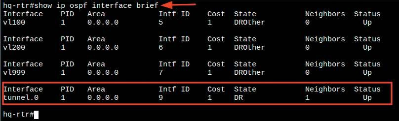
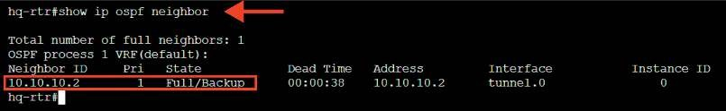
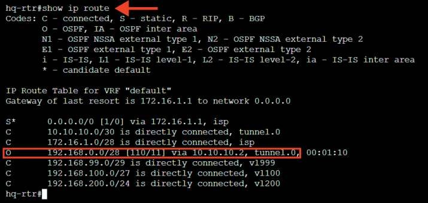
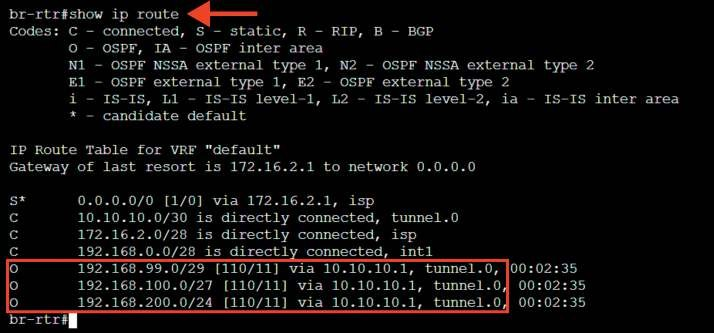
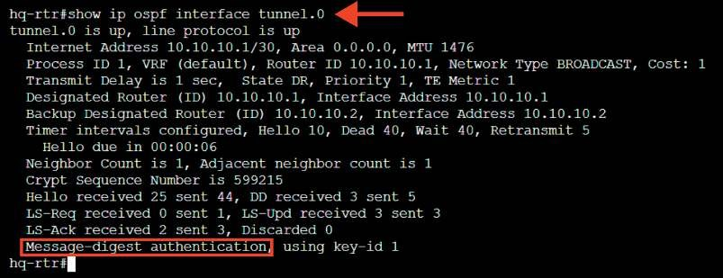
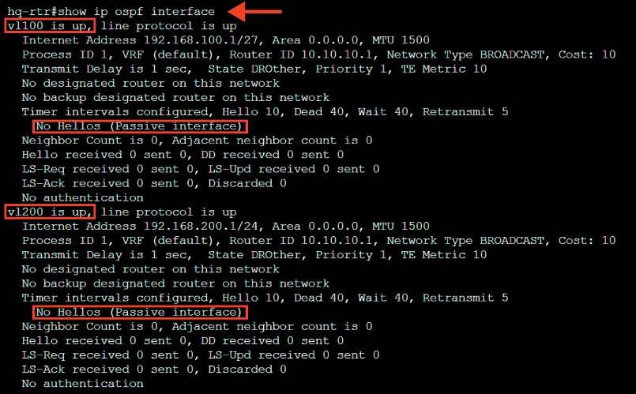
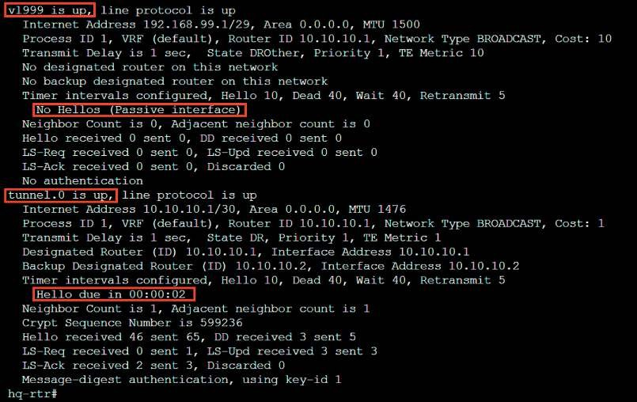
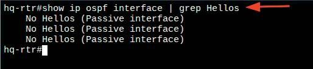
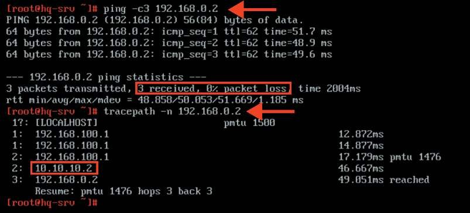
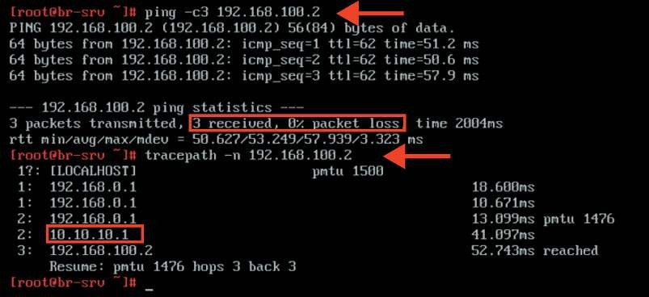

# Настройка динамической маршрутизации

**Печатные страницы:** 56–61.

КОД 09.02.06-1-2026 СЕТЕВОЙ И СИСТЕМНЫЙ АДМИНИСТРАТОР

IP-адреса начала и окончания туннеля. После доставки на маршрутизатор, на

котором находится окончание туннеля, верхний заголовок снимается, пакет

передается с обычным, внутренним IP-заголовком дальше.

Типичная размерность MTU для L3 интерфейса 1500 байт. В связи с добавлением служебного заголовка появляются новые требования к допустимо-

му значению MTU при передаче пакета. Заголовок IP in IP имеет размерность

20 байт, заголовок IP-пакета 20 байт, таким образом возникает необходимость

задавать размер допустимого MTU на интерфейсах туннеля меньше стандартного значения для Ethernet.

## Краткая справка

– документация по EcoRouterOS (Wiki) (https://docs.ecorouter.ru/).

## Где изучается?

2 курс:

– Компьютерные сети и далее.

Настройка динамической маршрутизации

## Подробное описание пункта задания

Обеспечьте динамическую маршрутизацию на маршрутизаторах HQ-RTR

и BR-RTR: сети одного офиса должны быть доступны из другого офиса и наоборот. Для обеспечения динамической маршрутизации используйте link state

протокол (на усмотрение участника):

• разрешите выбранный протокол только на интерфейсах IP-туннеля;

• маршрутизаторы должны делиться маршрутами только друг с другом;

• обеспечьте защиту выбранного протокола посредством парольной защиты;

• сведения о настройке и защите протокола занесите в отчет.

## Как делать?

Создать процесс OSPF можно, используя следующую команду из режима

администрирования (conf t):

router ospf <№>

Объявить сети для динамической маршрутизации в созданном процессе OSPF можно из режима конфигурирования процесса OSPF следующей ко

мандой:

network <IP-АДРЕС_СЕТИ>/<ПРЕФИКС> area <№>

Исключить все интерфейсы из процесса OSPF можно из режима конфигурирования процесса OSPF следующей командой:

passive-interface default

­

Добавить исключение, чтобы интерфейс использовался в процессе OSPF,

можно из режима конфигурирования процесса OSPF следующей командой:

no passive-interface <ИМЯ_ИНТЕРФЕЙСА>

Включить аутентификацию для всех интерфейсов определенной области

можно из режима конфигурирования процесса OSPF следующей командой:

area <№> authentication

Для обеспечения парольной защиты OSPF можно указать ключ аутентификации на конкретном интерфейсе, для этого необходимо выполнить команды

из режима администрирования (conf t):

interface <ИМЯ_ИНТЕРФЕЙСА>

ip ospf authentification-key <ПАРОЛЬ>

Пример описания настроек на виртуальных машинах

экзаменационного стенда

hq-rtr(config)#router ospf 1

hq-rtr(config-router)#ospf router-id 10.10.10.1

hq-rtr(config-router)#passive-interface default

hq-rtr(config-router)#no passive-interface tunnel.0

hq-rtr(config-router)#network 10.10.10.0/30 area 0

hq-rtr(config-router)#network 192.168.100.0/27 area 0

hq-rtr(config-router)#network 192.168.200.0/24 area 0

hq-rtr(config-router)#network 192.168.99.0/29 area 0

hq-rtr(config-router)#exit

hq-rtr(config)#interface tunnel.0

hq-rtr(config-if-tunnel)#ip ospf authentication message-digest

hq-rtr(config-if-tunnel)#ip ospf message-digest-key 1 md5

P@ssw0rd

hq-rtr(config-if-tunnel)#exit

hq-rtr(config)#write memory

br-rtr(config)#router ospf 1

br-rtr(config-router)#ospf router-id 10.10.10.2

br-rtr(config-router)#passive-interface default

КОД 09.02.06-1-2026 СЕТЕВОЙ И СИСТЕМНЫЙ АДМИНИСТРАТОР

br-rtr(config-router)#no passive-interface tunnel.0

br-rtr(config-router)#network 192.168.0.0/28 area 0

br-rtr(config-router)#network 10.10.10.0/30 area 0

br-rtr(config-router)#exit

br-rtr(config)#interface tunnel.0

br-rtr(config-if-tunnel)#ip ospf authentication message-digest

br-rtr(config-if-tunnel)#ip ospf message-digest-key 1 md5 P@ssw0rd

br-rtr(config-if-tunnel)#exit

br-rtr(config)#write memory

## Как проверить?

Для просмотра данных о состоянии и сконфигурированных настройках на

интерфейсах, участвующих в OSPF процессе, воспользуйтесь командой:

show ip ospf interface brief

Проверить установление соседских отношений можно из привилегированного режима с помощью команды:

show ip ospf neighbor

Проверить таблицу маршрутизации (маршруты по ospf) можно из привилегированного режима с помощью команды:

show ip route ospf

Проверить защиту выбранного протокола посредством парольной защиты

можно из привилегированного режима с помощью команды:

show ip ospf interface tunnel.0

КОД 09.02.06-1-2026 СЕТЕВОЙ И СИСТЕМНЫЙ АДМИНИСТРАТОР

Проверить, что маршрутизаторы должны делиться маршрутами только

друг с другом, можно из привилегированного режима с помощью команды:

show ip ospf interface

Или с помощью команды:

show ip ospf interface | grep Hellos

Средствами утилиты ping и tracepath проверить связность между BR-

SRV и HQ-SRV:

## Где выполнять?

На машинах: HQ-RTR, BR-RTR, BR-SRV и HQ-SRV.

---

## Иллюстрации из PDF

