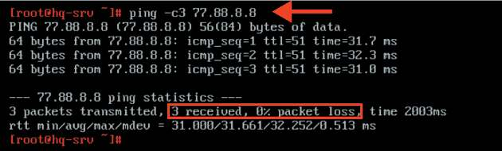
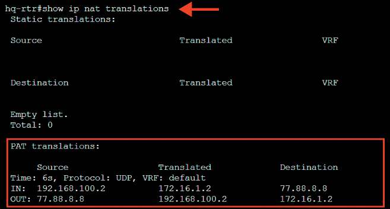

# Настройка динамической трансляции адресов

**Печатные страницы:** 62–64.

<!-- Стр. 62 -->

Дополнительно:
OSPF (Open Shortest Path First) — это протокол динамической маршрутизации, который используется для передачи данных в IP-сетях.
OSPF является одним из наиболее распространенных протоколов маршрутизации в корпоративных сетях благодаря своей эффективности, надежности
и адаптивности к изменяющимся условиям.
Вот несколько ключевых преимуществ OSPF:
- быстрая сходимость: OSPF быстро адаптируется к изменениям в сети,
что позволяет ему быстро находить новые маршруты и обеспечивать высокую
доступность;
- поддержка больших сетей: OSPF эффективно работает в крупных сетях,
поддерживая иерархическую структуру с использованием областей (areas), что
позволяет оптимизировать процесс маршрутизации и уменьшить нагрузку на
маршрутизаторы;
- адаптивность к изменениям: OSPF использует алгоритмы SPF (Shortest
Path First), которые позволяют ему находить кратчайший путь к каждой цели,
учитывая текущие условия в сети;
- поддержка многоадресной рассылки: OSPF может эффективно использовать многоадресную рассылку для обновления маршрутов, что уменьшает
количество дублирующего трафика;
- поддержка аутентификации: OSPF обеспечивает возможность настройки
аутентификации, что повышает уровень безопасности при обмене маршрутной
информацией между маршрутизаторами;
- интеграция с IPv6: OSPFv3 поддерживает маршрутизацию для IPv6, что
делает его актуальным в современных сетевых инфраструктурах;
- управляемый трафик: OSPF имеет механизмы, позволяющие управлять
маршрутным трафиком и обеспечивать балансировку нагрузки;
- гибкость: позволяет настраивать различные параметры, такие как приоритеты интерфейсов и стоимости маршрутов, что делает его очень гибким
инструментом для администраторов сетей.
Краткая справка:
- документация по EcoRouterOS (Wiki) (https://docs.ecorouter.ru/).
Где изучается?
2 курс:
- Компьютерные сети и далее на других курсах.

### Настройка динамической трансляции адресов

Подробное описание пункта задания
Настройка динамической трансляции адресов на маршрутизаторах HQ-
RTR и BR-RTR:
- настройте динамическую трансляцию адресов для обоих офисов в сторону ISP, все устройства в офисах должны иметь доступ к сети Интернет.

<!-- Стр. 63 -->

Как делать? Определить «внутренний интерфейс NAT» (inside) и «внешний интерфейс NAT» (outside) можно в режиме конфигурирования интерфейса:

```text
interface <ИМЯ_ИНТЕРФЕЙСА>
```

```text
ip nat <inside | outside>
```

Определить пул адресов для дальнейшего использования данного пула в правилах трансляции можно из режима администрирования (conf t) при помощи команды:

```text
ip nat pool <ИМЯ_ПУЛА> <IP-АДРЕС_НАЧАЛА_ДИАПАЗОНА>-<IP-АДРЕС_ОКОН- ЧАНИЯ_ДИАПАЗОНА>
```

Создать правило динамической трансляции адресов можно из режима администрирования (conf t) при помощи команды:

```text
ip nat source dynamic inside-to-outside pool <ИМЯ_ПУЛА> overload interface <ИМЯ_ВНЕШНЕГО_ИНТЕРФЕЙСА>
```

### Пример описания настроек на виртуальных машинах экзаменационного стенда

```text
hq-rtr(config)#interface isp hq-rtr(config-if)#ip nat outside hq-rtr(config-if)#exit hq-rtr(config)#interface vl100 hq-rtr(config-if)#ip nat inside hq-rtr(config-if)#exit hq-rtr(config)#interface vl200 hq-rtr(config-if)#ip nat inside hq-rtr(config-if)#exit hq-rtr(config)#interface vl999 hq-rtr(config-if)#ip nat inside hq-rtr(config-if)#exit hq-rtr(config)#ip nat pool VLAN100 192.168.100.1-192.168.100.30 hq-rtr(config)#ip nat pool VLAN200 192.168.200.1-192.168.200.254 hq-rtr(config)#ip nat pool VLAN999 192.168.99.1-192.168.99.6 hq-rtr(config)#ip nat source dynamic inside-to-outside pool VLAN100 overload interface isp hq-rtr(config)#ip nat source dynamic inside-to-outside pool VLAN200 overload interface isp hq-rtr(config)#ip nat source dynamic inside-to-outside pool VLAN999 overload interface isp
```

```text
hq-rtr(config)#write memory
```

<!-- Стр. 64 -->

```text
br-rtr(config)#interface isp br-rtr(config-if)#ip nat outside br-rtr(config-if)#exit br-rtr(config)#interface int1 br-rtr(config-if)#ip nat inside br-rtr(config-if)#exit br-rtr(config)#ip nat pool BR-Net 192.168.0.1-192.168.0.14 br-rtr(config)#ip nat source dynamic inside-to-outside pool BR-Net overload interface isp br-rtr(config)#exit
```

```text
br-rtr#write memory
```

### Как проверить? Средствами утилиты ping c HQ-SRV попытаться проверить связность с ISP:



После чего на HQ-RTR из привилегированного режима просмотреть таблицу NAT при помощи команды:

```text
show ip nat translations
```



### Где выполнять? На виртуальных машинах: HQ-RTR и BR-RTR.
