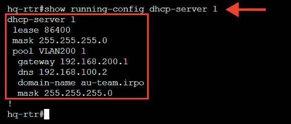
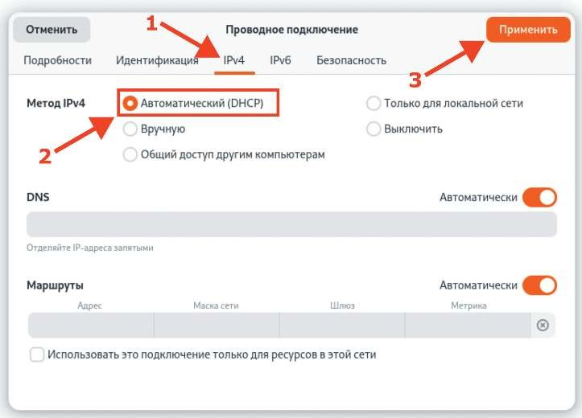
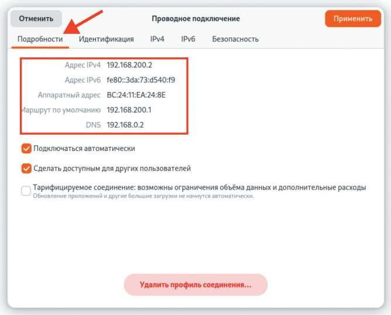
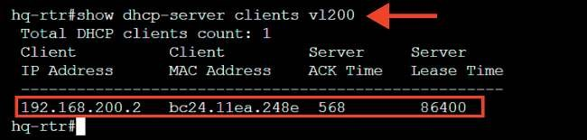

# Настройка протокола динамической конфигурации хостов

**Печатные страницы:** 65–68.

## Дополнительно

NAT (Network Address Translation) — это технология, используемая для преобразования частных IP-адресов в публичные и обратно. Вот несколько клю-

чевых преимуществ NAT:

• экономия IP-адресов: NAT позволяет многим устройствам в частной сети

использовать один публичный IP-адрес, что экономит ресурсы адресного пространства;

• улучшение безопасности: NAT скрывает внутреннюю структуру сети, что

делает ее менее уязвимой к внешним атакам. Внешние устройства не могут

напрямую обращаться к внутренним адресам;

• гибкость и управляемость: позволяет легко управлять внутренними IPадресами, изменяя их без необходимости в переадресации или изменении пу-

бличного адреса;

• поддержка различных протоколов: NAT может работать с различными

протоколами и типами трафика, обеспечивая совместимость.

Таким образом, NAT является полезным инструментом для управления адресами, улучшения безопасности и оптимизации использования IP-ресурсов в сети.

## Краткая справка

– документация по EcoRouterOS (Wiki) (https://docs.ecorouter.ru/).

## Где изучается?

2 курс:

– Операционные системы и среды;

– Компьютерные сети и далее.

Настройка протокола

динамической конфигурации хостов

## Подробное описание пункта задания

Настройте протокол динамической конфигурации хостов для сети в сторону HQ-CLI:

• настройте нужную подсеть;

• в качестве сервера DHCP выступает маршрутизатор HQ-RTR;

• клиентом является машина HQ-CLI;

• исключите из выдачи адрес маршрутизатора;

• адрес шлюза по умолчанию — адрес маршрутизатора HQ-RTR;

• адрес DNS-сервера для машины HQ-CLI — адрес сервера HQ-SRV;

• DNS-суффикс — au-team.irpo;

• сведения о настройке протокола занесите в отчет.

## Как делать?

Создать пул с произвольным именем и указать диапазон раздаваемых IPадресов можно из режима администрирования (conf t) при помощи следу-

ющей команды:

ip pool <ИМЯ_ПУЛА> <IP-АДРЕС_НАЧАЛА_ДИАПАЗОНА>-<IP-АДРЕС_ОКОНЧАНИЯ_

ДИАПАЗОНА>

КОД 09.02.06-1-2026 СЕТЕВОЙ И СИСТЕМНЫЙ АДМИНИСТРАТОР

Для настройки DHCP-сервера необходимо из режима администрирования

(conf t) перейти в режим конфигурирования dhcp-сервера, присвоив ему произвольный номер в системе маршрутизатора, для этого используется команда:

dhcp-server <№>

Далее в режиме конфигурирования dhcp-сервера необходимо привязать

созданный ранее пул раздаваемых адресов с указанием номера dhcp-сервера

в системе маршрутизатора, сделать это можно при помощи команды:

pool <ИМЯ_ПУЛА> <№>

В результате чего можно из режима настройки конкретного пула dhcp задавать все необходимые параметры, например:

mask <СЕТЕВАЯ_МАСКА>

gateway <IP-АДРЕС_ШЛЮЗА>

dns <IP-АДРЕС_DNS-СЕРВЕРА>

domain-name <DNS-СУФФИКС>

После настройки сервера необходимо указать на каком интерфейсе маршрутизатор будет принимать пакеты DHCP Discover и отвечать на них пред-

ложением с IP-настройками, сделать это можно из режима конфигурирования

определенного интерфейса при помощи следующей команды:

interface <ИМЯ_ИНТЕРФЕЙСА>

dhcp-server <№>

Пример описания настроек на виртуальных машинах

экзаменационного стенда

hq-rtr(config)#ip pool VLAN200 192.168.200.2-192.168.200.254

hq-rtr(config)#dhcp-server 1

hq-rtr(config-dhcp-server)#pool VLAN200 1

hq-rtr(config-dhcp-server-pool)#mask 24

hq-rtr(config-dhcp-server-pool)#gateway 192.168.200.1

hq-rtr(config-dhcp-server-pool)#dns 192.168.100.2

hq-rtr(config-dhcp-server-pool)#domain-name au-team.irpo

hq-rtr(config-dhcp-server-pool)#exit

hq-rtr(config-dhcp-server)#exit

hq-rtr(config)#interface vl200

hq-rtr(config-if)#dhcp-server 1

hq-rtr(config-if)#exit

hq-rtr(config)#write memory

## Как проверить?

Из привилегированного режима можно проверить информацию о созданном DHCP-пуле, используя команду:

show running-config dhcp-server 1

На виртуальной машине HQ-CLI должен быть получен IP-адрес и все необходимые сетевые параметры автоматически:

КОД 09.02.06-1-2026 СЕТЕВОЙ И СИСТЕМНЫЙ АДМИНИСТРАТОР

Также на DHCP-сервере можно просмотреть информацию о клиентах (выданных адресах) на определенном интерфейсе, для этого используется команда

из привилегированного режима:

show dhcp-server clients <ИМЯ_ИНТЕРФЕЙСА>

## Где выполнять?

На виртуальной машине: HQ-RTR.

## Дополнительно

DHCP (Dynamic Host Con guration Protocol) — это протокол, который автоматизирует процесс назначения IP-адресов и других параметров конфигура-

ции сетевых устройств. Вот несколько основных преимуществ DHCP:

• автоматизация: упрощает управление сетью, автоматически назначая

IP-адреса и настройки (например, шлюз, DNS) устройства при подключении

к сети;

---

## Иллюстрации из PDF

