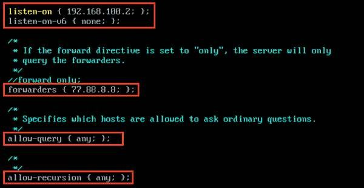
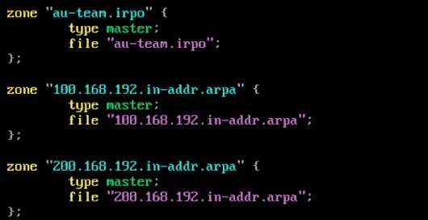
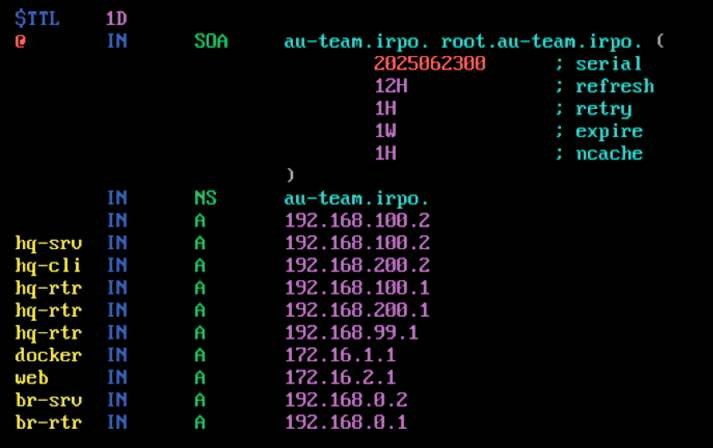
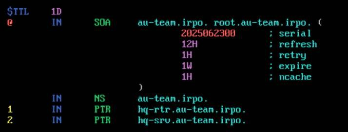
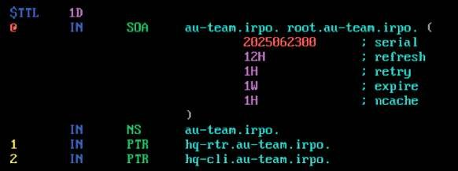
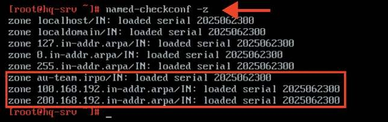
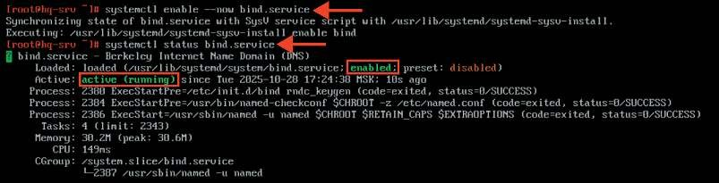
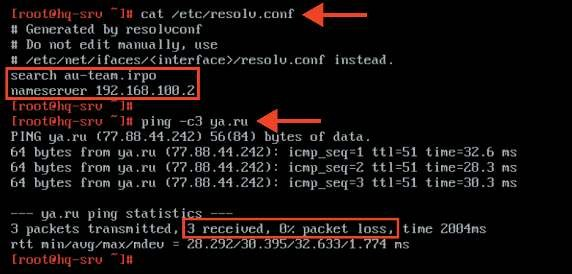
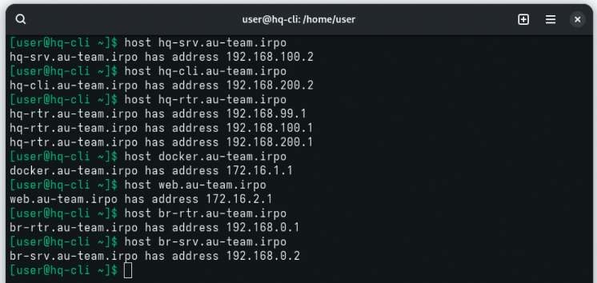
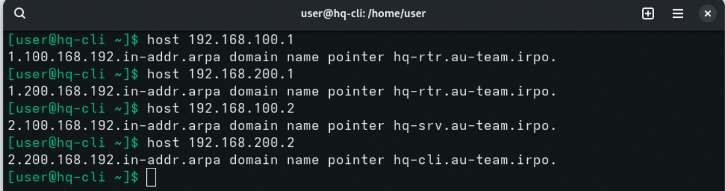

# Настройка инфраструктуры разрешения доменных имен

**Печатные страницы:** 69–74.

• снижение ошибок: минимизирует вероятность ошибок, связанных с ручной конфигурацией адресов, таких как дублирование IP-адресов;

• централизованное управление: позволяет администраторам управлять

настройками сети из одного места, упрощая внесение изменений;

• гибкость: поддерживает динамическое (временное) и статическое (постоянное) назначение IP-адресов, а также резервирование адресов для опре-

деленных устройств;

• оптимизация использования ресурсов: эффективно распределяет

адресное пространство, освобождая IP-адреса, которые не используются.

DHCP значительно упрощает администрирование сетей и улучшает их управляемость.

## Краткая справка

– документация по EcoRouterOS (Wiki) (https://docs.ecorouter.ru/).

## Где изучается?

2 курс:

– Операционные системы и среды;

– Компьютерные сети и далее.

Настройка инфраструктуры

разрешения доменных имен

## Подробное описание пункта задания

Настройте инфраструктуру разрешения доменных имен для офисов HQ

и BR:

• основной DNS-сервер реализован на HQ-SRV;

• сервер должен обеспечивать разрешение имен в сетевые адреса устройств

и обратно в соответствии с табл. 1.3;

• в качестве DNS-сервера пересылки используйте любой общедоступный

DNS-сервер (77.88.8.7, 77.88.8.3 или другие).

Устройство                               Запись           Тип

HQ-RTR                                          hq-rtr.au-team.irpo   A,PTR

BR-RTR                                          br-rtr.au-team.irpo   A

HQ-SRV                                          hq-srv.au-team.irpo   A,PTR

HQ-CLI                                          hq-cli.au-team.irpo   A,PTR

BR-SRV                                          br-srv.au-team.irpo   A

ISP (интерфейс, направленный в сторону

docker.au-team.irpo   A

HQ-RTR)

ISP (интерфейс, направленный в сторону

web.au-team.irpo      A

BR-RTR)

КОД 09.02.06-1-2026 СЕТЕВОЙ И СИСТЕМНЫЙ АДМИНИСТРАТОР

## Как делать?

Для установки и дальнейшей настройки DNS-сервера необходимо выполнить установку пакета BIND, сделать это можно при помощи команды:

apt-get update && apt-get install bind bind-utils -y

Далее выполняется редактирование конфигурационного файла /var/lib/

bind/etc/options.conf согласно скриншоту, используя текстовый редактор vim:

На фото выделены следующие элементы конфигурационного файла:

• listen-on — этот параметр определяет адреса и порты, на которых DNSсервер будет слушать запросы;

• в параметре forwarders указываются сервера, куда будут перенаправляться запросы, на которые нет информации в локальной зоне;

• allow-query — IP-адреса и подсети, от которых будут обрабатываться

запросы.

Далее необходимо добавить зоны прямого и обратного просмотра в конец

файла (но не заменить) /var/lib/bind/etc/rfc1912.conf, используя текстовый редактор vim:

Необходимо перейти в директорию /var/lib/bind/etc/zone и путем

копирования создать файлы зон:

cp /var/lib/bind/etc/zone/empty /var/lib/bind/etc/zone/au-team.irpo

cp   /var/lib/bind/etc/zone/empty       /var/lib/bind/etc/zone/

100.168.192.in-addr.arpa

cp   /var/lib/bind/etc/zone/empty       /var/lib/bind/etc/zone/

200.168.192.in-addr.arpa

Необходимо сконфигурировать файл au-team.irpo, который является

прямой зоной, следующим образом:

Далее необходимо настроить обратную зону и привести файл

100.168.192.in-addr.arpa к следующему виду:

КОД 09.02.06-1-2026 СЕТЕВОЙ И СИСТЕМНЫЙ АДМИНИСТРАТОР

Далее необходимо настроить обратную зону и привести файл

200.168.192.in-addr.arpa к следующему виду:

Для DNS-сервиса важно обеспечить непрерывный аптайм, не допуская

даже минутных простоев. Если вы попытаетесь перезапустить systemd-юнит

обычной командой systemctl, а в конфигурации будут ошибки, то BIND не запустится. Чтобы избежать столь неприятных последствий, надо правильно на-

строить утилиту rndc, которая позволяет обойти эти сложности.

После того, как конфигурация зон была завершена, для корректной работы

службы bind необходимо выполнить команду:

rndc-confgen > /etc/bind/rndc.key

Затем выполнить команду:

sed -i ‘6,$d’ /etc/bind/rndc.key

Перед запуском службы остается поменять группу у файлов зон, которые

были созданы ранее, на named, а также проверить конфигурационные файлы

и файлы зон командами named-checkconf и named-checkconf -z соответственно:

chown -R root:named /var/lib/bind/etc/zone/*

После этого можно запустить службу bind командой systemctl enable

--now bind.service. Проверить статус службы можно при помощи команды

systemctl status bind:

## Как проверить?

Проверить доступ в сеть Интернет средствами утилиты ping, учитывая,

что в качестве DNS-сервера используется HQ-SRV:

Используя утилиту host или nslookup, проверить записи типа A, PTR

и CNAME:

КОД 09.02.06-1-2026 СЕТЕВОЙ И СИСТЕМНЫЙ АДМИНИСТРАТОР

## Где выполнять?

На виртуальной машине: HQ-SRV.

## Дополнительно

DNS (Domain Name System) — это система, которая переводит доменные

имена, понятные человеку, в IP-адреса, которые понимают компьютеры. Вот

несколько ключевых моментов, которые делают DNS замечательным:

• удобство использования: позволяет пользователям обращаться к сайтам

по запоминающимся именам (например, www.example.com) вместо сложных

числовых IP-адресов;

• иерархическая структура: DNS имеет иерархическую архитектуру, что

позволяет распределять управление доменными именами и облегчает мас

штабирование;

• кэширование: DNS-серверы кэшируют результаты запросов, что ускоряет

доступ к часто запрашиваемым доменным именам и снижает нагрузку на сеть;

• распределенность: DNS работает на основе распределенной базы данных, что делает его устойчивым к сбоям и атакам;

• поддержка различных записей: DNS поддерживает различные типы записей (A, AAAA, CNAME, MX и др.), что позволяет управлять не только адреса-

ми, но и другими аспектами сетевой инфраструктуры.

BIND (Berkeley Internet Name Domain) — это одна из самых популярных

реализаций DNS-сервера. Вот несколько его особенностей:

• широкое распространение: BIND является стандартом де-факто для DNSсерверов в Unix-подобных системах и используется многими Интернет-про-

вайдерами и организациями;

• гибкость и настраиваемость: BIND предлагает множество опций для

настройки, включая поддержку различных типов записей и возможность настройки зон;

• поддержка безопасности: BIND поддерживает расширенные функции

безопасности, такие как DNSSEC (DNS Security Extensions), что позволяет защитить данные DNS от подделки.

Таким образом, DNS и его реализация BIND играют ключевую роль в функционировании Интернета, обеспечивая удобный и надежный способ разреше-

ния доменных имен.

## Краткая справка

– служба DNS (Bind) (https://docs.altlinux.org/ru-RU/archive/2.4/html-single/

master/alt-docs-master/ch06s13.html);

– безграничный DNS (https://www.altlinux.org/Безграничный_DNS).

­

---

## Иллюстрации из PDF

