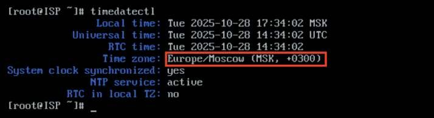

# Настройка часового пояса

**Печатные страницы:** 75–76.

## Где изучается?

2 курс:

– Операционные системы и среды;

– Компьютерные сети и далее.

3 курс:

– Организация, принципы построения и функционирования компьютерных сетей.

Настройка часового пояса

## Подробное описание пункта задания

Настройте часовой пояс на всех устройствах (за исключением виртуального коммутатора в случае его использования) согласно месту проведения эк-

замена.

## Как делать?

На устройствах с ОС «Альт» необходимо выполнить следующую команду:

timedatectl set-timezone <ЧАСОВАЯ_ЗОНА>

Например:

timedatectl set-timezone Europe/Moscow

На устройствах с ОС «EcoRouterOS» необходимо выполнить следующую

команду из режима администрирования (conf t):

ntp timezone utc+<ЦИФРА>

Например:

ntp timezone utc+3

## Как проверить?

На устройствах с ОС «Альт» воспользоваться утилитой timedatectl:

КОД 09.02.06-1-2026 СЕТЕВОЙ И СИСТЕМНЫЙ АДМИНИСТРАТОР

На устройствах с ОС «EcoRouterOS» воспользоваться командой из привилегированного режима:

show ntp timezone

## Где выполнять?

На всех машинах.

## Дополнительно

Настройка временной зоны (timezone) важна по нескольким причинам:

• корректное отображение времени: правильная настройка временной

зоны обеспечивает отображение актуального времени для пользователей

и систем, что особенно важно для приложений, работающих с временными

метками;

• синхронизация событий: временные зоны помогают синхронизировать

события и действия, происходящие в разных регионах, что критично для распределенных систем и приложений;

• логирование: правильная временная зона в логах позволяет точно отслеживать и анализировать события, что упрощает диагностику и устранение

проблем;

• планирование задач: многие системы используют время для планирования задач (например, cron в Linux). Неправильная временная зона может

привести к выполнению задач в нежелательное время;

• соответствие законодательству: в некоторых странах существуют законы, касающиеся времени работы и отчетности, поэтому правильная настройка

временной зоны помогает соблюдать эти требования.

В целом настройка временной зоны способствует улучшению работы систем и приложений, обеспечивая точность и согласованность во времени, а в не-

которых задачах это критически важно.

## Краткая справка

– синхронизация времени

(https://www.altlinux.org/Синхронизация_времени#Пакет_systemdtimesyncd).

## Где изучается?

2 курс:

– Операционные системы и среды;

– Компьютерные сети и далее.

---

## Иллюстрации из PDF

