# Настройка контроллера домена Samba DC

**Печатные страницы:** 81–93.

<!-- Стр. 81 -->

- при обращении по доменному имени docker.au-team.irpo клиента должно открываться веб-приложение testapp.
10. На маршрутизаторе ISP настройте web-based аутентификацию:
- при обращении к сайту web.au-team.irpo клиенту должно быть предложено ввести аутентификационные данные:

- в качестве логина для аутентификации выберите WEB с паролем P@
ssw0rd;

- выберите файл /etc/nginx/.htpasswd в качестве хранилища учетных записей;

- при успешной аутентификации клиент должен перейти на веб-сайт.
11. Удобным способом установите приложение Яндекс Браузер на HQ-CLI:
- установку браузера отметьте в отчете.

### Выполнение задания:

### Настройка контроллера домена Samba DC

## Задание 1. Настройте контроллер домена Samba DC на сервере BR-SRV.
Подробное описание пункта задания
Настройте контроллер домена Samba DC на сервере BR-SRV:
• имя домена au-team.irpo.
Как делать?
Для Samba DC на базе Heimdal Kerberos необходимо установить пакет
task-samba-dc:

```text
apt-get update && apt-get install -y task-samba-dc
```

Если настройка домена выполняется не сразу после установки ОС, перед установкой необходимо остановить конфликтующие службы krb5kdc и slapd, а также bind:

```text
for service in smb nmb krb5kdc slapd bind; do \ systemctl disable $service; \ systemctl stop $service; \
```

```text
done
```

Необходимо очистить базы и конфигурацию Samba (домен, если он создавался до этого, будет удален):

```text
rm -f /etc/samba/smb.conf rm -rf /var/lib/samba rm -rf /var/cache/samba mkdir -p /var/lib/samba/sysvol
```

<!-- Стр. 82 -->

Для интерактивного развертывания запустите samba-tool domain provision, это запустит утилиту развертывания, которая будет задавать различные вопросы о требованиях к установке:

```text
samba-tool domain provision
```

- у Samba свой собственный DNS-сервер. В DNS forwarder IP address нужно указать внешний DNS-сервер, чтобы DC мог разрешать внешние доменные
имена;
- при запросе ввода нажимайте Enter за исключением запроса пароля администратора («Administrator password:» и «Retype password:»);
- пароль администратора должен быть не менее 7 символов и содержать
символы как минимум трех групп из четырех возможных: латинских букв
в верхнем и нижнем регистрах, чисел и других не буквенно-цифровых символов;
- пароль, не полностью соответствующий требованиям, является одной из
причин завершения развертывания домена ошибкой;
- при правильной базовой настройке устройства все параметры подставятся автоматически.

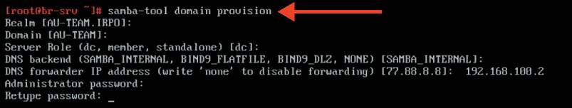

Результат успешного интерактивного развертывания домена Samba DC:

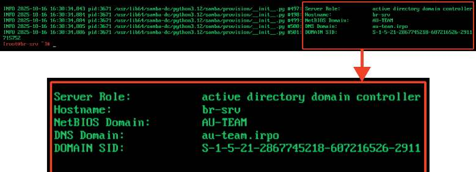


После создания домена необходимо внести изменения в файл /etc/ krb5.conf. В этом файле следует раскомментировать строку default_realm и содержимое разделов realms и domain_realm, указать название доме-

<!-- Стр. 83 -->

на (обратите внимание на регистр символов), в строке dns_lookup_realm должно быть установлено значение false. В момент создания домена Samba конфигурирует шаблон файла krb5.conf для домена в каталоге /var/lib/ samba/private/. Можно просто заменить этим файлом файл, находящийся в каталоге /etc/:

```text
cp /var/lib/samba/private/krb5.conf /etc/krb5.conf
```

Включить и добавить в автозагрузку службу samba:

```text
systemctl enable --now samba
```

### Как проверить? Просмотр общей информации о домене и предоставляемых службах:

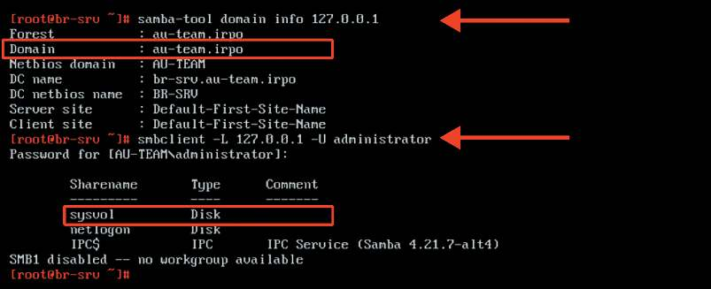

Проверка Kerberos (имя домена должно быть в верхнем регистре) и просмотр полученного билета:
- убедиться в наличии nameserver 127.0.0.1 в /etc/resolv.conf
перед проверкой.

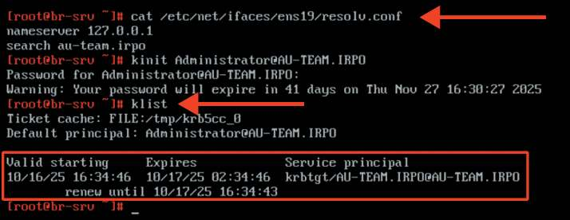

<!-- Стр. 84 -->

Проверка конфигурации DNS. Утилита host находится в пакете bind-utils

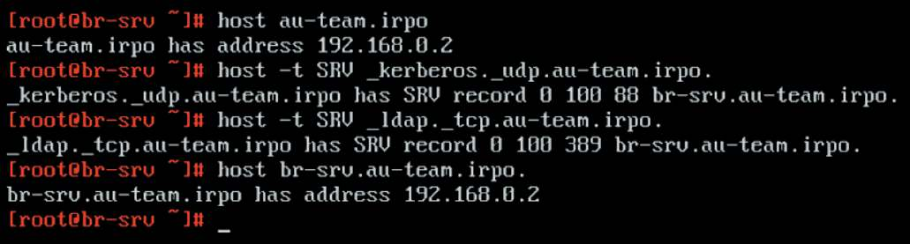

Где выполнять?
На виртуальной машине: BR-SRV.
Дополнительно:
«Альт Домен» — служба каталогов (доменная служба), позволяющая централизованно управлять компьютерами и пользователями в корпоративной
сети с операционными системами (ОС) на ядре Linux и Windows по единым
правилам из единого центра. В системе реализовано хранение данных о пользователях, компьютерах (рабочих станциях) и других объектах корпоративной
сети, а также управление профилями пользователей и компьютеров с помощью
групповых политик в доменах MS Active Directory / Samba DC. Состав программного комплекса «Альт Домен»:
- контроллер(ы) домена (DC) на базе дистрибутива ОС «Альт Сервер»;
- модуль для ввода компьютера в домен;
- модуль удаленного управления базой данных конфигурации (ADMC) —
графический инструмент для управления объектами домена и групповыми
политиками;
- модуль редактирования настроек клиентской конфигурации (GPUI) —
предназначен для изменения параметров групповых политик;
- шаблоны групповых политик;
- модуль применения конфигурации на целевой ОС Linux (gpupdate);
- аналитический инструмент, формирующий отчеты о применении групповых политик (GPResult);
- инструмент диагностики (ADT).
Краткая справка:
- «Альт Домен» (https://docs.altlinux.org/ru-RU/alt-server/11.1/html/altserver/sambadc--chapter.html);
- «Альт Домен» 11.0 Руководство администратора (https://docs.altlinux.org/
ru-RU/alt-domain/11.0/html/alt-domain/index.html).
Где изучается?
2 курс:
- Операционные системы и среды.

<!-- Стр. 85 -->

3 курс:
- Администрирование сетевых операционных систем;
- Программное обеспечение компьютерных сетей;
- Организация администрирования компьютерных систем и далее.

## Задание 2. Настройте пользовательскую структуру домена Samba DC на
сервере BR-SRV.
Подробное описание пункта задания
Настройте контроллер домена Samba DC на сервере BR-SRV:
• создайте 5 пользователей для офиса HQ: имена пользователей формата
hquser№ (например: hquser1, hquser2 и т.д.);
• создайте группу hq, введите в группу созданных пользователей.
Как делать?
Для управления группами в «Альт Домен» можно использовать подкоманду group утилиты samba-tool:
• создать группу с именем hq:

```text
samba-tool group add hq
```

Для управления пользователями в «Альт Домен» можно использовать подкоманду user утилиты samba-tool:
- создать пользователя hquser1 с паролем P@ssw0rd:

```text
samba-tool user add hquser1 P@ssw0rd
```

- установить срок действия для учетной записи пользователя в значение
«период действия неограничен»:

```text
samba-tool user setexpiry hquser1 --noexpiry
```

• добавить пользователя hquser1 в группу hq:

```text
samba-tool group addmembers «hq» hquser1
```

Для ускорения процесса создания пользователей и добавления их в соответствующую группу можно использовать цикл.

<!-- Стр. 86 -->

### Как проверить? Просмотр списка всех групп в рамках домена:

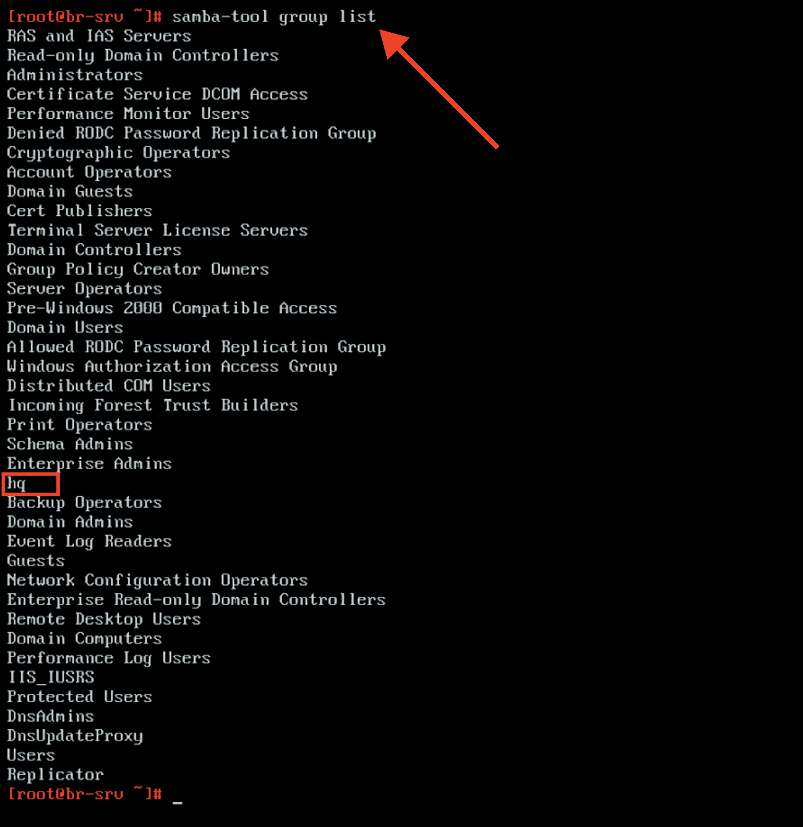

Просмотр списка всех пользователей в рамках группы hq:

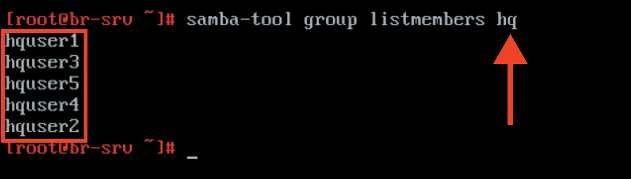

<!-- Стр. 87 -->

Где выполнять?
На виртуальной машине: BR-SRV.
Дополнительно:
Для управления пользователями и группами в «Альт Домен» можно использовать модуль удаленного управления базой данных конфигурации
(ADMC). Компонент удаленного управления базой данных конфигурации (далее — ADMC) предназначен для управления:
- объектами в домене (пользователями, группами, компьютерами, подразделениями);
- групповыми политиками.
ADMC позволяет:
- создавать и администрировать учетные записи пользователей, компьютеров и групп;
- менять пароль пользователя;
- создавать организационные подразделения для структурирования и выстраивания иерархической системы распределения учетных записей в AD;
- просматривать и редактировать атрибуты объектов;
- создавать и просматривать объекты групповых политик;
- выполнять поиск объектов по разным критериям;
- сохранять поисковые запросы;
- переносить поисковые запросы между компьютерами (выполнять экспорт и импорт поисковых запросов).
Краткая справка:
- модуль удаленного управления базой данных конфигурации (ADMC)
(https://docs.altlinux.org/ru-RU/alt-domain/11.0/html/alt-domain/admc.html);
- «Альт Домен» 11.0 Управление пользователями и группами (https://docs.
altlinux.org/ru-RU/alt-domain/11.0/html/alt-domain/users-management.html).
Где изучается?
2 курс:
- Операционные системы и среды.
3 курс:
- Администрирование сетевых операционных систем;
- Программное обеспечение компьютерных сетей;
- Организация администрирования компьютерных систем и далее.

## Задание 3. Введите в созданный домен машину HQ-CLI.
Подробное описание пункта задания
Настройте контроллер домена Samba DC на сервере BR-SRV:
• введите в созданный домен машину HQ-CLI;
• убедитесь, что пользователи группы hq имеют право аутентифицироваться на HQ-CLI;
• пользователи группы hq должны иметь возможность повышать привилегии для выполнения ограниченного набора команд: cat, grep, id. Запускать
другие команды с повышенными привилегиями пользователи группы права
не имеют.

<!-- Стр. 88 -->

Как делать? На клиенте необходимо установить статические параметры для сетевого интерфейса, также важно в качестве адреса DNS-сервера указать IP-адрес виртуальной машины BR-SRV (контроллера домена):

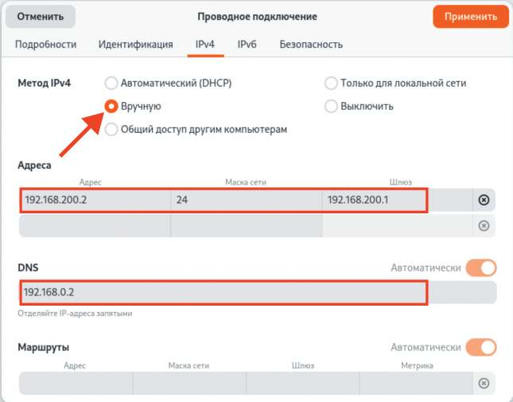

Также необходимо проверить, что имя домена корректно преобразуется в IP-адрес:

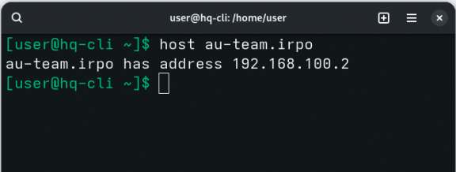

Подключение к домену с использованием SSSD:
- необходимо установить пакет task-auth-ad-sssd:

```text
apt-get update && apt-get install -y task-auth-ad-sssd
```

• для ввода компьютера в домен в ЦУС необходимо выбрать пункт Пользователи → Аутентификация:

<!-- Стр. 89 -->

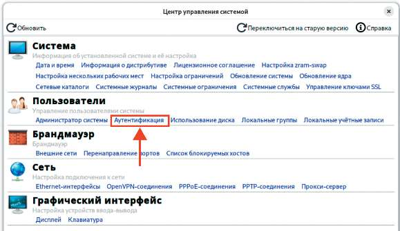

- в окне модуля Аутентификация следует выбрать пункт Домен Active
Directory, заполнить поля (Домен, Рабочая группа, Имя компьютера), выбрать пункт SSSD (в единственном домене) и нажать кнопку Применить;
- в открывшемся окне необходимо ввести имя пользователя, имеющего
право вводить машины в домен, его пароль и нажать кнопку ОК.

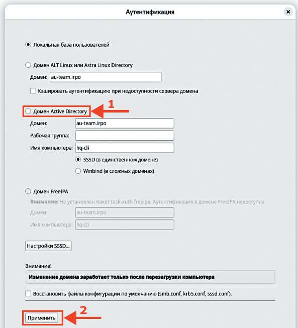

<!-- Стр. 90 -->

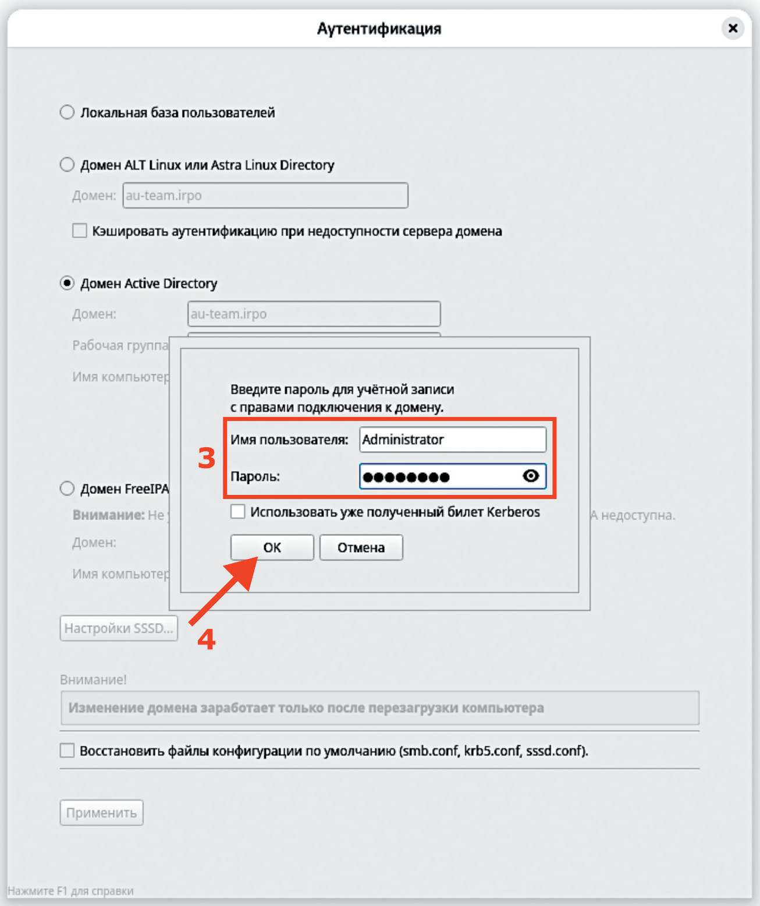

При успешном подключении к домену отобразится соответствующая информация:

<!-- Стр. 91 -->

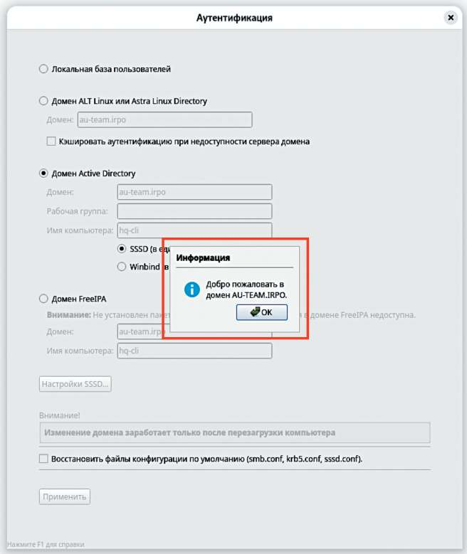

Перезагрузить рабочую станцию для применения всех настроек. На HQ-CLI установить библиотеку libnss-role для NSS и набор инструментов для администрирования ролей и привилегий:

```text
apt-get install -y libnss-role
```

Данный модуль должен быть включен:

```text
control libnss-role
```

Связать доменную группу hq с локальной группой wheel:

```text
roleadd hq wheel
```

<!-- Стр. 92 -->

Отредактировать конфигурационный файл /etc/sudoers:

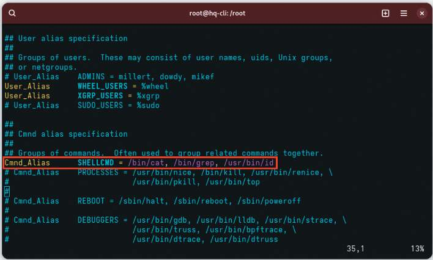

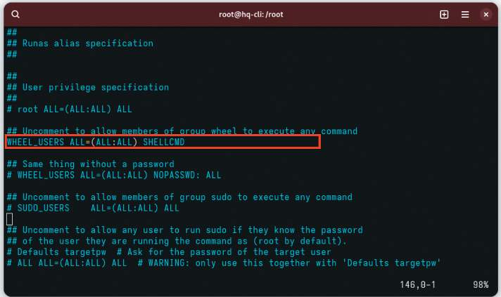

### Как проверить? Выйти из учетной записи локального пользователя:


<!-- Стр. 93 -->

Выполнить вход из-под учетной записи доменного пользователя из группы hq, проверить возможность запуска утилиты sudo для необходимых утилит:


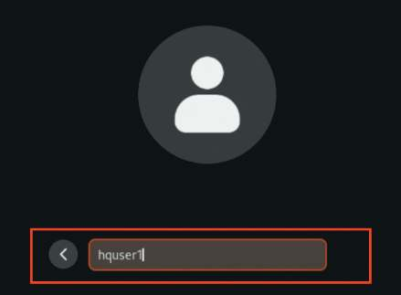

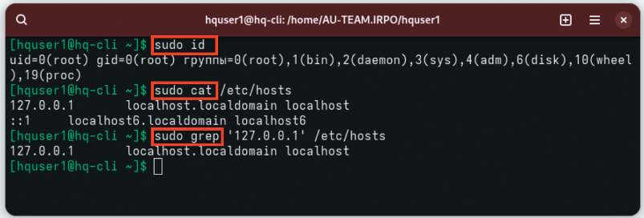

Проверить возможность запуска утилиты sudo для других команд:

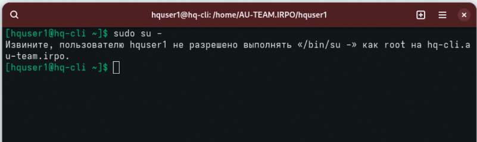
