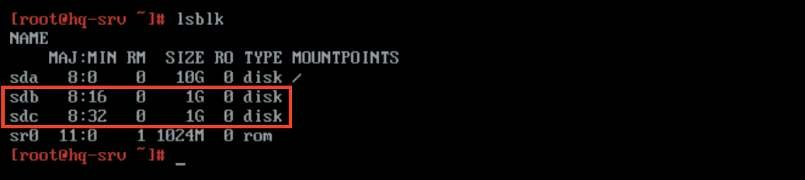
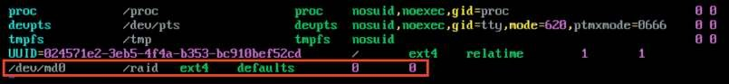
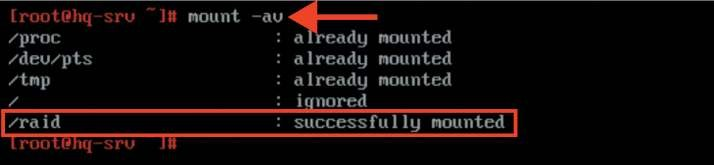
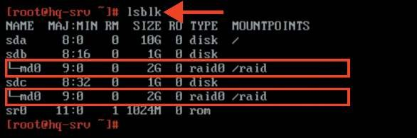
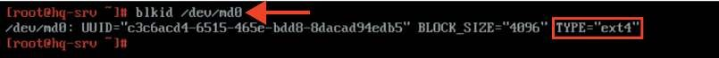
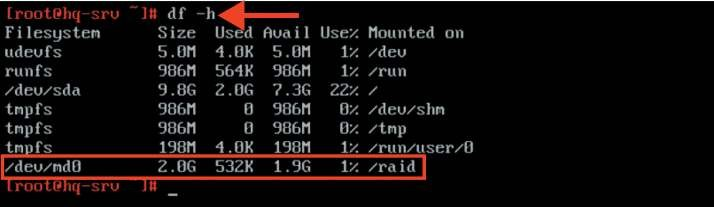

# Настройка файлового хранилища

**Печатные страницы:** 94–96.

КОД 09.02.06-1-2026 СЕТЕВОЙ И СИСТЕМНЫЙ АДМИНИСТРАТОР

## Где выполнять?

На виртуальной машине: HQ-CLI.

## Дополнительно

SSSD используется для доступа к пользовательскому каталогу для аутентификации и авторизации через общую структуру с кешированием пользова-

телей, чтобы разрешить автономный вход в систему.

SSSD легко настраивается; он обеспечивает интеграцию подключаемых

модулей аутентификации (PAM) и службы переключения имен (NSS), базу данных для хранения локальных пользователей, а также расширенных пользова-

тельских данных, полученных с центрального сервера.

## Краткая справка

– подключение к домену с использованием SSSD (https://docs.altlinux.org/

ru-RU/alt-domain/11.0/html/alt-domain/client-sssd.html).

## Где изучается?

2 курс:

– Операционные системы и среды.

3 курс:

– Администрирование сетевых операционных систем;

– Программное обеспечение компьютерных сетей;

– Организация администрирования компьютерных систем и далее.

Настройка файлового хранилища

## Подробное описание пункта задания

Сконфигурируйте файловое хранилище на сервере HQ-SRV:

• при помощи двух подключенных к серверу дополнительных дисков размером 1 ГБ сконфигурируйте дисковый массив уровня 0;

• имя устройства — md0, при необходимости конфигурация массива размещается в файле /etc/mdadm.conf;

• создайте раздел, отформатируйте раздел, в качестве файловой системы

используйте ext4;

• обеспечьте автоматическое монтирование в папку /raid.

## Как делать?

Для просмотра всех подключенных блочных устройств можно воспользоваться утилитой lsblk:

Неразмеченные диски должны быть одного размера — 1 ГБ, не смонтированы и не размечены. Для создания RAID-массива необходимо установить па-

кет mdadm, если он не установлен. Для этого можно воспользоваться командой:

apt-get install –y mdadm

Создание RAID-массива с использованием утилиты mdadm происходит при

использовании следующей команды:

mdadm --create --verbose /dev/md0 –l 0 –n 2 /dev/sdb /dev/sdc

Описание применяемых команд:

/dev/md0 — устройство RAID, которое появится после сборки;

-l 0 — уровень RAID;

-n 2 — количество дисков, из которых собирается массив;

/dev/sdb /dev/sdc — сборка выполняется из дисков sdb и sdc.

При необходимости конфигурация массива размещается в файле /etc/

mdadm.conf:

mdadm --detail --scan --verbose | tee –a /etc/mdadm.conf

Далее необходимо создать файловую систему на созданном RAID-массиве,

используя утилиту mkfs следующей командой:

mkfs.ext4 /dev/md0

Для реализации автоматического монтирования созданного RAID-массива в директорию /raid первым делом следует создать данную директорию,

используя команду:

mkdir /raid

В конфигурационный файл /etc/fstab в конец файла текстовым редактором vim дописываем следующую строку:

КОД 09.02.06-1-2026 СЕТЕВОЙ И СИСТЕМНЫЙ АДМИНИСТРАТОР

Для применения монтирования можно воспользоваться утилитой mount,

выполнив команду:

mount -av

## Как проверить?

Средствами утилиты lsblk:

Средствами утилиты blkid:

Средствами утилиты df:

Описание применяемых команд:

-h — «человекочитаемый формат» (human readable).

## Где выполнять?

На виртуальной машине: HQ-SRV.

---

## Иллюстрации из PDF

