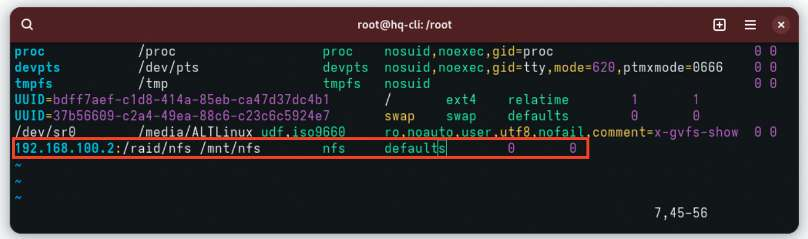
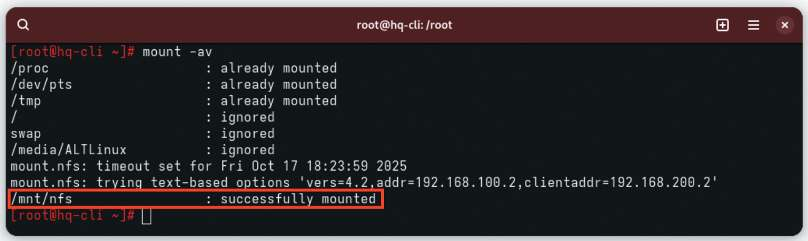
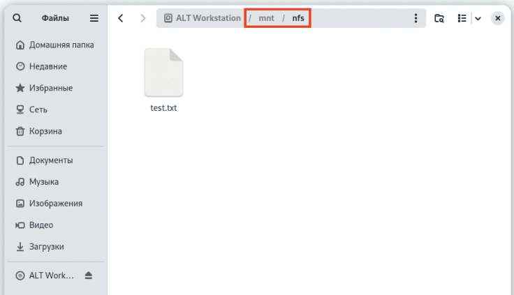

# Настройка сервера сетевой файловой системы

**Печатные страницы:** 97–99.

<!-- Стр. 97 -->

Дополнительно:
RAID — технология виртуализации данных для объединения нескольких
физических дисковых устройств в логический модуль для повышения отказоустойчивости и (или) производительности. Типы RAID:
- RAID0 — технология, когда диски объединяются в один большой диск;
- RAID1 — технология, когда диски зеркалируются, дублируют друг друга;
- RAID4 — технология, когда данные разбиваются на блоки и распределяются по n−1 дискам;
- RAID5 — технология, когда создается массив дисков с поблочным чередованием с одной контрольной суммой;
- RAID6 — технология, когда создается массив дисков с поблочным чередованием с двумя контрольными суммами;
- RAID10 — зеркалированный массив, данные в котором записываются
последовательно на несколько дисков, как в RAID0. Эта архитектура представляет собой массив типа RAID0, сегментами которого вместо отдельных дисков
являются массивы RAID1.
Краткая справка:
- RAID — технология виртуализации данных (https://www.altlinux.org/
CreateRAID).
Где изучается?
2 курс:
- Операционные системы и среды;
- Компьютерные сети.
3 курс:
- Организация, принципы построение и функционирования компьютерных сетей;
- Программное обеспечение компьютерных сетей;
- Организация администрирования компьютерных систем и далее.

### Настройка сервера сетевой файловой системы

Подробное описание пункта задания
Настройте сервер сетевой файловой системы (nfs) на HQ-SRV:
- в качестве папки общего доступа выберите /raid/nfs, доступ для чтения
и записи исключительно для сети в сторону HQ-CLI;
- на HQ-CLI настройте автомонтирование в папку /mnt/nfs;
- основные параметры сервера отметьте в отчете.
Как делать?
Для реализации сервера NFS необходимо установить пакеты nfs-server
и nfs-utils, для этого можно воспользоваться командой:

```text
apt-get install –y nfs-server nfs-utils
```

<!-- Стр. 98 -->

Для того чтобы реализовать общий доступ средствами NFS до директории / raid/nfs, данную директорию необходимо создать командой:

```text
mkdir /raid/nfs
```

Также стоит выдать права для созданной директории:

```text
chmod 777 /raid/nfs
```

Настроить общий доступ средствами NFS можно, отредактировав конфигурационный файл /etc/exports и добавив в него следующую запись:


где: /raid/nfs — общий ресурс; 192.168.200.0/24 — клиентская сеть, которой разрешено монтирование общего ресурса; rw — разрешение на чтение и запись; no_root_squash — отключение ограничения прав root. Для того чтобы запустить NFS-сервер можно воспользоваться командой:

```text
systemctl enable --now nfs-server
```

Для того чтобы на виртуальной машине HQ-CLI реализовать монтирование общего ресурса с NFS-сервера необходимо установить пакеты nfs-utils и nfs-clients. Сделать это можно, воспользовавшись командой:

```text
apt-get install –y nfs-utils nfs-clients
```

После чего создать директорию, в которую будет происходить монтирование общего ресурса:

```text
mkdir /mnt/nfs
```

Выдать соответствующие права на созданную директорию:

```text
chmod -R 777 /mnt/nfs
```

В конец конфигурационного файла /etc/fstab удобным текстовым редактором vim дописываем следующую строку:

<!-- Стр. 99 -->



Для применения монтирования можно воспользоваться утилитой mount, выполнив команду:

```text
mount -av
```



### Как проверить? Проверить возможность создания файлов на общем ресурсе:


