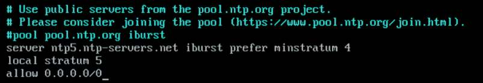
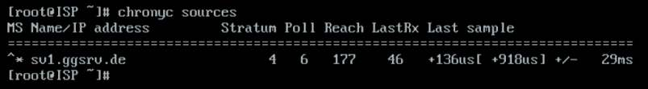
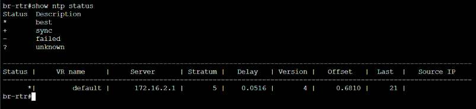

# Настройка служб сетевого времени

**Печатные страницы:** 100–102.

<!-- Стр. 100 -->

Проверить наличие созданного файла на сервере:


Где выполнять?
На виртуальных машинах: HQ-SRV, HQ-CLI.
Дополнительно:
NFS (Network File System) — это протокол, который позволяет пользователям и приложениям на одном компьютере получать доступ к файлам на другом
компьютере через сеть. Вот несколько основных преимуществ NFS:
- простота использования: позволяет пользователям работать с удаленными файлами так же, как с локальными, что упрощает доступ к данным;
- совместный доступ: обеспечивает возможность совместного использования файлов и каталогов между несколькими пользователями и системами,
что улучшает сотрудничество;
- кроссплатформенная поддержка: работает на различных операционных
системах, включая UNIX, Linux и Windows, что делает его универсальным решением для сетевого хранения;
- гибкость: позволяет монтировать удаленные файловые системы в локальную файловую систему, что упрощает организацию и доступ к данным;
- эффективность: поддерживает кэширование, что может улучшить производительность при доступе к часто используемым файлам.
NFS является мощным инструментом для организации сетевого хранения
и совместного доступа к файлам.
Краткая справка:
- NFS (https://www.altlinux.org/NFS).
Где изучается?
2 курс:
- Операционные системы и среды;
- Компьютерные сети.
3 курс:
- Организация, принципы построение и функционирования компьютерных сетей;
- Программное обеспечение компьютерных сетей;
- Организация администрирования компьютерных систем и далее.

### Настройка служб сетевого времени

Подробное описание пункта задания
Настройте службу сетевого времени на базе сервиса chrony на маршрутизаторе ISP:
- вышестоящий сервер ntp на маршрутизаторе ISP — на выбор участника;
- стратум сервера — 5;
- в качестве клиентов ntp настройте: HQ-SRV, HQ-CLI, BR-RTR, BR-SRV.

<!-- Стр. 101 -->

Как делать? На виртуальной машине ISP, которая будет выступать в роли сервера времени, необходимо привести конфигурационный файл /etc/chrony.conf в текстовом редакторе vim к следующему виду:



Для применения изменений необходимо перезагрузить службу chronyd следующей командой:

```text
systemctl restart chronyd
```

На всех остальных виртуальных машинах с ОС «Альт», которые будут выступать клиентами с точки зрения сервера времени, необходимо добавить в конфигурационный файл /etc/chrony.conf следующую строку:


Для применения изменений необходимо перезагрузить службу chronyd следующей командой:

```text
systemctl restart chronyd
```

На всех остальных виртуальных машинах с ОС «EcoRouterOS» из режима администрирования (conf t) необходимо выполнить следующую команду:

```text
(config)# ntp server <IP_АДРЕС_ШЛЮЗА> (config)# write memory
```

### Как проверить? Источник синхронизации времени при помощи утилиты chronyc на ОС «Альт»:



<!-- Стр. 102 -->

Источник синхронизации времени при помощи команды show ntp status на ОС «EcoRouterOS»:



Где выполнять?
На машинах: ISP, HQ-SRV, HQ-CLI, BR-RTR, BR-SRV.
Дополнительно:
Chronyd — это демон для синхронизации системного времени с использованием протокола NTP (Network Time Protocol). Вот несколько основных преимуществ и причин, почему он нужен:
- точная синхронизация времени: Chronyd обеспечивает высокую точность синхронизации системного времени с удаленными NTP-серверами, что
важно для многих приложений и служб;
- быстрая корректировка времени: Chronyd может быстро корректировать
время, даже если оно значительно отклонено от реального, что делает его полезным для систем, которые часто отключаются от сети;
- работа в условиях нестабильной сети: Chronyd хорошо справляется с изменениями в сетевых условиях, такими как высокая задержка или временные
разрывы соединения;
- низкое потребление ресурсов: Chronyd требует меньше системных ресурсов по сравнению с другими NTP-демонами, что делает его подходящим для
использования на устройствах с ограниченными ресурсами;
- поддержка виртуальных и мобильных сред: Chronyd хорошо работает в виртуализированных и мобильных средах, где время может быть неста
бильным.
Chronyd является эффективным инструментом для обеспечения точного
и надежного времени в компьютерных системах.
Краткая справка:
- синхронизация времени (https://www.altlinux.org/Синхронизация_времени).
Где изучается?
3 курс:
- Организация, принципы построение и функционирования компьютерных сетей;
- Программное обеспечение компьютерных сетей;
- Организация администрирования компьютерных систем и далее.
