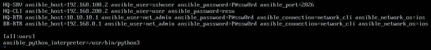
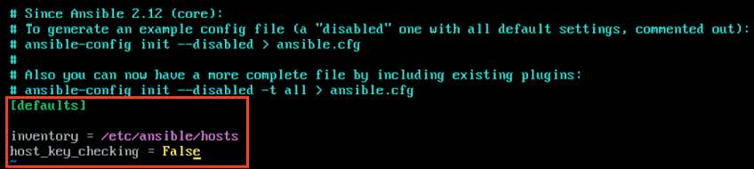
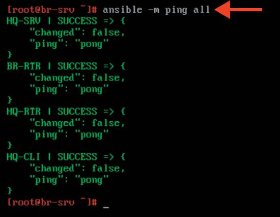

# Настройка ansible

**Печатные страницы:** 103–104.

<!-- Стр. 103 -->

### Настройка ansible

Подробное описание пункта задания
Сконфигурируйте ansible на сервере BR-SRV:
- сформируйте файл инвентаря, в инвентарь должны входить HQ-SRV, HQ-
CLI, HQ-RTR и BR-RTR;
- рабочий каталог ansible должен располагаться в /etc/ansible;
- все указанные машины должны без предупреждений и ошибок отвечать
pong на команду ping в ansible посланную с BR-SRV.
Как делать?
Необходимо установить пакеты ansible и sshpass. Выполнить установку можно следующей командой:

```text
apt-get update && apt-get install –y ansible sshpass
```

Привести файл инвентаря Ansible к виду, приведенному на скриншоте ниже, отредактировав конфигурационный файл по пути /etc/ansible/hosts любым удобным текстовым редактором, например vim:



Отредактировать файл /etc/ansible/ansible.cfg, приводя его к следующему виду:



Установить необходимые коллекции для подключения к ОС «EcoRou terOS»:

```text
ansible-galaxy collection install ansible.netcommon
```

```text
ansible-galaxy collection install cisco.ios
```

<!-- Стр. 104 -->

Установить пакет python3-module-pip, далее поставить библиотеку ansible-pylibssh:

```text
apt-get install –y python3-module-pip
```

```text
pip3 install ansible-pylibssh
```

На виртуальных машинах с ОС «EcoRouterOS» из режима администрирования (conf t) разрешить подключения к устройству по ssh:

```text
(config)# security none (config)# write memory
```

Важное замечание: данный способ не рекомендуется использовать в производственных средах, применимо исключительно только для экономии времени при выполнении задания Демонстрационного экзамена (ДЭ). За рамками выполнения задания Демонстрационного экзамена (ДЭ) лучше сделать отдельный security profille для интерфейса управления типа In-Band Management с соответствующими правилами безопасности, а также добавить созданный профиль безопасности в отдельный VRF. Как проверить? Ответы от машин должны быть зеленого цвета и содержать поле pong:

```text
ansible all -m ping
```


