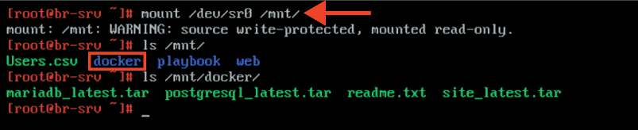
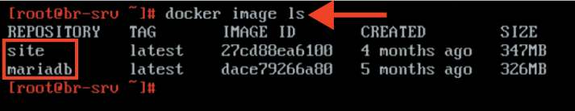
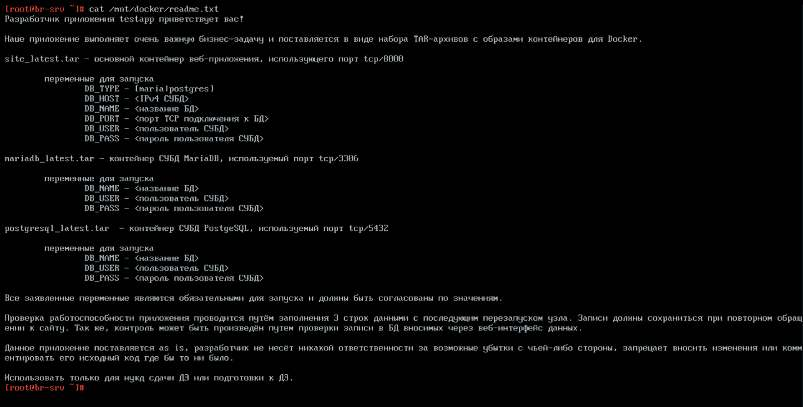
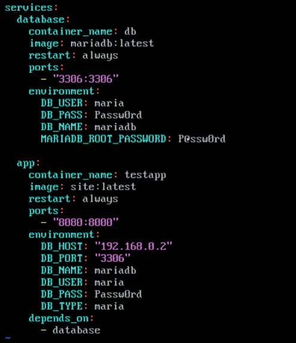
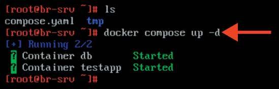
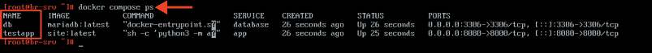

# Настройка веб-приложения с использованием средств контейнеризации

**Печатные страницы:** 105–108.

<!-- Стр. 105 -->

Где выполнять?
На виртуальных машинах: BR-SRV, HQ-RTR, BR-RTR.
Дополнительно:
Ansible — это инструмент для автоматизации управления конфигурацией,
развертывания приложений и оркестрации. Вот несколько основных преимуществ Ansible:
- простота использования: Ansible использует простой и понятный синтаксис на основе YAML, что облегчает написание и чтение сценариев (плейбуков);
- безагентная архитектура: Ansible не требует установки агентов на управляемых узлах, что упрощает развертывание и управление;
- масштабируемость: Ansible может управлять большим количеством серверов одновременно, что делает его подходящим для работы в масштабируемых средах;
- кроссплатформенность: Ansible поддерживает множество операционных
систем и платформ, включая Linux, Windows и облачные сервисы;
- идемпотентность: Ansible гарантирует, что выполнение плейбука приведет к одному и тому же результату, независимо от того, сколько раз он будет
запущен, что упрощает управление конфигурацией;
- расширяемость: Ansible позволяет создавать собственные модули и плагины, что дает возможность адаптировать его под специфические нужды;
- сообщество и поддержка: Ansible имеет активное сообщество и мно
жество доступных модулей и ролей, что облегчает поиск решений и примеров.
Ansible является мощным инструментом для автоматизации и управления
инфраструктурой, что позволяет повысить эффективность и снизить вероятность ошибок.
Краткая справка:
- Ansible — система управления конфигурациями (https://www.altlinux.org/
Ansible).
Где изучается?
2 курс:
- Операционные системы и среды.
3, 4 курс:
- Организация администрирования компьютерных систем и далее.

### Настройка веб-приложения с использованием средств контейнеризации

Подробное описание пункта задания
Разверните веб-приложение в docker на сервере BR-SRV:
- средствами docker должен создаваться стек контейнеров с веб-приложением и базой данных;

<!-- Стр. 106 -->

- используйте образы site_latest и mariadb_latest, располагающиеся в директории docker в образе Additional.iso;
- основной контейнер testapp должен называться tespapp;
- контейнер с базой данных должен называться db. Импортируйте образы
в docker, укажите в yaml-файле параметры подключения к СУБД, имя БД —
mariadb, пользователь — maria, пароль — Passw0rd, порт приложения — 8080,
при необходимости другие параметры;
- приложение должно быть доступно для внешних подключений через
порт 8080.
Как делать?
Установить необходимые пакеты для работы с Docker и Docker Compose
с помощью следующей команды:

```text
apt-get install –y docker-engine docker-compose-v2
```

После установки необходимых пакетов стоит запустить службу docker:

```text
systemctl enable --now docker.service
```

Выполнить монтирование Additional.iso в директорию /mnt:

```text
mount /dev/sr0 /mnt/
```



Выполнить импорт образа mariadb_latest и site_latest:

```text
docker load < /mnt/docker/site_latest.tar
```

```text
docker load < /mnt/docker/mariadb_latest.tar
```



<!-- Стр. 107 -->

Также у данного веб-приложения есть инструкция в виде файла readme.txt:



Создать любым удобным текстовым редактором, например vim, файл compose.yaml и поместить в него следующее содержимое:



<!-- Стр. 108 -->

Запустить стек контейнеров с веб-приложением и базой данных:

```text
docker compose up -d
```



### Как проверить? Проверяем стек контейнеров с веб-приложением и базой данных:

```text
docker compose ps
```



Проверяем доступ до веб-приложения из браузера:


Где выполнять?
На виртуальных машинах: BR-SRV, HQ-CLI.
Дополнительно:
Docker — это платформа для автоматизации развертывания, масштабирования и управления приложениями в контейнерах. Вот несколько основных
преимуществ использования Docker:
- изоляция приложений: контейнеры Docker обеспечивают изоляцию приложений и их зависимостей, что позволяет избежать конфликтов между различными версиями библиотек и программного обеспечения;
