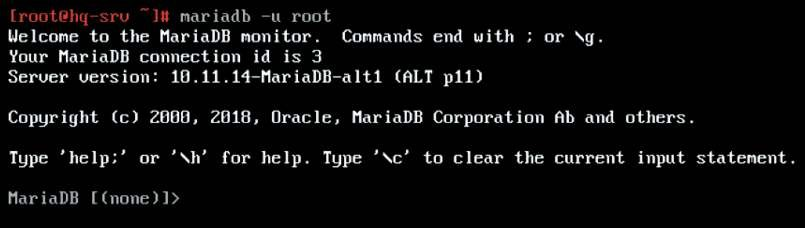
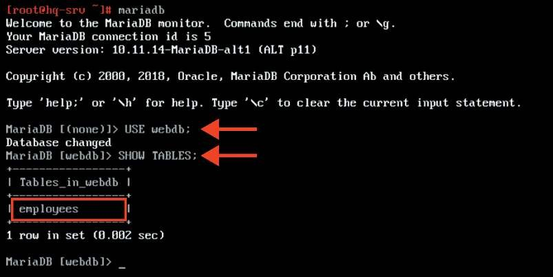
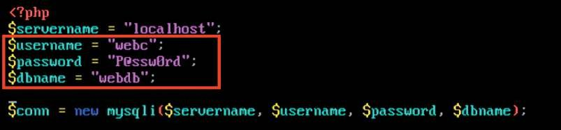
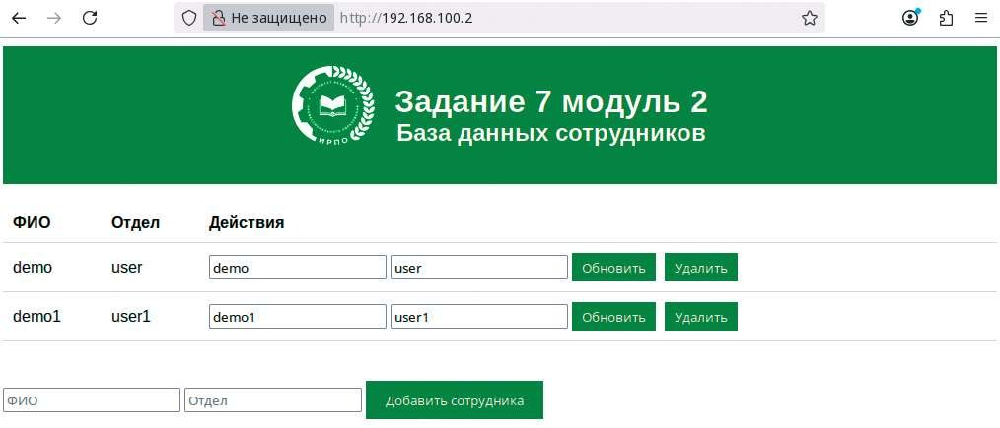

# Настройка веб-приложения на сервере

**Печатные страницы:** 109–112.

• портативность: контейнеры могут работать на любой системе, поддерживающей Docker, что делает приложения легко переносимыми между раз-

личными средами;

• упрощенное развертывание: Docker позволяет быстро и легко развертывать приложения, используя образы, что сокращает время на настройку и кон-

фигурацию;

• масштабируемость: Docker упрощает масштабирование приложений,

позволяя быстро создавать и удалять контейнеры в зависимости от нагрузки;

• эффективное использование ресурсов: контейнеры используют меньше ресурсов по сравнению с виртуальными машинами, так как они разделя-

ют ядро операционной системы, что позволяет запускать большее количество

приложений на одном хосте;

• управление зависимостями: Docker позволяет упаковывать все зависимости приложения в один контейнер, что упрощает управление и разверты-

вание;

• поддержка микросервисной архитектуры: Docker идеально подходит для

разработки и развертывания микросервисов, позволяя каждому сервису работать в своем контейнере;

• сообщество и экосистема: Docker имеет активное сообщество и множество доступных образов в Docker Hub, что облегчает поиск готовых решений

и ускоряет разработку.

## Краткая справка

– начало работы с Docker (https://docs.docker.com/get-started/);

– установка Docker в ОС «Альт» (https://www.altlinux.org/Docker).

## Где изучается?

3, 4 курс:

– Организация администрирования компьютерных систем и далее.

Настройка веб-приложения на сервере

## Подробное описание пункта задания

Разверните веб-приложение на сервере HQ-SRV:

• используйте веб-сервер apache;

• в качестве системы управления базами данных используйте mariadb;

• файлы веб-приложения и дамп базы данных находятся в директории

web-образа Additional.iso;

• выполните импорт схемы и данных из файла dump.sql в базу данных

webdb;

• создайте пользователя web с паролем P@ssw0rd и предоставьте ему права доступа к этой базе данных;

• файлы index.php и директорию images скопируйте в каталог веб-сервера

apache;

• в файле index.php укажите правильные учетные данные для подключения к БД;

КОД 09.02.06-1-2026 СЕТЕВОЙ И СИСТЕМНЫЙ АДМИНИСТРАТОР

• запустите веб-сервер и убедитесь в работоспособности приложения;

• основные параметры отметьте в отчете.

## Как делать?

Установить пакет lamp-server для работы веб-сервера Apache с базой

данных MariaDB и PHP:

apt-get install –y lamp-server

Выполнить монтирование Additional.iso в директорию /mnt:

mount /dev/sr0 /mnt/

Произвести копирование файлов веб-приложения в директорию /var/

www/html:

cp /mnt/web/index.php /var/www/html

cp /mnt/web/logo.png /var/www/html

Включить и добавить в автозагрузку службу mariadb:

systemctl enable --now mariadb

Перейти в интерфейс управления MariaDB:

mariadb –u root

Создать базу данных с именем webdb:

CREATE DATABASE webdb;

Создать пользователя webc с паролем P@ssw0rd:

CREATE USER ‘webc’@’localhost’ IDENTIFIED BY ‘P@ssw0rd’;

Назначить пользователю webc полные права на базу данных webdb, после

чего выйти из интерфейса управления MariaDB:

GRANT ALL PRIVILEGES ON webdb.* TO ‘webc’@’localhost’ WITH GRANT

OPTION;

EXIT;

Из директории /mnt/web/ скопировать файл dump.sql и выполнить импорт схемы и данных из файла dump.sql в базу данных webdb:

cp /mnt/web/dump.sql ./

mariadb –u webc –p –D webdb < dump.sql

Если dump.sql имеет кодировку UTF-16, то перед этим сделать:

Iconv -f UTF-16LE -t UTF-8 dump.sql -o dump_new.sql

И тогда в итоге для импорта схемы и данных необходимо будет использовать команду:

mariadb –u webc –p –D webdb < dump_new.sql

КОД 09.02.06-1-2026 СЕТЕВОЙ И СИСТЕМНЫЙ АДМИНИСТРАТОР

В файле /var/www/html/index.php указать правильные учетные данные для подключения к БД любым удобным текстовым редактором, напри-

мер vim:

Включить и добавить в автозагрузку службу httpd2:

systemctl enable --now httpd2

## Как проверить?

Проверить доступ до веб-приложения из браузера:

## Где выполнять?

На виртуальных машинах: HQ-SRV, HQ-CLI.

## Дополнительно

Apache2 (Apache HTTP Server) — веб-сервер, который представляет собой

программное обеспечение с открытым исходным кодом. Он используется

для размещения веб-сайтов и доступа к ним. Благодаря модульной структуре

Apache обладает гибкостью и расширяемостью, а также надежностью и стабильностью работы. Apache поддерживается многими операционными систе-

мами, в том числе ОС «Альт».

MariaDB — ответвление от системы управления базами данных MySQL,

разрабатываемое сообществом под лицензией GNU GPL. Разработку и под

­

---

## Иллюстрации из PDF

