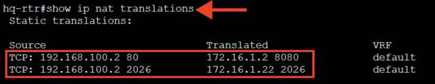
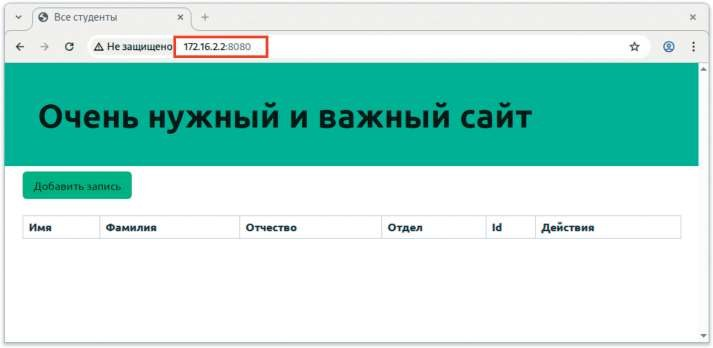
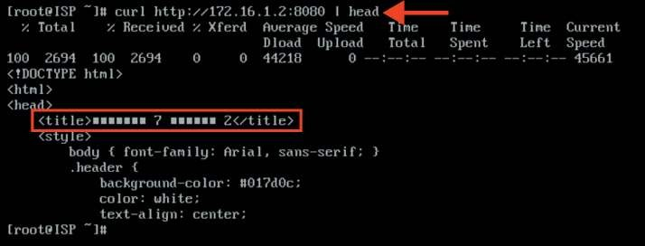

# Настройка трансляции портов

**Печатные страницы:** 113–114.

держку MariaDB осуществляет компания MariaDB Corporation Ab и фонд MariaDB

Foundation. Толчком к созданию стала необходимость обеспечения свободного статуса СУБД, в противовес политике лицензирования MySQL компани-

ей Oracle.

## Краткая справка

– apache2 (Apache HTTP Server) (https://www.altlinux.org/Apache2);

– MariaDB (https://www.altlinux.org/EnterpriseApps/MariaDB).

## Где изучается?

2 курс:

– Операционные системы и среды;

– Компьютерные сети.

3,4 курс:

– Организация, принципы построения и функционирования компьютерных систем;

– Организация администрирования компьютерных систем и далее.

Настройка трансляции портов

## Подробное описание пункта задания

На маршрутизаторах сконфигурируйте статическую трансляцию портов:

• пробросьте порт 8080 в порт приложения testapp BR-SRV на маршрутизаторе BR-RTR для обеспечения работы приложения testapp извне;

• пробросьте порт 8080 в порт веб-приложения на HQ-SRV на маршрутизаторе HQ-RTR для обеспечения работы веб приложения извне;

• пробросьте порт 2026 на маршрутизаторе HQ-RTR в порт 2026 сервера

HQ-SRV, для подключения к серверу по протоколу ssh из внешних сетей;

• пробросьте порт 2026 на маршрутизаторе BR-RTR в порт 2026 сервера

BR-SRV для подключения к серверу по протоколу ssh из внешних сетей.

## Как делать?

Из режима администрирования (conf t) выполнить следующую команду:

ip nat source static tcp <IP-АДРЕС_УСТРОЙСТВА_ЛОКАЛЬНОЙ_СЕТИ> <ПОРТ_

УСТРОЙСТВА_ЛОКАЛЬНОЙ_СЕТИ> <ВНЕШНИЙ_IP-АДРЕС_УСТРОЙСТВА> <ПОРТ_ДЛЯ_

ОБРАЩЕНИЯ_ИЗ_ВНЕШНЕЙ_СЕТИ>

Пример описания настроек на виртуальных машинах

экзаменационного стенда

hq-rtr(config)#ip nat source static tcp 192.168.100.2 80 172.16.1.2

8080

hq-rtr(config)#ip nat source static tcp 192.168.100.2 2026 172.16.1.2

2026

hq-rtr(config)#write memory

КОД 09.02.06-1-2026 СЕТЕВОЙ И СИСТЕМНЫЙ АДМИНИСТРАТОР

br-rtr(config)#ip nat source static tcp 192.168.0.2 8080 172.16.2.2 8080

br-rtr(config)#ip nat source static tcp 192.168.0.2 2026 172.16.2.2 2026

br-rtr(config)#write memory

## Как проверить?

Проверить статическую трансляцию портов:

Проверить возможность доступа извне до веб-приложения, развернутого

на базе стека контейнеров из браузера на клиенте:

Проверяем возможность доступа извне до веб-приложения, развернутого

на базе веб-сервера Apache с виртуальной машины ISP:

---

## Иллюстрации из PDF

