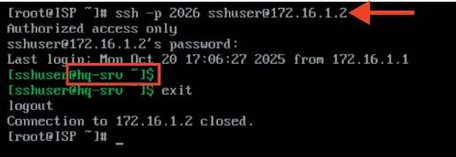
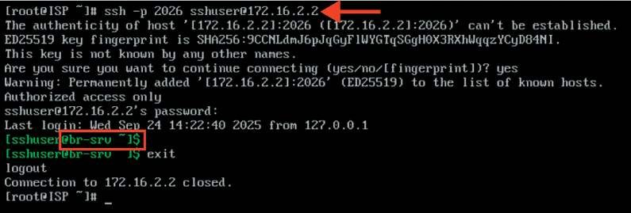
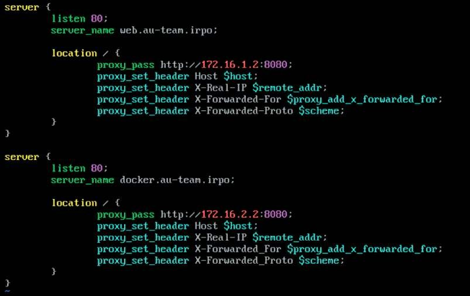
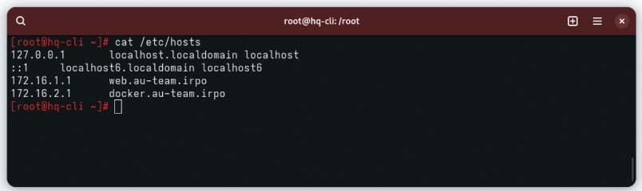

# Настройка обратного прокси-сервера

**Печатные страницы:** 115–117.

Проверяем возможность доступа извне по SSH с виртуальной машины ISP:

## Где выполнять?

На виртуальных машинах: HQ-RTR, BR-RTR, HQ-CLI, ISP.

## Дополнительно

Статический NAT (проброс портов) — это метод, используемый для сопоставления внутреннего IP-адреса и порта с внешним IP-адресом и портом,

позволяющим устройствам из внешней сети (например, из сети Интернет) получить доступ к определенным сервисам, запущенным в локальной сети.

## Краткая справка

– документация по EcoRouterOS (Wiki) (https://docs.ecorouter.ru/).

## Где изучается?

2 курс:

– Операционные системы и среды;

– Компьютерные сети.

3, 4 курс:

– Организация, принципы построения и функционирования компьютерных систем;

– Организация администрирования компьютерных систем и далее.

Настройка обратного прокси-сервера

## Подробное описание пункта задания

Настройте веб-сервер nginx как обратный прокси-сервер на ISP:

• при обращении по доменному имени web.au-team.irpo у клиента должно

открываться веб-приложение на HQ-SRV;

КОД 09.02.06-1-2026 СЕТЕВОЙ И СИСТЕМНЫЙ АДМИНИСТРАТОР

• при обращении по доменному имени docker.au-team.irpo клиента должно открываться веб-приложение testapp.

## Как делать?

Установите пакет nginx:

apt-get install -y nginx

Настроить nginx как реверсивный прокси-сервер, приведя файл /etc/

nginx/sites-available.d/default.conf к следующему виду любым удобным текстовым редактором, например vim:

Добавить символическую ссылку на данный файл:

ln -s /etc/nginx/sites-available.d/default.conf /etc/nginx/sitesenabled.d/

Запустить и активировать службу nginx:

systemctl enable --now nginx

Поскольку в домене SambaDC нет DNS записей, ссылающихся на необходимые имена, а на HQ-CLI в качестве DNS-сервера задан адрес именно контролле-

ра домена, то необходимо добавить записи в файл /etc/hosts на виртуальной

машине HQ-CLI:

## Как проверить?

Проверить возможность доступа до веб-ресурсов из браузера на клиенте:

## Где выполнять?

На виртуальной машине: ISP, HQ-CLI.

## Дополнительно

Реверсивный прокси Nginx обладает рядом замечательных характеристик и преимуществ, которые делают его популярным выбором для веб-раз-

---

## Иллюстрации из PDF

