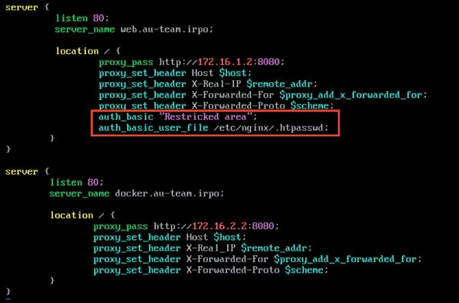
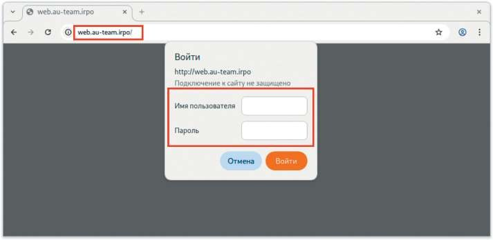
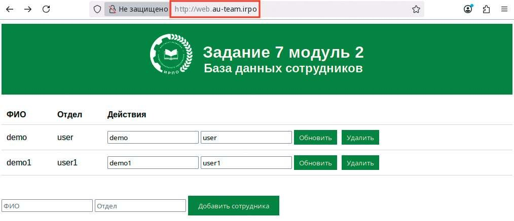

# Настройка web-based аутентификации

**Печатные страницы:** 118–120.

КОД 09.02.06-1-2026 СЕТЕВОЙ И СИСТЕМНЫЙ АДМИНИСТРАТОР

работчиков и системных администраторов. Вот некоторые из основных достоинств:

• балансировка нагрузки: Nginx может распределять входящие запросы

между несколькими серверами, что позволяет улучшить производительность

и отказоустойчивость;

• кэширование: Nginx может кэшировать статические файлы и результаты

выполнения запросов, что снижает нагрузку на серверы приложений и ускоряет ответ пользователям;

• безопасность: реверсивный прокси может служить дополнительным

уровнем безопасности, скрывая внутреннюю инфраструктуру и предоставляя

защиту от атак, таких как DDoS;

• сжатие данных: поддержка сжатия ответов (например, с использованием

gzip) помогает уменьшить объем трафика и ускорить время загрузки страниц;

• легкость в использовании и высокая производительность: Nginx известен

своей высокой производительностью и эффективно использует ресурсы, что

делает его пригодным для обработки большого объема одновременных соединений;

• масштабируемость: Nginx легко масштабируется, позволяя добавлять дополнительные серверы в инфраструктуру без значительных изменений в кон-

фигурации;

• отладка и мониторинг: Nginx предоставляет различные возможности для

логирования и мониторинга, что помогает в диагностике проблем и оптимизации производительности.

## Краткая справка

– использование Nginx (https://www.altlinux.org/Nginx/php-fpm);

– Nginx (https://www.altlinux.org/EnterpriseApps/Nginx).

## Где изучается?

2 курс:

– Операционные системы и среды.

3 курс:

– Организация администрирования компьютерных систем и далее.

Настройка web-based аутентификации

## Подробное описание пункта задания

На маршрутизаторе ISP настройте web-based аутентификацию:

• при обращении к сайту web.au-team.irpo клиенту должно быть предложено ввести аутентификационные данные:

 в качестве логина для аутентификации выберите WEB с паролем

P@ssw0rd;

 выберите файл /etc/nginx/.htpasswd в качестве хранилища учетных за-

писей;

 при успешной аутентификации клиент должен перейти на веб-сайт.







## Как делать?

Установить пакет apache2:

apt-get install -y apache2

Средствами утилиты htpasswd создать пользователя WEB и добавить

информацию о нем в файл /etc/nginx/.htpasswd, задав пароль P@ssw0rd:

htpasswd –c /etc/nginx/.htpasswd WEB

Добавить web-based аутентификацию для доступа к сайту web.au-team.irpo

в конфигурационный файл /etc/nginx/sites-available.d/default.conf

любым удобным текстовым редактором, например vim:

Перезапустить службу nginx:

systemctl restart nginx

КОД 09.02.06-1-2026 СЕТЕВОЙ И СИСТЕМНЫЙ АДМИНИСТРАТОР

## Как проверить?

Проверить возможность доступа до веб-ресурса из браузера на клиенте:

## Где выполнять?

На виртуальной машине: ISP, HQ-CLI.

## Дополнительно

Nginx позволяет настраивать web-based аутентификацию — механизмы,

которые защищают веб-ресурсы от неавторизованного доступа. Это позволяет:

• ограничивать доступ к определенным частям сайта (например, к виртуальным хостам или чувствительным страницам);

• интегрироваться с внешними системами аутентификации.

## Краткая справка

– ограничение доступа с помощью базовой HTTP-аутентификации (https://

docs.nginx.com/nginx/admin-guide/security-controls/configuring-http-basicauthentication/).

## Где изучается?

2 курс:

– Операционные системы и среды.

---

## Иллюстрации из PDF

