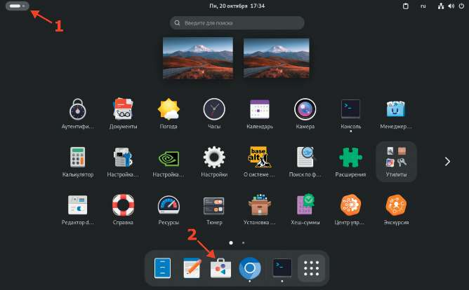
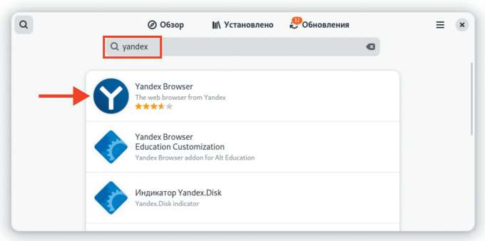

# Установка Яндекс Браузера

**Печатные страницы:** 121–123.

<!-- Стр. 121 -->

3 курс:
- Организация администрирования компьютерных систем и далее.

### Установка Яндекс Браузера

Подробное описание пункта задания
Удобным способом установите приложение Яндекс Браузер на HQ-CLI:
- установку браузера отметьте в отчете.
Как делать?
От имени суперпользователя выполнить:

```text
apt-get install –y yandex-browser-stable
```

или воспользоваться Центром приложений:





<!-- Стр. 122 -->


### Где выполнять? На виртуальной машине: HQ-CLI.

<!-- Стр. 123 -->

Дополнительно:
Yandex Browser (Яндекс Браузер) — это веб-браузер для просмотра Всемирной паутины. Он основан на движке ChromiumYandex.Browser, доступен
для различных платформ, включая Linux и даже Windows.
Существует две основные версии браузера:
1. Стандартная (красный Yandex Browser) — версия для домашнего использования.
2. Корпоративная (синий Yandex Browser для бизнеса) — версия с дополнительными инструментами для организаций, включая управление через групповые политики (GPO) и Active Directory.
Краткая справка:
- Яндекс Браузер (https://www.altlinux.org/ЯндексБраузер).
Где изучается?
2 курс:
- Операционные системы и среды.
