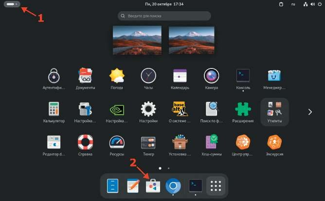
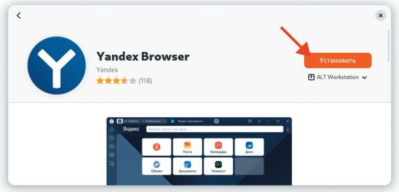
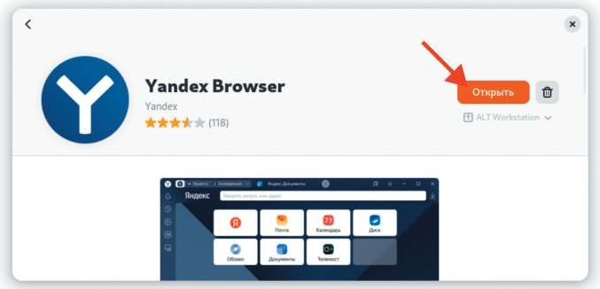
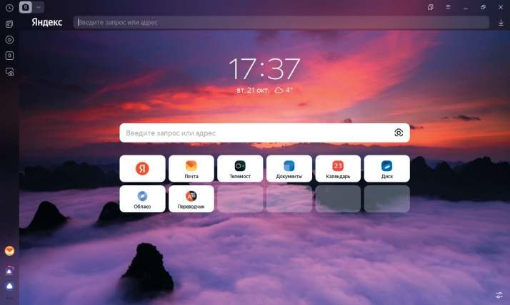

# Установка Яндекс Браузера

**Печатные страницы:** 121–123.

3 курс:

– Организация администрирования компьютерных систем и далее.

Установка Яндекс Браузера

## Подробное описание пункта задания

Удобным способом установите приложение Яндекс Браузер на HQ-CLI:

• установку браузера отметьте в отчете.

## Как делать?

От имени суперпользователя выполнить:

apt-get install –y yandex-browser-stable

или воспользоваться Центром приложений:

КОД 09.02.06-1-2026 СЕТЕВОЙ И СИСТЕМНЫЙ АДМИНИСТРАТОР

## Где выполнять?

На виртуальной машине: HQ-CLI.

## Дополнительно

Yandex Browser (Яндекс Браузер) — это веб-браузер для просмотра Всемирной паутины. Он основан на движке ChromiumYandex.Browser, доступен

для различных платформ, включая Linux и даже Windows.

Существует две основные версии браузера:

1. Стандартная (красный Yandex Browser) — версия для домашнего использования.

2. Корпоративная (синий Yandex Browser для бизнеса) — версия с дополнительными инструментами для организаций, включая управление через груп-

повые политики (GPO) и Active Directory.

## Краткая справка

– Яндекс Браузер (https://www.altlinux.org/ЯндексБраузер).

## Где изучается?

2 курс:

– Операционные системы и среды.

---

## Иллюстрации из PDF

