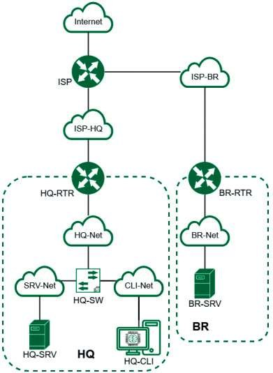

# Обзор модуля 3

**Печатные страницы:** 124–127.

КОД 09.02.06-1-2026 СЕТЕВОЙ И СИСТЕМНЫЙ АДМИНИСТРАТОР

МОДУЛЬ 3. ЭКСПЛУАТАЦИЯ ОБЪЕКТОВ

СЕТЕВОЙ ИНФРАСТРУКТУРЫ

Модуль 3

Эксплуатация объектов сетевой инфраструктуры

Вид аттестации/уровень ДЭ

ГИА ДЭ БУ, ГИА ДЭ ПУ (инвариантная часть)

Задание.

Необходимо разработать и настроить инфраструктуру информационнокоммуникационной системы согласно предложенной топологии (см. рис. 3.1).

*Рис. 3.1. Топология сети*

Задание Модуля 3 содержит миграцию пользователей, развертывание

и настройку центра сертификации, выдачу сертификатов веб-серверам для

шифрования трафика, настройку шифрованного туннеля, настройку межсетевого экрана, принт-сервера, сервера логирования и мониторинга, автомати-

зации на основе инфраструктуры открытых ключей, настройку защиты протокола ssh от перебора, настройку программного обеспечения для создания

архивных копий.

В ходе проектирования и настройки сетевой инфраструктуры следует заносить записи в отчет о своих действиях, когда это требуется в задании. Отчет

по окончании работы следует сохранить на диске рабочего места и задать имя

файла без учета расширения — ФамилияУчастникаМодуль3.

Таблица 3.1

Имя                        Центральный

Оперативная                                     Операционная

виртуальной                     процессор,        Накопитель

память                                           система

машины                           ядер

Дистрибутив

ISP            1 ГБ             1 ядро            5 ГБ          ОС JeOS/Linux

или аналог

ОС «EcoRouterOS»,

4 ГБ в случае    4 ядра в случае

в случае

использования    использования

невозможности

EcoRouter        EcoRouter

использования

HQ-RTR         1 ГБ в случае    1 ядро в случае   10 ГБ

EcoRouter —

использования    использования

дистрибутив

дистрибутива     дистрибутива

ОС JeOS/Linux

Linux            Linux

или аналог

ОС «EcoRouterOS»,

4 ГБ в случае    4 ядра в случае

в случае

использования    использования

невозможности

EcoRouter        EcoRouter

использования

BR-RTR         1 ГБ в случае    ядро ГБ в случае 10 ГБ

EcoRouter —

использования    использования

дистрибутив

дистрибутива     дистрибутива

ОС JeOS/Linux

Linux            Linux

или аналог

ОС «Альт Сервер»

HQ-SRV         2 ГБ             1 ядро            10 ГБ

или аналог

ОС «Альт Сервер»

BR-SRV         2 ГБ             1 ядро            10 ГБ

или аналог

ОС «Альт Рабочая

HQ-CLI         2 ГБ             2 ядра            20 ГБ         станция»

или аналог

15 (9 в случае   13 (7 в случае

использования    использования

Итого                                             60 ГБ                –

ОС «Альт»        ОС «Альт»

или аналога)     или аналога)

КОД 09.02.06-1-2026 СЕТЕВОЙ И СИСТЕМНЫЙ АДМИНИСТРАТОР

1. Выполните импорт пользователей в домен au-team.irpo:

• в качестве файла источника выберите файл users.csv, располагающийся

в образе Additional.iso;

• пользователи должны быть импортированы со своими паролями и другими атрибутами;

• убедитесь, что импортированные пользователи могут войти на машину

HQ-CLI.

2. Выполните настройку центра сертификации на базе HQ-SRV:

• необходимо использовать отечественные алгоритмы шифрования;

• сертификаты выдаются на 30 дней;

• обеспечьте доверие сертификату для HQ-CLI;

• выдайте сертификаты веб-серверам;

• перенастройте ранее настроенный реверсивный прокси nginx на протокол https;

• при обращении к веб-серверам https://web.au-team.irpo и https://docker.

au-team.irpo у браузера клиента не должно возникать предупреждений.

3. Перенастройте ip-туннель с базового до уровня туннеля, обеспечивающего шифрование трафика:

• настройте защищенный туннель между HQ-RTR и BR-RTR;

• внесите необходимые изменения в конфигурацию динамической маршрутизации, протокол динамической маршрутизации должен возобновить

работу после перенастройки туннеля;

• выбранное программное обеспечение, обоснование его выбора и его основные параметры, изменения в конфигурации динамической маршрутизации

отметьте в отчете.

4. Настройте межсетевой экран на маршрутизаторах HQ-RTR и BR-RTR на

сеть в сторону ISP:

• обеспечьте работу протоколов http, https, dns, ntp, icmp или дополнительных нужных протоколов;

• запретите остальные подключения из сети Интернет во внутреннюю сеть.

5. Настройте принт-сервер cups на сервере HQ-SRV:

• опубликуйте виртуальный pdf-принтер;

• на клиенте HQ-CLI подключите виртуальный принтер как принтер по

умолчанию.

6. Реализуйте логирование при помощи rsyslog на устройствах HQ-RTR,

BR-RTR, BR-SRV:

• сервер сбора логов расположен на HQ-SRV, убедитесь, что сервер не является клиентом самому себе;

• приоритет сообщений должен быть не ниже warning;

• все журналы должны находиться в директории /opt. Для каждого устройства должна выделяться своя поддиректория, которая совпадает с именем ма-

шины;

• реализуйте ротацию собранных логов на сервере HQ-SRV:

 ротируются все логи, находящиеся в директории и поддиректориях /opt;

 ротация производится один раз в неделю;





   логи необходимо сжимать;

   минимальный размер логов для ротации — 10 МБ.

7. На сервере HQ-SRV реализуйте мониторинг устройств с помощью открытого программного обеспечения:

• обеспечьте доступность по URL — http://mon.au-team.irpo для сетей офиса HQ, внесите изменения в инфраструктуру разрешения доменных имен;

• мониторить нужно устройства HQ-SRV и BR-SRV;

• в мониторинге должны визуально отображаться нагрузка на ЦП, объем

занятой ОП и основного накопителя;

• логин и пароль для службы мониторинга admin, P@ssw0rd;

• организуйте доступ к мониторингу для HQ-CLI без внешнего доступа;

• выбор программного обеспечения, основание выбора и основные параметры с указанием порта, на котором работает мониторинг, отметьте в отчете.

8. Реализуйте механизм инвентаризации машин HQ-SRV и HQ-CLI через

Ansible на BR-SRV:

• плейбук должен собирать информацию о рабочих местах:

 имя компьютера;

 IP-адрес компьютера;

• плейбук, должен быть размещен в директории /etc/ansible, отчеты в поддиректории PC-INFO, в формате .yml. Файлы должны называться именем ком-

пьютера, который был инвентаризирован;

• файл плейбука располагается в образе Additional.iso в директории

playbook.

9. На HQ-SRV настройте программное обеспечение fail2ban для защиты ssh:

• укажите порт ssh;

• при 3 неуспешных авторизациях адрес атакующего попадает в бан;

• бан производится на 1 минуту.

10. Настройка резервного копирования директории сервера HQ-SRV:

• на HQ-SRV развернуть программное обеспечение для резервного копирования и восстановления данных с защитой от вирусов-шифровальщиков;

• в качестве решения рекомендуется использовать программное обеспечение Кибер Бэкап версии 17.4 или аналог;

• настройте организацию irpo;

• настройте пользователя с правами администратора на сервере HQ-SRV,

имя пользователя irpoadmin с паролем P@ssw0rd;

• установите на HQ-CLI агент с функциями узла хранилища и подключите

его к серверу управления;

• на узле хранилища HQ-CLI создайте директорию /backup и выберите ее

в качестве устройства хранения;

• создайте два плана резервного копирования для сервера HQ-SRV:

 план для резервного копирования директории /etc и всех ее подди-

ректорий;

 план для резервного копирования базы данных webdb типа mysql;













---

## Иллюстрации из PDF

