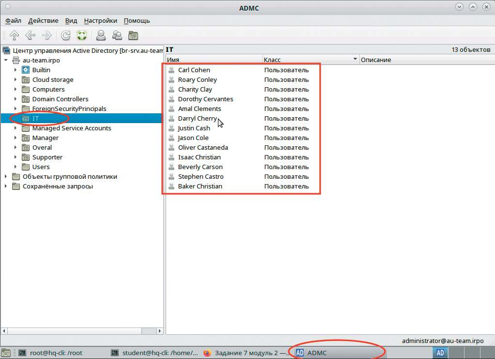

# Импорт пользователей в домен

**Печатные страницы:** 128–129.

<!-- Стр. 128 -->

- выполните резервное копирование директории /etc и всех ее поддиректорий сервера HQ-SRV на узел хранения HQ-CLI;
- выполните резервное копирование базы данных webdb сервера HQ-SRV
на узел хранения HQ-CLI.

### Импорт пользователей в домен

Подробное описание пункта задания
Выполните импорт пользователей в домен au-team.irpo:
- в качестве файла источника выберите файл users.csv, располагающийся
в образе Additional.iso;
- пользователи должны быть импортированы со своими паролями и другими атрибутами;
- убедитесь, что импортированные пользователи могут войти на машину
HQ-CLI.
Как делать?
На сервере HQ-SRV смонтировать образ Additions.iso:

```text
mount /dev/sr0 /mnt
```

Скопировать файл Users.csv в директорию /root:

```text
cp /mnt/Users.csv /root
```

Переконвертировать файл в utf-8 и избавиться от диакритических знаков, экспортировать в новый файл:

```text
iconv -f UTF-8 -t UTF-8//IGNORE /root/Users.csv > /root/Users_fixed.csv
```

Далее перейти в директорию /root, создать в текстовом редакторе скрипт import.sh:

```text
#!/bin/bash while IFS=';' read -r first last role phone ou street zip city country pass; do username=”${first:0:1}$last” samba-tool user create “${username,,}” “$pass” --givenname=”$first” --surname=”$last” --job-title=”$role” --telephonenumber=”$phone” [[ -n “$ou” ]] && samba-tool ou create “OU=$ou” 2>/dev/null [[ -n “$ou” ]] && samba-tool user move “${username,,}” “OU=$ou” 2>/dev/null done < Users_fixed.csv
```

<!-- Стр. 129 -->

Выполните скрипт:

```text
bash /root/import.sh
```

Скрипт во время своей работы выведет информацию о каждом созданном пользователе и подразделении. Проверить корректность импорта на клиенте с помощью ADMC, предварительно необходимо получить билет kerberos с помощью kinit Administrator@ AU-TEAM.IRPO.



Где выполнять?
На виртуальной машине: BR-SRV, проверка на HQ-CLI.
Дополнительно:
Samba-tool позволяет автоматизировать создание пользователей в домене
Active Directory через скрипты. Это дает возможность:
- массово импортировать учетные записи из CSV-файлов или корпо
ративных баз данных;
- стандартизировать атрибуты пользователей (логины, имена, отделы,
группы);
- интегрироваться с системами кадрового учета или другими источниками
данных.
