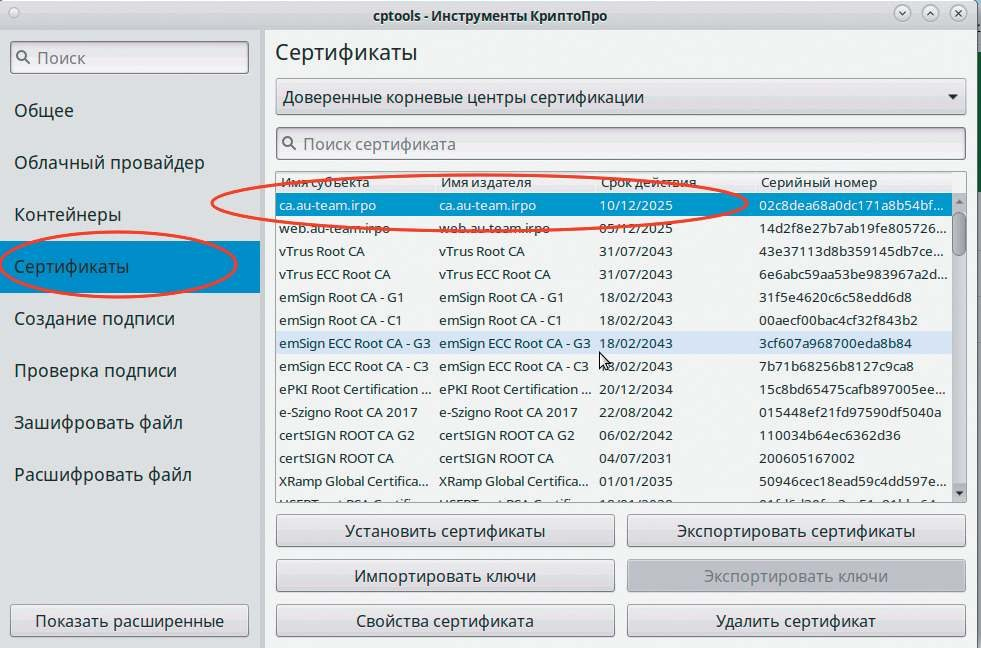
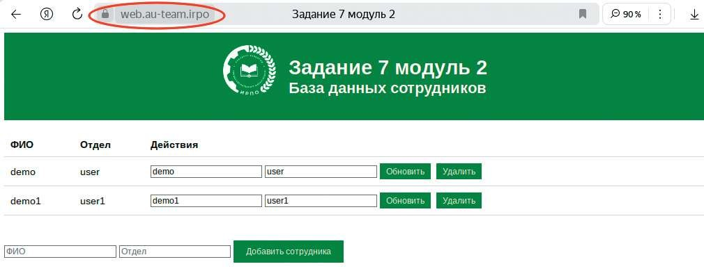
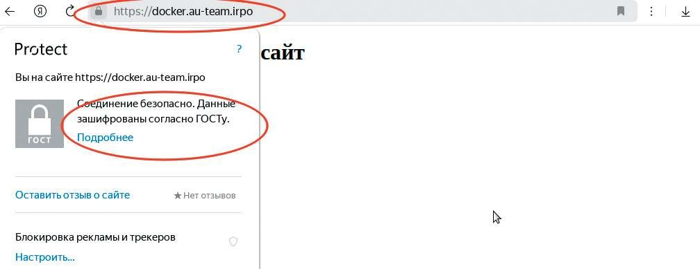
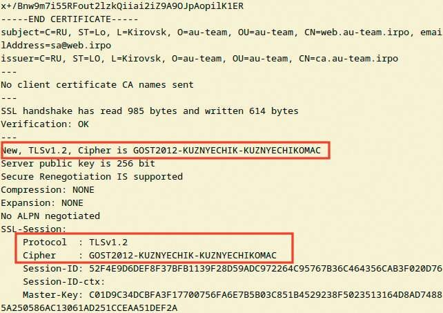

# Настройка сертификатов ГОСТ

**Печатные страницы:** 130–134.

КОД 09.02.06-1-2026 СЕТЕВОЙ И СИСТЕМНЫЙ АДМИНИСТРАТОР

## Краткая справка

– https://docs.altlinux.org/ru-RU/domain/10.4/html/alt-domain-p10/;

– https://docs.altlinux.org/ru-RU/domain/10.4/html/alt-domain-p10/ch38s02.

html.

## Где изучается?

3 курс:

– Программное обеспечение компьютерных сетей;

– Организация администрирования компьютерных систем и далее.

Настройка сертификатов ГОСТ

## Подробное описание пункта задания

Выполните настройку центра сертификации на базе HQ-SRV:

• необходимо использовать отечественные алгоритмы шифрования;

• сертификаты выдаются на 30 дней;

• обеспечьте доверие сертификату для HQ-CLI;

• выдайте сертификаты веб-серверам;

• перенастройте ранее настроенный реверсивный прокси nginx на протокол https;

• при обращении к веб-серверам https://web.au-team.irpo и https://docker.

au-team.irpo у браузера клиента не должно возникать предупреждений.

## Как делать?

На сервере HQ-SRV включить поддержку ГОСТ в ОС «Альт»:

control openssl-gost enabled

С помощью утилиты openssl настроить центр сертификации:

openssl genpkey -algorithm gost2012_256 -pkeyopt paramset:TCB -out

ca.key

Выдать сертификат ЦС на 90 дней:

openssl req -new -x509 -md_gost12_256 -days 90 -key ca.key -out ca.crt

Затем создать приватный ключ для сервера web:

openssl genpkey -algorithm gost2012_256 -pkeyopt paramset:A -out

web.au-team.irpo.key

Создать запрос для ЦС:

openssl req -new -md_gost12_256 -key web.au-team.irpo.key -out web.

au-team.irpo.csr

Выдать сертификат на 30 дней:

openssl x509 -req -in web.au-team.irpo.csr -CA ca.crt -CAkey ca.key

-CAcreateserial -out web.au-team.irpo.crt -days 30

Аналогично для docker:

openssl genpkey -algorithm gost2012_256 -pkeyopt paramset:A -out

docker.au-team.irpo.key

Создать запрос для ЦС:

openssl req –new -md_gost12_256 -key docker.au-team.irpo.key -out

docker.au-team.irpo.csr

Выдать сертификат на 30 дней:

openssl x509 -req -in docker.au-team.irpo.csr -CA ca.crt -CAkey

ca.key -CAcreateserial -out docker.au-team.irpo.crt -days 30

Удобным способом скопировать приватные и публичные ключи с сервера

HQ-SRV на ISP в директорию /etc/nginx.

scp *.key *.crt root@172.16.1.1:/etc/nginx/

Отредактировать конфигурационный файл nginx на ISP, внутри секции

http, скопировать секции и server для обоих серверов, дописать к ранее описанной конфигурации параметры работы по протоколу https:

server {

listen 443 ssl;

server_name web.au-team.irpo;

ssl_certificate /etc/nginx/web.au-team.irpo.crt;

ssl_certificate_key /etc/nginx/web.au-team.irpo.key;

ssl_ciphers GOST2012-KUZNYECHIK-KUZNYECHIKOMAC;

ssl_protocols TLSv1.2;

ssl_prefer_server_ciphers on;

location / {

proxy_pass http://172.16.1.2:8080;

auth_basic “Authorized access”;

auth_basic_user_file /etc/nginx/.htpasswd;

}

}

КОД 09.02.06-1-2026 СЕТЕВОЙ И СИСТЕМНЫЙ АДМИНИСТРАТОР

server {

listen 443 ssl;

server_name docker.au-team.irpo;

ssl_certificate /etc/nginx/docker.au-team.irpo.crt;

ssl_certificate_key /etc/nginx/docker.au-team.irpo.key;

ssl_ciphers GOST2012-KUZNYECHIK-KUZNYECHIKOMAC;

ssl_protocols TLSv1.2;

ssl_prefer_server_ciphers on;

location / {

proxy_pass http://172.16.2.2:8080;

}

}

Проверить конфигурацию nginx на ISP:

nginx -t

Если конфигурация в порядке, перечитать конфиг или перезапустить сервис на ISP:

systemctl reload nginx

Передать удобным способом публичный ключ ЦС с сервера HQ-SRV на

клиента HQ-CLI:

scp ca.crt root@hq-cli:/etc/pki/ca-trust/source/anchors/

На клиенте HQ-CLI выполнить команду обновления корневых сертификатов:

update-ca-trust

На клиенте HQ-CLI скачать, распаковать и установить cryptopro csp 5, обязательно установить версию с графикой, поставить галочку напротив пункта

«Копировать корневые сертификаты»:

bash linux-amd64/install_gui.sh

Проверить и убедиться, что появился сертификат в списке доверенных на

клиенте, открыв утилиту «Инструменты работы с криптографией», щелкнув на

кнопке «Сертификаты»:

В случае, если сертификат отсутствует, добавить его вручную, скопировав его в папку, доступную для чтения пользователем в графике, например

/home/user.

Открыть обозреватель Яндекс на странице https://web.au-team.irpo

и https://docker.au-team.irpo, согласиться с тем, что сервер использует алгоритмы ГОСТ:

­

КОД 09.02.06-1-2026 СЕТЕВОЙ И СИСТЕМНЫЙ АДМИНИСТРАТОР

Для проверки алгоритма и соединения выполните команду на клиенте:

openssl s_client -connect web.au-team.irpo:443

В случае корректной настройки можно увидеть используемый алгоритм

(Кузнечик) и информацию о том, что данные шифруются по ГОСТ:

## Где выполнять?

На виртуальной машине: HQ-SRV.

## Дополнительно

OpenSSL позволяет настраивать SSL/TLS-сертификаты — механизмы, которые обеспечивают криптографическую защиту соединения и аутентифика-

цию сторон. Это позволяет:

• шифровать передаваемые данные, предотвращая перехват трафика;

• идентифицировать веб-сервер, подтверждая его подлинность для пользователей;

• интегрироваться с центрами сертификации (как коммерческими, так

и собственными).

## Краткая справка

– https://www.altlinux.org/ГОСТ_в_OpenSSL.

---

## Иллюстрации из PDF

