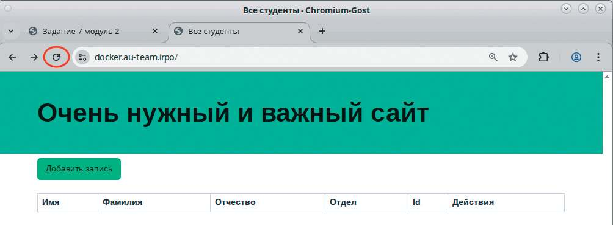
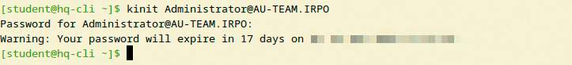
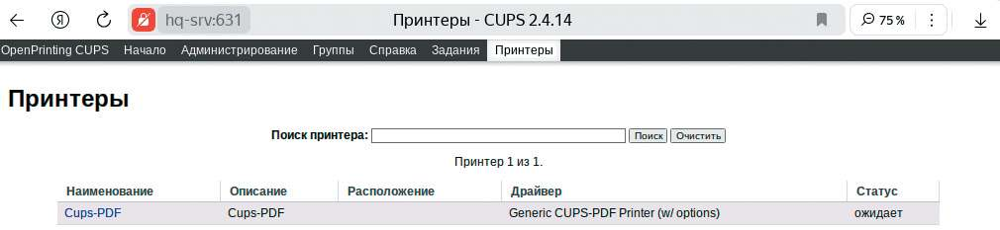

# Настройка принт-сервера

**Печатные страницы:** 139–140.

<!-- Стр. 139 -->





Где выполнять?
На виртуальных маршрутизаторах: HQ-RTR и BR-RTR.
Дополнительно:
Межсетевое экранирование позволяет контролировать сетевой трафик —
механизмы, которые фильтруют пакеты на основе заданных правил. Это позволяет:
- блокировать нежелательные соединения и атаки из внешних сетей;
- разделять сеть на сегменты с разным уровнем доверия (DMZ, LAN, WAN);
- работать на 4-м (транспортном) уровне модели OSI, фильтруя пакеты по
портам и протоколам (TCP/UDP).
Краткая справка:
- https://docs.ecorouter.ru/Руководство/21-Списки-доступа/03-Filtermap/02-Настройка-L3-ˋlter-map.
Где изучается?
2 курс:
- Компьютерные сети (основы).
3 курс:
- Организация, принципы построения и функционирования компьютерных сетей.
4 курс:
- Безопасность компьютерных сетей.

### Настройка принт-сервера

Подробное описание пункта задания
Настройте принт-сервер cups на сервере HQ-SRV:
- опубликуйте виртуальный pdf-принтер;
- на клиенте HQ-CLI подключите виртуальный принтер как принтер по
умолчанию.

<!-- Стр. 140 -->

### Как делать? На HQ-SRV выполнить установку cups:

```text
apt-get update && apt-get install -y cups cups-pdf
```

В конфигурационном файле cups дописать Allow all в секциях в соответствии с приведенным ниже листингом:

```text
<Location /> Order allow,deny Allow all </Location> <Location /admin> AuthType Default Require user @SYSTEM Allow all </Location> <Location /admin/conf> AuthType Default Require user @SYSTEM Allow all </Location>
```

Это позволит управлять сервером cups удаленно с помощью учетной записи root на HQ-SRV. Затем выполнить запуск и автозагрузку сервера cups:

```text
systemctl enable –now cups
```

На клиенте HQ-CLI в веб-обозревателе перейти на страницу https://hqsrv:631/admin/, сделать исключение для самоподписанного сертификата, перейти на вкладку управления принтерами, убедиться, что Cups-PDF опубликован и находится в статусе ожидания. Также можно выполнить добавление принтера вручную:


