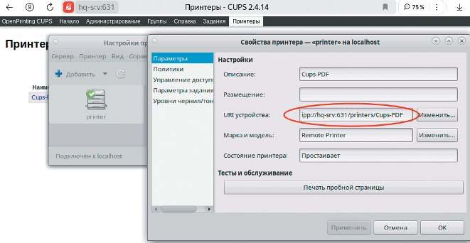
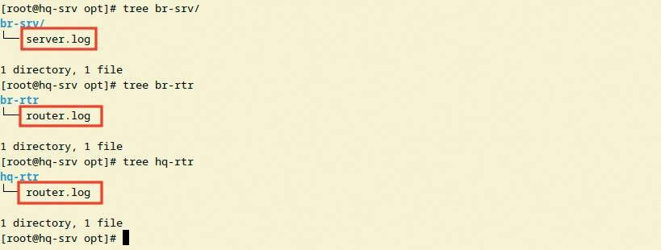
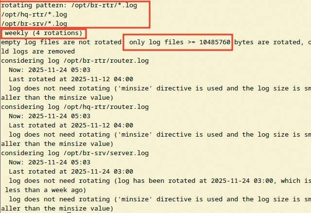

# Логирование, ротация логов

**Печатные страницы:** 141–144.

Удобным способом подключить принтер к клиенту по адресу:

ipp://hq-srv:631/printers/Cups-PDF

## Где выполнять?

На виртуальных машинах: HQ-SRV, клиент на HQ-CLI.

## Дополнительно

CUPS позволяет настраивать сетевую печать — механизмы, которые централизуют управление принтерами в сети. Это позволяет:

• предоставлять общий доступ к принтерам для множества пользователей;

• автоматически определять и настраивать драйверы печатающих уст

ройств;

• интегрироваться с различными операционными системами и сетевыми

протоколами печати (IPP).

## Краткая справка

– https://docs.altlinux.org/ru-RU/archive/2.4/html-single/master/alt-docsmaster/ch06s09.html.

## Где изучается?

2 курс:

– Архитектура аппаратных средств;

– Операционные системы и среды.

3 курс:

– Администрирование сетевых операционных систем;

– Программное обеспечение компьютерных сетей.

Логирование, ротация логов

## Подробное описание пункта задания

Реализуйте логирование при помощи rsyslog на устройствах HQ-RTR, BR-

RTR, BR-SRV:

• сервер сбора логов расположен на HQ-SRV, убедитесь, что сервер не является клиентом самому себе;

­

КОД 09.02.06-1-2026 СЕТЕВОЙ И СИСТЕМНЫЙ АДМИНИСТРАТОР

• приоритет сообщений должен быть не ниже warning;

• все журналы должны находиться в директории /opt. Для каждого устройства должна выделяться своя поддиректория, которая совпадает с именем ма-

шины;

• реализуйте ротацию собранных логов на сервере HQ-SRV:

 ротируются все логи, находящиеся в директории и поддиректориях /opt;

 ротация производится один раз в неделю:

 логи необходимо сжимать;

 минимальный размер логов для ротации — 10 МБ.

## Как делать?

Сервер логирования:

На сервера HR-SRV настроить сервер rsyslog, в случае его отсутствия

(к примеру, на AltLinux StarterKit) выполнить установку и последующую настройку:

apt-get install -y rsyslog

Можно привести конфигурационный файл /etc/rsyslog.conf к следующему

виду, или создать в директории /etc/rsyslog.conf.d/ свой файл, ввести код:

module(load=”imudp”)

$ModLoad imuxsock

authpriv.* /var/log/auth.log

input(type=”imudp” port=”514”)

if $fromhost-ip contains '192.168.100.1' then {

*.warn /opt/hq-rtr/router.log

}

if $fromhost-ip contains '10.10.10.2' then {

*.warn /opt/br-rtr/router.log

}

if $fromhost-ip contains '192.168.0.2' then {

*.warn /opt/br-srv/server.log

}

Затем запустить сервер rsyslog:

systemctl enable –now rsyslog

На маршрутизаторах HQ-RTR и BR-RTR указать сервер rsyslog:

rsyslog host 192.168.100.2









На BR-SRV установить и запустить rsyslog, прописать в конфигурационном

файле (rsyslog.conf или созданном .conf в директории /etc/rsyslog.conf.d):

$ModLoad imuxsock

$ModLoad imjournal

*.warn @@192.168.100.2:514

При корректной настройке логи типа *.warn будут присылаться с устройств

в директорию /opt, в поддиректории, описанные в конфигурации:

Утилитой logger на BR-SRV можно быстро проверить, высылаются ли логи

на сервер:

logger warn atencion

Ротация логов:

Проверить, установлен ли сервис logrotate. Если не установлен (в случае

использования AltLinux StarterKit), выполнить команду:

apt-get install –y logrotate

Настроить ротацию в конфигурационном файле /etc/logrotate.conf:

/opt/br-rtr/*.log

/opt/hq-rtr/*.log

/opt/br-srv/*.log

{

weekly

compress

minsize 10M

}

КОД 09.02.06-1-2026 СЕТЕВОЙ И СИСТЕМНЫЙ АДМИНИСТРАТОР

Запустить службу и установить автозапуск сервиса:

systemctl enable –now logrotate

Проверить конфигурацию командой:

logrotate -d /etc/logrotate.conf

В конце вывода команды будет описание ротирования указанных директорий:

## Где выполнять?

На виртуальных машинах: HQ-SRV — сервер, BR-SRV — клиент.

На маршрутизаторах: HQ-RTR, BR-RTR — клиенты.

## Дополнительно

Системы логирования (rsyslog, journald) позволяют настраивать сбор

и анализ системных событий — механизмы, которые централизуют учет работы приложений и ОС. Это позволяет:

• отслеживать ошибки и критические события в реальном времени;

• хранить историю изменений и действий пользователей для аудита;

• интегрироваться с внешними SIEM-системами для анализа безопасности.

## Краткая справка

– https://docs.altlinux.org/ru-RU/domain/10.4/html/alt-domain-p10/

ch54s09.html;

– https://www.altlinux.org/Journald.

---

## Иллюстрации из PDF

