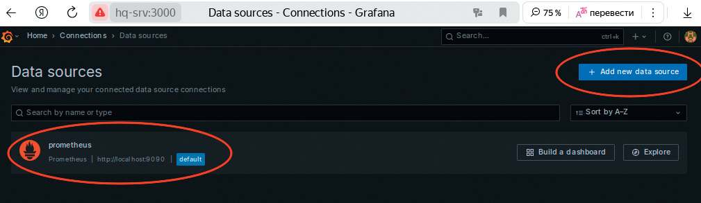
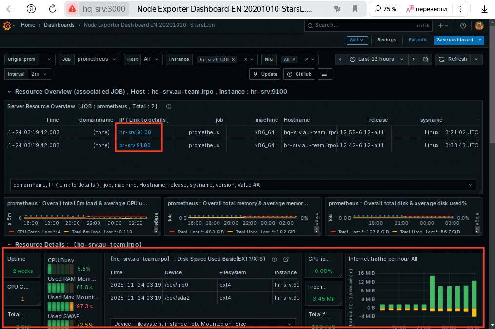

# Мониторинг с помощью визуализатора grafana и сборщика Prometheus

**Печатные страницы:** 145–146.

<!-- Стр. 145 -->

Где изучается?
2 курс:
- Операционные системы и среды (основы).
3 курс:
- Администрирование сетевых операционных систем;
- Организация, принципы построения и функционирования компьютерных сетей.

### Мониторинг с помощью визуализатора grafana и сборщика Prometheus

Подробное описание пункта задания
На сервере HQ-SRV реализуйте мониторинг устройств с помощью открытого программного обеспечения:
- обеспечьте доступность по URL — http://mon.au-team.irpo для сетей офиса HQ, внесите изменения в инфраструктуру разрешения доменных имен;
- мониторить нужно устройства HQ-SRV и BR-SRV;
- в мониторинге должны визуально отображаться нагрузка на ЦП, объем
занятой ОП и основного накопителя;
- логин и пароль для службы мониторинга admin, P@ssw0rd;
- организуйте доступ к мониторингу для HQ-CLI без внешнего доступа;
- выбор программного обеспечения, основание выбора и основные
параметры с указанием порта, на котором работает мониторинг, отметьте
в отчете.
Как делать?
На сервер HQ-SRV установить grafana, prometheus и prometheus-node_
exporter. Это можно сделать с помощью команды:

```text
apt-get install -y grafana prometheus prometheus-node_exporter
```

На сервер BR-SRV установить только prometheus-node_exporter, запустить и активировать автозапуск:

```text
apt-get install –y prometheus-node_exporter systemctl enable –now prometheus-node_exporter
```

Выполнить настройку сборщика prometheus, в конфигурационном файле / etc/prometheus/prometheus.yml, в секции job_name: 'prometheus' в static_conˋgs дописать в поле targets следующее:

```text
static_configs:
- targets: ['localhost:9090','hr-srv:9100','br-srv:9100']
```

<!-- Стр. 146 -->

Выполнить запуск и активацию автозапуска grafana-server и prometheus:

```text
systemctl enable –now grafana-server systemctl enable –now prometheus systemctl enable –now prometheus-node_exporter
```

На клиенте HQ-CLI в веб-обозревателе перейти на сайт http://hq-srv:3000, выполнить вход в grafana с помощью учетной записи: по умолчанию — admin с паролем admin. Заменить пароль по умолчанию на P@ssw0rd. Добавить источник данных типа prometheus, указать сборщика local host:9090:



Импортировать дашборд, к примеру 11074 во вкладке dashboards. Перейти в дашборд, убедиться, что нужные данные (цп, оп, хранилища) отображаются корректно:


