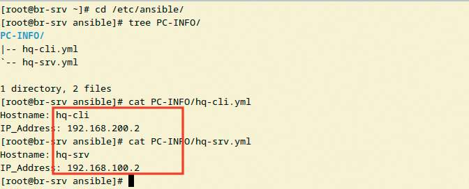

# Инвентаризация с помощью ansible плейбука

**Печатные страницы:** 147–148.

<!-- Стр. 147 -->

Где выполнять?
На виртуальных машинах: HQ-SRV — сервер и клиент, BR-SRV — клиент.
Дополнительно:
Системы мониторинга (Zabbix, Prometheus) позволяют настраивать отслеживание работы инфраструктуры — механизмы, которые собирают метрики
и анализируют производительность. Это позволяет:
- выявлять сбои и аномалии в реальном времени;
- планировать ресурсы на основе исторических данных и трендов;
- интегрироваться с системами оповещения для оперативного реагирования.
Краткая справка:
- https://www.altlinux.org/Prometheus.
Где изучается?
2 курс:
- Операционные системы и среды.
3 курс:
- Администрирование сетевых операционных систем;
- Организация, принципы построения и функционирования компьютерных сетей.

### Инвентаризация с помощью ansible плейбука

Подробное описание пункта задания
Реализуйте механизм инвентаризации машин HQ-SRV и HQ-CLI через
Ansible на BR-SRV:
- плейбук должен собирать информацию о рабочих местах:

- имя компьютера;

- IP-адрес компьютера;
- плейбук должен быть размещен в директории /etc/ansible, отчеты в поддиректории PC-INFO, в формате .yml. Файлы должны называться именем компьютера, который был инвентаризирован;
- файл плейбука располагается в образе Additional.iso в директории
playbook.
Как делать?
На сервере BR-SRV в директории /etc/ansible/ создать плейбук get_
hostname_address.yml со следующим содержимым в формате yaml (заготовку
плейбука можно взять с образа Additional.iso в директории playbook):

```text
- name: Get_hostname
hosts: hq-srv,hq-cli
tasks:
- name: Save hostname ip
copy:
dest: /etc/ansible/PC-INFO/{{ ansible_hostname }}.yml
```

<!-- Стр. 148 -->

```text
content: | Hostname: {{ ansible_hostname }} IP_Address: {{ ansible_default_ipv4.address }} delegate_to: localhost
```

Выполнить плейбук командой:

```text
ansible-playbook get_hostname_address.yml
```

Убедиться, что в поддиректории PC_INFO появились файлы и данные корректны:



Где выполнять?
На виртуальных машинах: BR-SRV — сервер, HQ-SRV, HQ-CLI — клиенты.
Дополнительно:
Ansible позволяет настраивать автоматизацию управления инфраструктурой — механизмы, которые унифицируют развертывание и конфигурирование
систем. Это позволяет:
- централизованно управлять конфигурациями серверов и сетевых
устройств;
- быстро развертывать приложения и обновления без ручного вмешательства;
- интегрироваться с облачными платформами и системами мониторинга.
Краткая справка:
- https://www.altlinux.org/Ansible.
Где изучается?
2 курс:
- Операционные системы и среды (основы).
3 курс:
- Организация администрирования компьютерных систем.
