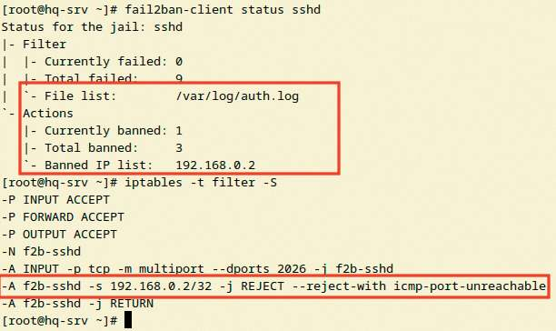

# Защита ssh от атак методом перебора пароля

**Печатные страницы:** 149–150.

<!-- Стр. 149 -->

### Защита ssh от атак методом перебора пароля

Подробное описание пункта задания
На HQ-SRV настройте программное обеспечение fail2ban для защиты ssh:
- укажите порт ssh;
- при 3 неуспешных авторизациях адрес атакующего попадает в бан;
- бан производится на 1 минуту.
Как делать?
Установить fail2ban и iptables (как блокировщик портов):

```text
apt-get install –y fail2ban iptables
```

Настроить сервис ssh на передачу своих логов в службу rsyslog, открыть в конфигурационном файле /etc/opensshd/sshd_conˋg секции:

```text
SyslogFacility AUTHPRIV LogLevel INFO
```

Настроить файл /etc/fail2ban/jail.conf, указав в секции [sshd] параметры защиты:

```text
[sshd] enabled = yes port = 2026 logpath = /var/log/auth.log backend = %(sshd_backend)s maxretry = 3 bantime = 1m
```

Убедиться, что логи sshd пишутся в /var/log/auth.log. Для настройки auth логов в конфигурационном файле rsyslog должна быть следующая секция:

```text
authpriv.* /var/log/auth.log
```

Если логи сервиса sshd ведут в другое место, стоит указать это место (например, /var/log/secure) или оставить параметр logpath в jail.conf по умолчанию: Запустить сервис fail2ban:

```text
systemctl enable –now fail2ban
```

<!-- Стр. 150 -->

Удостовериться в том, что порт 2026 блокируется при 3 неуспешных авторизациях для конкретного ip-адреса, к примеру, выполнив 3 неуспешных попытки авторизации с сервера BR-SRV:

```text
fail2ban-client status sshd
```



Для быстрого вывода из бана выполнить:

```text
fail2ban-client unban all #всех fail2ban-client unban 192.168.0.2 #отдельный ip адрес
```

Где выполнять?
На виртуальных машинах: HQ-SRV.
Дополнительно:
Fail2ban позволяет настраивать защиту от bruteforce-атак — механизмы,
которые автоматически блокируют подозрительные IP-адреса. Это позволяет:
- анализировать логи сервисов (SSH, FTP, веб-серверы) на предмет неудачных попыток входа;
- динамически добавлять нарушителей в черный список через iptables/
ˋrewalld;
- интегрироваться с любыми сервисами, ведущими журналы аутентификации.
Краткая справка:
- https://habr.com/ru/articles/557980/.
Где изучается?
2 курс:
- Операционные системы и среды (основы).
4 курс:
- Безопасность компьютерных сетей.
