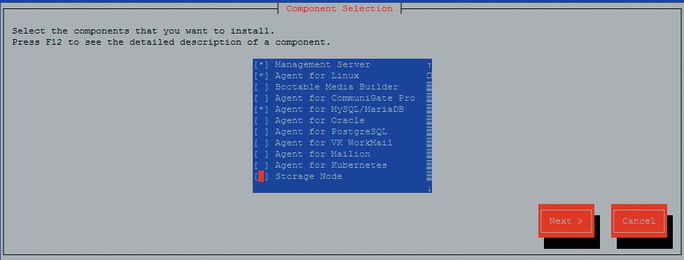
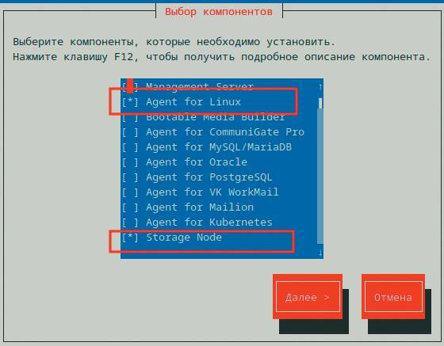
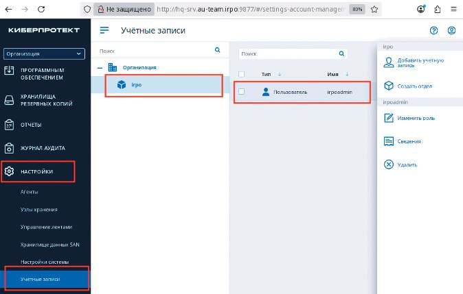
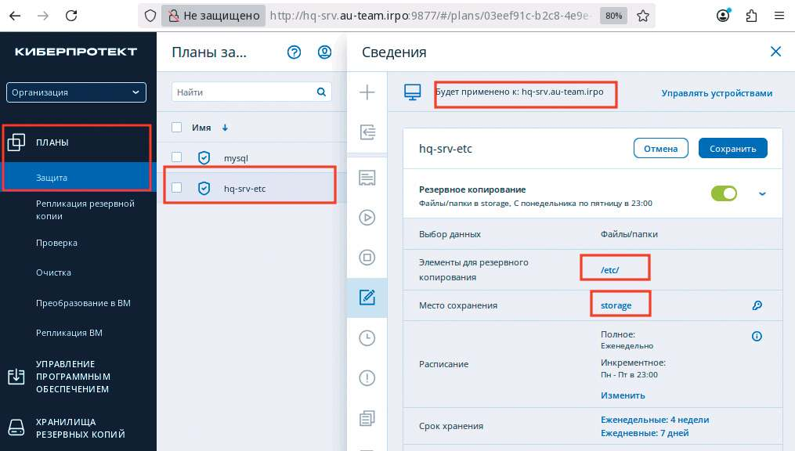

# Резервное копирование

**Печатные страницы:** 151–155.

<!-- Стр. 151 -->

### Резервное копирование

Подробное описание пункта задания
Настройка резервного копирования директории сервера HQ-SRV:
- на HQ-SRV развернуть программное обеспечение для резервного копирования и восстановления данных с защитой от вирусов-шифровальщиков;
- в качестве решения рекомендуется использовать программное обеспечение Кибер Бэкап версии 17.4 или аналог;
- настройте организацию irpo;
- настройте пользователя с правами администратора на сервере HQ-SRV,
имя пользователя irpoadmin с паролем P@ssw0rd;
- установите на HQ-CLI агент с функциями узла хранилища и подключите
его к серверу управления;
- на узле хранилища HQ-CLI создайте директорию /backup и выберите ее
в качестве устройства хранения;
- создайте два плана резервного копирования для сервера HQ-SRV:

- план для резервного копирования директории /etc и всех ее поддиректорий;

- план для резервного копирования базы данных webdb типа mysql;
- выполните резервное копирование директории /etc и всех ее поддиректорий сервера HQ-SRV на узел хранения HQ-CLI;
- выполните резервное копирование базы данных webdb сервера HQ-SRV
на узел хранения HQ-CLI.
Как делать?
Обновить репозитории, обновить ядро операционной системы (затем перезагрузить виртуальную машину), установить нужные пакеты:

```text
update-kernel && reboot apt-get update apt-get install kernel-source-6.12 kernel-headers-modules-6.12 gcc make
```

Важное замечание: на момент написания руководства новейшее ядро — 6.12.55-6.12-alt1, именно поэтому заголовки ядра и исходные коды ядра устанавливались версии 6.12. В случае другой версии ядра заголовки и исходные коды ядра должны быть версии, совпадающей с версией ядра. В случае отсутствия пакета update-kernel (актуально для AltLinux StarterKit), его стоит установить. На сервере HQ-SRV смонтировать образ с установщиков Кибер Бекап 18, в примере образ Additional.iso - /dev/sr0, установщик Кибер Бекап 18 - /dev/sr1.

```text
mount /dev/sr1 /mnt
```

Запустить установку Кибер Бекап, выполнив команду:

```text
bash /mnt/CyberBackup_18_64-bit.x86_64
```

<!-- Стр. 152 -->

Следуя шагам установщика, на сервере HQ-SRV установить компоненты Management Server, Agent for Linux, Agent for MySQL/MariaDB.



На узле хранилища HQ-CLI смонтировать образ с установщиков Кибер Бекап 18:

```text
mount /dev/sr0 /mnt
```

Запустить установку Кибер Бекап, выполнив команду:

```text
bash /mnt/CyberBackup_18_64-bit.x86_64
```

Следуя шагам установщика, на узле хранилища HQ-CLI установить компоненты Agent for Linux, Storage Node.



После установки всех компонентов на сервере HQ-SRV создать учетную запись irpoadmin с паролем P@ssw0rd, затем на клиенте в веб-обозревателе на странице http://hq-srv:9877 авторизоваться учетными данными root с паролем

<!-- Стр. 153 -->

P@ssw0rd (локальный root HQ-SRV), перейти на вкладку «Настройки — учетные записи», создать подразделение irpo, создать учетную запись в подразделении irpoadmin с привилегиями администратора:



На узле хранилища создать директорию /backup:

```text
mkdir /backup
```

Настроить план резервного копирования для сервера HQ-SRV для директории /etc и всех ее поддиректорий, в качестве места сохранения архивных копий указать узел хранения HQ-CLI (в примере на снимке — storage):



<!-- Стр. 154 -->

Создать второй план резервного копирования, на сервере HQ-SRV создать директорию /backup_db, указать директорию в качестве места хранения копий:


Выполнить запуск резервного копирования сначала одного, затем другого плана:


### Где выполнять? На виртуальных машинах: HQ-SRV сервер, HQ-CLI — клиент и узел хранилища.

<!-- Стр. 155 -->

Дополнительно:
Системы резервного копирования позволяют настраивать сохранность
данных — механизмы, которые создают и управляют резервными копиями
файлов и систем. Это позволяет:
- автоматически создавать инкрементальные бэкапы с дедупликацией;
- восстанавливать данные на определенный момент времени;
- интегрироваться с облачными хранилищами и локальными архивами.
Краткая справка:

<table>
<thead>
<tr>
<th>Продукт</th>
<th>Ссылка</th>
<th></th>
</tr>
</thead>
<tbody>
<tr>
<td>Кибер<br>Инфраструктура</td>
<td>https://cyberprotect.ru/forms/forma-trial-<br>infr?education=1</td>
<td></td>
</tr>
<tr>
<td>Кибер Хранилище</td>
<td>https://cyberprotect.ru/forms/forma-trial-<br>storage?education=1</td>
<td></td>
</tr>
<tr>
<td>Кибер Файлы</td>
<td>https://cyberprotect.ru/forms/forma-trial-<br>(cid:715)les?education=1</td>
<td></td>
</tr>
<tr>
<td>Кибер Протего</td>
<td>https://cyberprotect.ru/forms/forma-trial-<br>protego?education=1</td>
<td></td>
</tr>
<tr>
<td>Кибер Бэкап</td>
<td>https://cyberprotect.ru/forms/forma-trial-<br>backup?education=1</td>
<td></td>
</tr>
</tbody>
</table>


Где изучается?
3 курс:
- Администрирование сетевых операционных систем.
