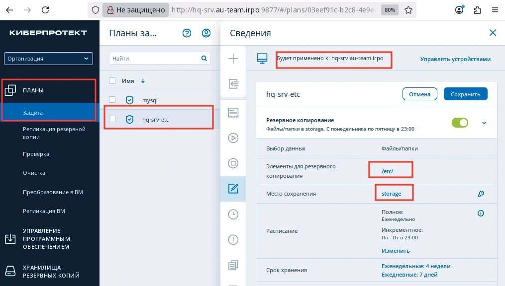
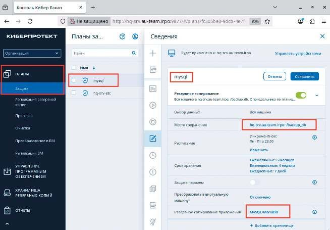
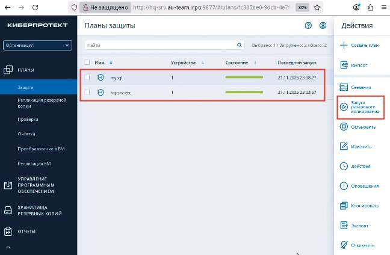

# Резервное копирование

**Печатные страницы:** 151–155.

Резервное копирование

## Подробное описание пункта задания

Настройка резервного копирования директории сервера HQ-SRV:

• на HQ-SRV развернуть программное обеспечение для резервного копирования и восстановления данных с защитой от вирусов-шифровальщиков;

• в качестве решения рекомендуется использовать программное обеспечение Кибер Бэкап версии 17.4 или аналог;

• настройте организацию irpo;

• настройте пользователя с правами администратора на сервере HQ-SRV,

имя пользователя irpoadmin с паролем P@ssw0rd;

• установите на HQ-CLI агент с функциями узла хранилища и подключите

его к серверу управления;

• на узле хранилища HQ-CLI создайте директорию /backup и выберите ее

в качестве устройства хранения;

• создайте два плана резервного копирования для сервера HQ-SRV:

 план для резервного копирования директории /etc и всех ее подди-

ректорий;

 план для резервного копирования базы данных webdb типа mysql;

• выполните резервное копирование директории /etc и всех ее поддиректорий сервера HQ-SRV на узел хранения HQ-CLI;

• выполните резервное копирование базы данных webdb сервера HQ-SRV

на узел хранения HQ-CLI.

## Как делать?

Обновить репозитории, обновить ядро операционной системы (затем перезагрузить виртуальную машину), установить нужные пакеты:

update-kernel && reboot

apt-get update

apt-get install kernel-source-6.12 kernel-headers-modules-6.12 gcc make

Важное замечание: на момент написания руководства новейшее ядро —

6.12.55-6.12-alt1, именно поэтому заголовки ядра и исходные коды ядра устанавливались версии 6.12. В случае другой версии ядра заголовки и исходные

коды ядра должны быть версии, совпадающей с версией ядра. В случае отсутствия пакета update-kernel (актуально для AltLinux StarterKit), его стоит уста-

новить.

На сервере HQ-SRV смонтировать образ с установщиков Кибер Бекап 18,

в примере образ Additional.iso - /dev/sr0, установщик Кибер Бекап 18 - /dev/sr1.

mount /dev/sr1 /mnt

Запустить установку Кибер Бекап, выполнив команду:

bash /mnt/CyberBackup_18_64-bit.x86_64





КОД 09.02.06-1-2026 СЕТЕВОЙ И СИСТЕМНЫЙ АДМИНИСТРАТОР

Следуя шагам установщика, на сервере HQ-SRV установить компоненты

Management Server, Agent for Linux, Agent for MySQL/MariaDB.

На узле хранилища HQ-CLI смонтировать образ с установщиков Кибер Бекап 18:

mount /dev/sr0 /mnt

Запустить установку Кибер Бекап, выполнив команду:

bash /mnt/CyberBackup_18_64-bit.x86_64

Следуя шагам установщика, на узле хранилища HQ-CLI установить компоненты Agent for Linux, Storage Node.

После установки всех компонентов на сервере HQ-SRV создать учетную

запись irpoadmin с паролем P@ssw0rd, затем на клиенте в веб-обозревателе на

странице http://hq-srv:9877 авторизоваться учетными данными root с паролем

P@ssw0rd (локальный root HQ-SRV), перейти на вкладку «Настройки — учетные

записи», создать подразделение irpo, создать учетную запись в подразделении

irpoadmin с привилегиями администратора:

На узле хранилища создать директорию /backup:

mkdir /backup

Настроить план резервного копирования для сервера HQ-SRV для директории /etc и всех ее поддиректорий, в качестве места сохранения архивных копий

указать узел хранения HQ-CLI (в примере на снимке — storage):

КОД 09.02.06-1-2026 СЕТЕВОЙ И СИСТЕМНЫЙ АДМИНИСТРАТОР

Создать второй план резервного копирования, на сервере HQ-SRV создать

директорию /backup_db, указать директорию в качестве места хранения копий:

Выполнить запуск резервного копирования сначала одного, затем другого

плана:

## Где выполнять?

На виртуальных машинах: HQ-SRV сервер, HQ-CLI — клиент и узел хранилища.

## Дополнительно

Системы резервного копирования позволяют настраивать сохранность

данных — механизмы, которые создают и управляют резервными копиями

файлов и систем. Это позволяет:

• автоматически создавать инкрементальные бэкапы с дедупликацией;

• восстанавливать данные на определенный момент времени;

• интегрироваться с облачными хранилищами и локальными архивами.

## Краткая справка

Продукт                             Ссылка

Кибер             https://cyberprotect.ru/forms/forma-trial-

Инфраструктура    infr?education=1

https://cyberprotect.ru/forms/forma-trial-

Кибер Хранилище

storage?education=1

https://cyberprotect.ru/forms/forma-trial-

Кибер Файлы

les?education=1

https://cyberprotect.ru/forms/forma-trial-

Кибер Протего

protego?education=1

https://cyberprotect.ru/forms/forma-trial-

Кибер Бэкап

backup?education=1

## Где изучается?

3 курс:

– Администрирование сетевых операционных систем.

---

## Иллюстрации из PDF

